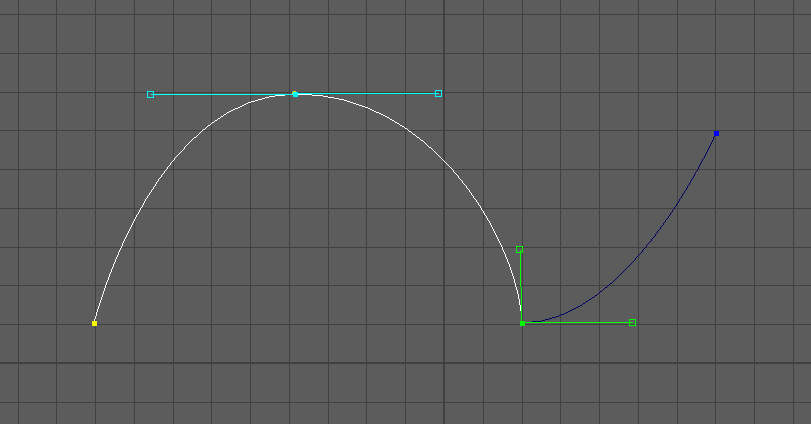

# Bezier Grundlagen

# Grundlagen Bezier Curves

Bezier Curves sind die typischen Kurven, die man in Vektorzeichenprogrammen verwendet – bekannt z. B. aus Inkscape oder Adobe Illustrator.

Um eine Bezierkurve zu zeichnen muss man Anchorpoints setzen, jeder Anchorpoint hat einen Control Handle der die Krümmung definiert. Anchorpoints, können symmetrisch (Bezier), asymmetrisch (Bezier Corner) oder als Corner angelegt werden.

## Arbeiten mit dem Bezier Curve Tool

Man findet das Tool unter Create > Curves > Bezier Curve Tool.
Mit einem kurzen LMB-Klick erzeugt man Anchorpoints als Corner; mit Klicken und Ziehen entstehen symmetrische Control Handles. Nachdem man das Zeichnen der Kurve abgeschlossen hat, bestätigt man dies mit Enter.

Die beste Art und Weise den Umgang mit dem Tool zu lernen ist es Bilder abzupausen.
Dabei sollte man achten, so wenig Punkte wie möglich zu setzen. Anchorpoints sollten nur dort gesetzt werden wo die Linie eine Krümmung hat.

### Modus Wechseln

Um den Modus eines Anchorpoints zu wechseln, kann man im Marking Menu (Shift+RMB) auf einen Anchorpoint klicken. Alternativ: mit Strg auf den Anchor Point klicken, um zu „Corner" zu wechseln; mit gedrücktem Strg+LMB symmetrische Control Handles aus dem Punkt herausziehen; oder mit Strg+LMB auf einen Control Handle die Control Handles asymmetrisch machen.

### Zeichnen fortsetzen

Man sollte bei dem Zeichnen der Kurve gleich die Winkel der Control Handles anpassen. Diese kann man mit LMB verschieben. Um danach das Zeichnen Fortsetzen zu können, muss man den letzten Punkt mit LMB anklicken, sodass er gelb erscheint, danach kann man die Kurve weiterzeichnen.

### Zusätzliche Punkte der Kurve Hinzufügen

Um weitere Anchorpoints der Kurve hinzuzufügen, muss man einfach das Bezier Curve Tool auswählen und dort auf die Kurve klicken wo man den Punkt einfügen möchte.

## Convert Bezier to NURBS

Falls man eine Bezier Curve editieren will wie eine NURBS Curve,
kann man sie umwandeln mithilfe des Werkzeuges
Edit > Convert > Bezier

## Bezier Components

Die Bezier Kurven sind eine relativ neue Entwicklung in Maya.
Daher zeigt das Marking Menu keinen Menupunkt "Anchor Points" sondern, nur den Punkt "Control Vertex" und "Hull".

Man muss sehr vorsichtig in dem CV-Modus sein, da die Anchorpoints sowie die Control Handles als gleichwertig selektiert werden. Selektiert man einen Anchorpoint mit den Punkten des Control Handle und verschiebt sie, so wird sich gleichzeitig der Winkel der Control Handles unvorhersehbar verändern.

Den Hull Modus sollte man vollkommen ignorieren, da dieser alle Punkte miteinander verbindet und somit nutzlos ist.

In der Praxis vermeidet man den Component Modus für Bezier Kurves. Um schnell das Bezier Curve Tool zu öffnen kann man mit Shift-RMB auf die Kurve klicken und in dem Marking Menü das Bezier Curve Tool öffnen.
