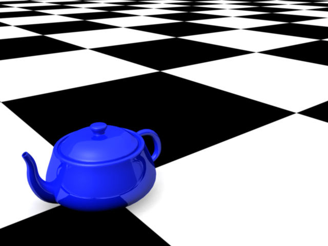
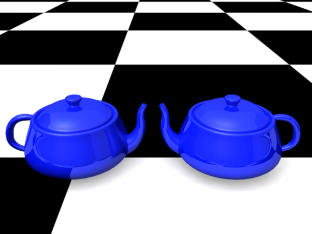
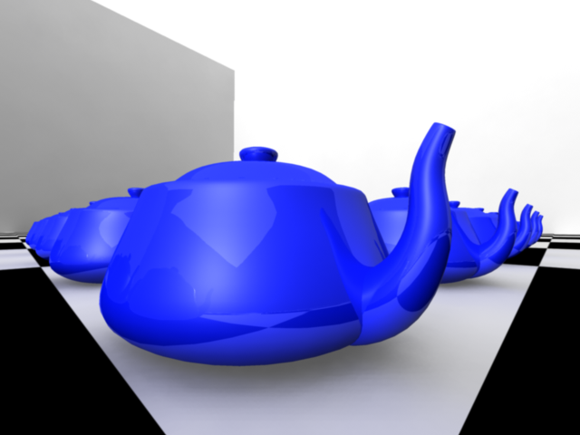
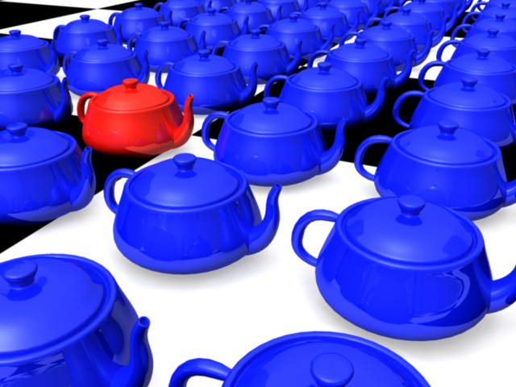

# Grundlagen Bild Komposition

Um interessante Bilder mit der Kamera zu machen können wir die Grundlagen der Bildkomposition aus der Fotografie und Malerei anwenden.
Eine Bildkomposition beschreibt wie die Objekte anzuordnen sind und sich die Kamera zu positionieren hat.

Viele Künstler und Fotografen sind sich nicht aktiv bewusst, dass sie Kompositionstechniken verwenden.
Die beste Übung um Bildkomposition zu lernen ist mit einer Kamera Fotos zu machen oder Bilder zu zeichnen.

## Gesetz der Drittel

Das „Gesetz der Drittel“ ist das am meisten benutzte Prinzip in der Fotografie. Es ist eine gängige Art und Weise immer
im Drittel eines Bildes das interessanteste Objekt zu platzieren.

Das liegt vor allem daran, das die Drittelschnittpunkte fast auf dem Goldenen Schnitt liegen und somit ein harmonisches Bild liefern.
Der Goldener Schnitt (Goldenes Verhältnis, Göttlicher Schnitt) ist in der Natur und in der Kunst immer wiederkehrendes Verhältnis
mit dem Wert ~1,619. Beispiel: Das Breitbild Format 16:9 hat ein Verhältnis von ~1,77

## Leitlinien

Einfache Strukturen und Linien im Bild verdeutlichen Tiefe und Räumlichkeit. Es ist für den Betrachter angenehmer wenn Leitlinien
im Bild vorhanden sind.Es kommt zu einer Art Führung des Beobachters, welche das Gefühl der Harmonie vermittelt.

## Symmetrie

Ein anderer Ansatz, gegensätzlich zur ersten Regel, ist die vollkommene Symmetrie. Dieser Kompositionstyp platziert das Objekt genau in die Bildmitte. Die Wirkung entfaltet sich jedoch nur bei symmetrischen Motiven, z. B. einem Gebäude, einer Blume oder einer interessanten symmetrischen Form. Ist das Objekt nicht exakt zentriert, empfindet das Gehirn die Abweichung als störend. Oft wirkt diese Komposition allerdings langweilig und unnatürlich.

## Gerader Horizont

Eigentlich nicht erwähenswert, doch oft vergessen. Oftmals bildet man einfach eine Landschaft ab, und der Horizont ist irgendwie schräg im Bild. Dies lenkt sehr von der eigentlich schönen Landschaft ab, da auch hier das Gehirn den Fehler korrigiert.

## Perspektivenwechsel

Eines der Dinge die beim positionieren der Kamera ans Tageslicht kommt ist seine eigene Perspektive wie man Dinge betrachtet.
Um abwechselungsreiche Bilder schaffen zu können lohnt es sich selbst immer wieder mal einen Perspektivenwechsel zu veranlassen.

Um den Blickwinkel zu verändern muss man die Position und den Winkel von der Kamera zu dem Objekt verändern und mit den
Kameraeinstellungen der Kamera experimentieren. z.B: der Brennweite der Kamera verändern

## Bruch eines Musters

Wenn sich ein homogenes Muster im Hintergrund befindet, so lässt sich ein Objekt davor stellen und das Gehirn wird seinen
vollen Fokus auf dieses richten, da es das Muster bricht.

## Bruch der Regeln

Irgendwann kann es reizvoll sein, die etablierten Regeln bewusst zu missachten und etwas vollkommen anderes auszuprobieren. Das funktioniert jedoch nur, wenn man weiß, welche Regel man bricht und warum. Man kann Regeln nur dann gezielt brechen, wenn man sie kennt.
