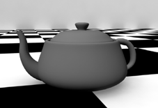
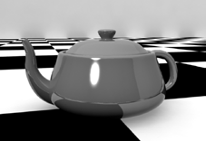
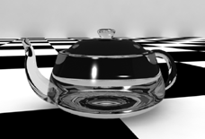
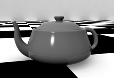

# Shading Grundlagen

## Diffuse Reflektion

Diffuse Reflektion beschreibt, wie Licht von einer Oberfläche gestreut wird. Ein niedriger Diffuse-Wert lässt die Oberfläche glatt und direkt reflektierend wirken.

Ein sehr diffuses Material wäre hingegen z.B. Beton oder Papier diese haben raue Oberflächen und streuen das Licht in alle Richtungen.

## Direct Reflection

Eine Reflection simuliert die Eigenschaft eines Spiegels. Wie z.B. Porzellan oder Chrome. Hier ist zu beachten, dass nur die wenigsten Materialien die Umgebung perfekt spiegeln z.B. Silber oder Gold. Meistens handelt es sich um eine verschwommene Reflektion. Diese wird mit der Blurred Reflection Eigenschaft kontrolliert.

### Specular Highlights

Maya unterscheidet zwischen der Umgebungsreflektion und den direkt im Material gespiegelten Lichtquellen (Specular Highlights). Diese Trennung existiert in der Natur nicht – sie wird in 3D-Programmen verwendet, weil virtuelle Lichtstrahlen von einem unendlich kleinen Punkt ausgehen und daher nicht direkt im Material gespiegelt werden können.

## Refraction

Transparente Objekte brechen die durch Lichtstrahlen sie hindurch gehen. Diesen Effekt nennt man „Refraction“. Jedes Material hat seinen eigenen Index of Refraction (IOR). Glas hat beispielsweise einen Brechungsfaktor von 1.4. Um eine raue Oberfläche zu simulieren muss man „Refraction Blurring“ aktiviere.

### Fresnel Reflection

Der Fresnel Effekt ist ein physikalischer Effekt, welcher die Reflektion je nach Einfallwinkel des Lichts errechnet. Das bedeutet, dass Teile des Objekts die zu der Kamera hin zeigen weniger reflektieren als die Teile des Objekts die einen Winkel zu der Kamera einnehmen.

