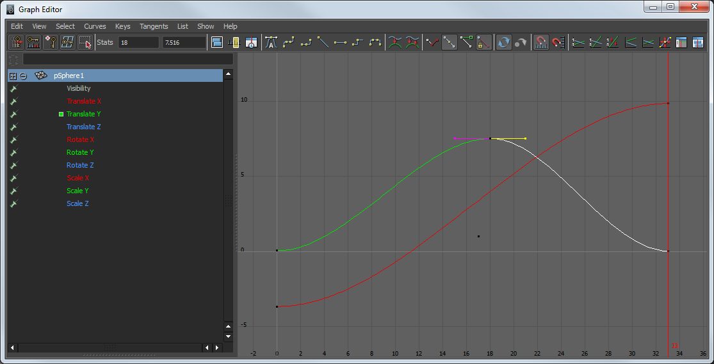
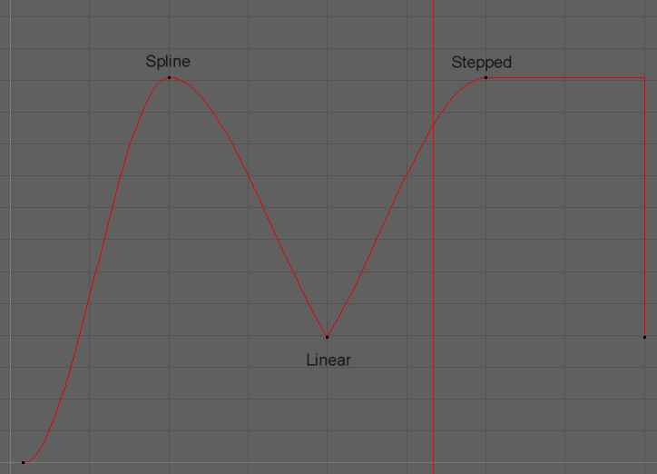

# Graph Editor

Der Graph Editor (Window > Animation Editors > Graph Editor) ermöglicht es die Keyframes graphisch zu visualisieren, sowie den Übergang von Frame zu Frame.

Auf der rechten Seite hat man die graphische Darstellung der Animation. Selektiert man ein Objekt z.B. in der Perspektivischen Ansicht wird der Graphe angezeigt. Die schwarzen Punkte sind die entsprechenden Keyframes.
Die Outliner-Liste an der linken Seite zeigt die selektierten Objekte an, sowie die Channels die bereits einen Keyframe haben und ermöglicht schnelles selektieren von bestimmten Attributen. Man wählt sie aus der Liste auf der linken Seite aus (Mit Shift-LMB bzw. Strg-LMB macht man eine mehrfach Auswahl).

Um den Kurvenverlauf zu verändern, manipuliert man entweder direkt die Keyframes oder deren Kontrollpunkte. Durch Anklicken der Keyframes werden diese selektiert (oder man zieht ein Rechteck für eine Mehrfachauswahl). Man kann die Punkte manipulieren, indem man zunächst mit der Taste W in das Move Tool wechselt. Mit MMB lässt sich der Keyframe frei verschieben, mit Shift-MMB nur horizontal oder vertikal (je nach Mausbewegung).

### Keyboard Shortcuts

| Shortcut                                  | Funktion                                      |
| ----------------------------------------- | --------------------------------------------- |
| W, MMB       | Move Keyframe                                 |
| W, MMB-Shift | Horizontal bzw. vertikal Keyframe verschieben |
| F            | Focus on Keyframe (Zoomed den Graph)          |
| ALT - MMB    | Move Graph                                    |
| Alt-RMB      | Zoom Graph                                    |

### Tangents

Die Einstellung der Tangents bestimmt wie man die Kontrollpunkte manipulieren kann und wie der Kurvenverlauf nach dem Keyframe interpretiert wird.
Mit dem Menü lässt sich der Umwandeln z.B. ermöglicht „Spline“ gerundete Kurven, „Linear“ eckige und „Stepped“ springt sprunghaft zu einem anderen Wert.

