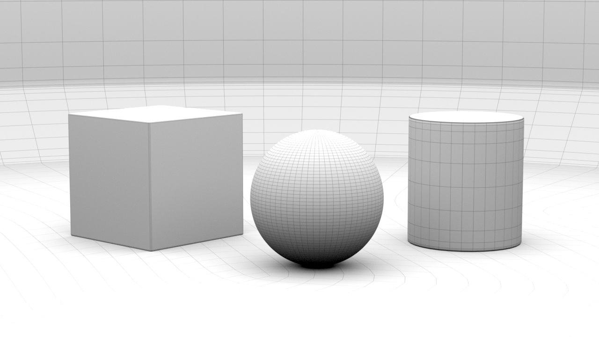

# Modelling: NURBS

Beim Curve-Modelling (auch Spline-Modelling genannt) werden die äußeren Kanten eines Objektes, ähnlich wie in einer Blaupause, skizziert und anschließend Flächen zwischen diesen Kurven erzeugt. Diese Technik ist besonders nützlich, wenn eine präzise Gestaltung des Objektes erforderlich ist.

Die Surface Tools von Maya basieren auf dem mathematischen Modell Non-uniform rational basis spline (NURBS), das insbesondere in CAD-Programmen zur Erstellung von NURBS-Geometrien eingesetzt wird.
Maya erledigt alle komplexen mathematischen Berechnungen im Hintergrund, sodass man sich ausschließlich auf die Form der Kurve konzentrieren kann.

In diesem Kapitel sollst du lernen:

- Wie man 3D Kurven zeichnet mit den Curve Tools
- Grundlagen von NURBS Objekten
