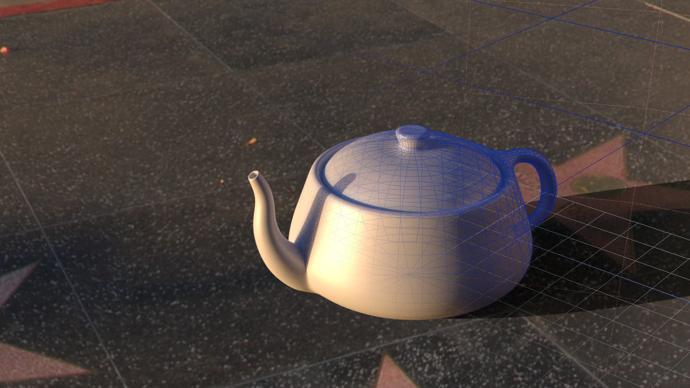
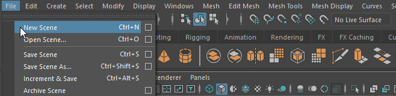
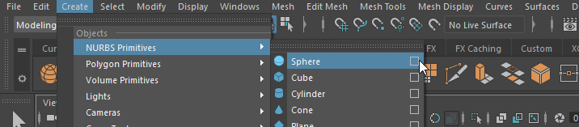

# Eine Einführung in die Welt der 3D-Animation

In den frühen Anfängen der 3D-Computergrafik wurden mehrere Softwarepakete benötigt, um 3D-Animationen zu erstellen: "Wavefront - Advanced Visualizer", "Thomson Digital Image - Explore" und "Alias - Power Animator". Mit diesen Werkzeugen wurden die beeindruckenden Spezialeffekte in Filmen wie "Terminator 2" (James Cameron, 1991) oder "Jurassic Park" (Steven Spielberg, 1993) erstellt. Die Programme wurden 1999 in einem einzigen Paket namens "Maya" (nach dem Sanskrit-Wort für "Illusion") kombiniert. Bei der Entwicklung von Maya wurde besonderer Wert darauf gelegt, dass Animatoren angenehm mit dem Programm arbeiten konnten. Insbesondere arbeitete das Entwicklerteam mit dem Animierer Chris Landreth zusammen, um mit der Betaversion den Kurzfilm "Bingo" (1998) zu produzieren. Kurze Zeit später wurde Maya für die Spezialeffekte in "The Matrix" (Wachowski-Brothers, 1999) und "The Mummy" (Stephen Sommers, 1999) verwendet.

Heutzutage ist der Anwendungsbereich von Maya nicht mehr auf Spezialeffekte und Animationsfilme beschränkt, sondern erstreckt sich auch auf die Entwicklung von 3D-Objekten für Computerspiele, Architekturvisualisierung, Physik-Simulation und 3D-Druck. Die Werkzeuge von Maya sind so vielseitig und flexibel, dass sie bereits jetzt für die 3D-Technologie der Zukunft eingesetzt werden können, wie beispielsweise für Virtual Reality (HTC Vive, Oculus Rift) und Augmented Reality (Microsoft Hololens).

Maya wird ständig weiterentwickelt und erhält jährlich ein Update mit neuen Funktionen. Daher versucht dieses Buch gar nicht, alle Funktionen von Maya zu beschreiben, sondern fokussiert sich auf die Grundfunktionen von Maya. Wir werden uns die "CG-Produktionspipeline" für Animationsfilme ansehen und zeigen, wie man sie in Maya umsetzen kann. Am Ende des Buches sollte jeder in der Lage sein, seinen eigenen Animationsfilm zu drehen.

## Benötigte Hardware

Um Maya zu nutzen, wird eine 3-Tasten-Maus oder eine Maus mit klickbarem Scrollrad benötigt. Viele Funktionen des Programms erfordern die Verwendung der dritten Maustaste, wie beispielsweise die Navigation in einer Szene. Insbesondere Gaming-Mäuse eignen sich gut für Maya aufgrund ihrer hohen Präzision und den vielen Tasten.

Die empfohlenen Hardwareanforderungen für Maya findet man unter:
[http://knowledge.autodesk.com/support/maya/troubleshooting/caas/sfdcarticles/sfdcarticles/System-requirements-for-Autodesk-Maya-2023.html](http://knowledge.autodesk.com/support/maya/troubleshooting/caas/sfdcarticles/sfdcarticles/System-requirements-for-Autodesk-Maya-2023.html)

Als Anfänger ist es nicht unbedingt notwendig, sofort einen neuen PC zu kaufen, da Maya auf den meisten aktuellen PCs läuft. Jedoch kann Maya von einer höheren Prozessorleistung, mehr Arbeitsspeicher und einer besseren GPU-Leistung profitieren.

## Benötigte Software

### Maya

Autodesk Maya läuft auf allen gängigen Betriebssystemen (Windows, Linux und macOS). Autodesk bietet verschiedene Lizenztypen an, darunter:

- **30-Tage-Lizenz**: Diese ermöglicht es, Maya 30 Tage lang zu testen. Weitere Informationen dazu gibt es unter: [http://www.autodesk.com/products/autodesk-maya/free-trial](http://www.autodesk.com/products/autodesk-maya/free-trial)
- **Studentenversion**: Diese erlaubt Studenten während ihres Studiums, Maya kostenlos für Studentenprojekte zu verwenden. Weitere Informationen dazu gibt es unter: [http://students.autodesk.com/](http://students.autodesk.com/)
- **Maya LT**: Diese Version ist für Game Developer geeignet und hat weniger Funktionen als die vollständige Lizenz von Maya. Insbesondere fehlen Lizenzen für Render Engines, da die Game Engine als Render Engine genutzt wird. Der Preis dieser Lizenz ist dementsprechend günstiger als der der Maya-Komplettversion. Eine genaue Übersicht darüber, welche Funktionen in Maya LT nicht enthalten sind, gibt es hier: [http://www.autodesk.com/products/maya/compare/compare-products](http://www.autodesk.com/products/maya/compare/compare-products)
- **Maya**: Diese Lizenz enthält alle Funktionen von Maya und erlaubt die kommerzielle Nutzung.

#### Installation von Maya

Nachdem man seine Lizenz für Maya ausgewählt hat, kann man das Programm herunterladen. Die Installation unter Windows und macOS ist selbsterklärend.

Für Fedora gibt es diese offiziellen [Installationsanweisungen](https://knowledge.autodesk.com/support/maya/learn-explore/caas/CloudHelp/cloudhelp/2023/ENU/Maya-Installlation/files/GUID-E7E054E1-0E32-4B3C-88F9-BF820EB45BE5-htm.html).

Bevor man Maya startet, sollten die aktuellsten Grafikkartentreiber installiert sein. Dazu gibt es folgende Links:

- nVidia: [http://www.nvidia.com/Download/index.aspx?lang=en-us](http://www.nvidia.com/Download/index.aspx?lang=en-us)
- AMD/ATI: [http://support.amd.com/en-us/download](http://support.amd.com/en-us/download)
- Intel: [https://downloadcenter.intel.com/download/24971/Intel-HD-Graphics-Driver-for-Windows-7-8-64-bit](https://downloadcenter.intel.com/download/24971/Intel-HD-Graphics-Driver-for-Windows-7-8-64-bit)

Bei der Installation von Maya sollte man sicherstellen, dass auch Arnold mitinstalliert wird.

### Maya Plug-Ins

Um mit Maya effizienter und einfacher arbeiten zu können, können Plug-Ins hinzugefügt werden.

#### Maya Bonus Tools

Die Maya Bonus Tools sind eine kostenlose Sammlung von Werkzeugen, die einige Prozesse in Maya vereinfachen.

Obwohl sie von Autodesk entwickelt wurden, gibt es keinen offiziellen Support für die Werkzeuge.

[Bonus Tools](http://area.autodesk.com/bonustools)

### DaVinci Resolve

Die Render-Engines von Maya berechnen immer nur einzelne Bilder.
Um diese in ein Video umzuwandeln, benötigen wir ein Videobearbeitungsprogramm.

Wir werden hierfür die kostenfreie Variante von DaVinci Resolve verwenden
[https://www.blackmagicdesign.com/products/davinciresolve](https://www.blackmagicdesign.com/products/davinciresolve)

## Schreibweisen

Manche Schreibweisen sind im gesamten Buch zu finden und werden hier erläutert. Die Auswahl eines Menüpunkts wird wie folgt dargestellt: **Menü > Befehl**

Wenn die Optionen eines Menüpunkts benutzt werden sollen: **Menü > Befehl (Option)**

Maus- und Tastaturbefehle werden in dieser **Schrift** geschrieben.

- **RMB** Rechte Maustaste
- **MMB** Mittlere Maustaste
- **LMB** Linke Maustaste
