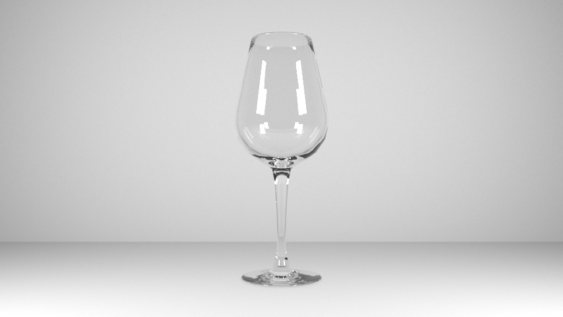

Als erstes werden wir uns das Maya User Interface anschauen. Am ende von dieser Lektion werden wir ein Weinglas modelliern, shader zuweisen, beleuchten und ausrendern. Keine Angst, wir werden in den späteren Kapiteln nochmals genauer auf die einzelnen Schritte eingehen.

## Materials

- [Wineglass Reference Image](/03_maya_basics/images/wineglass/WineGlass-Reference.png)

## References

- https://de.wikipedia.org/wiki/Weinglas
- http://www.home-designing.com/2016/01/decorative-unique-red-white-wine-glasses-goblets
  img/04_Lighting/Lightimg/04_Lighting/Light
