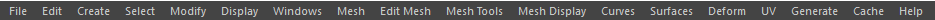
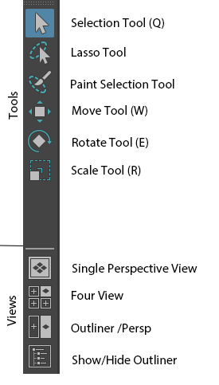

Beim ersten Starten von Maya öffnet sich das Fenster "What's New Highlight Settings", können wir beide Häkchen entfernen und auf "ok" drücken damit es verschwindet.

In dem Hauptpanel sehen wir einen leeren 3D-Raum. Damit wir uns orientieren können wird ein Hilfsgitter (Grid) eingeblendet.
Wir schauen in die 3D-Welt mit der Kamera "persp", sie hat eine 35mm Öffnung, was der natürlichen Wahrnehmung entspricht.

Das User Interface von Maya ist so gestaltet das es immer angepasst werden kann auf den jeweiligen Aufgabenbereich.
Als Anfänger ist das User Interface sehr unübersichtlich und unklar, da viele Funktionen doppelt existieren und manche
Funktionen findet man überhaupt nicht, da Maya sie gerade nicht anzeigt.

Für jetzt verschaffen wir uns einen groben Überblick über das User Interface.

## Menu / Workspaces

Wie jedes Programm hat Maya eine Menüleiste. Das besondere an der Maya Menüleiste ist,
das sie mehrere "Menu Sets" hat.

Es werden immer die Einträge "File", "Edit", "Create", "Select", "Modify", "Display", "Windows", "Cache", "Help" angezeigt.
Die restlichen Einträge verändern sich je nach aktiviertem Modus.

Man wechselt die Menu Sets entweder mit dem Dropdown in der "Status Line" oder mit den Tastaturkürzeln:

- F2 Modeling
- F3 Rigging
- F4 Animation
- F5 FX
- F6 Rendering

Am Ende der Zeile findet man auch ein Dropdown Menü "Workspaces".
Workspaces speichern die Position der Fenster und Panels und eine Reihe von UI Einstellungen.
Man kann mit dem Menü zwischen verschiedenen Voreinstellungen wählen und so z.B. eine Workspace auswählen die für das Modelling optimiert ist.

Für das gesamte Buch werde ich davon ausgehen das die "Maya Classic" Workspace genutzt wird.
Diese Einstellung ist für Anfänger mit Maya am einfachsten zu verstehen.

Ist man mit Maya vertraut, sollte man sich seine eigene Workspace anlegen.
Man kann sein eigenes Layout abspeichern mit Windows > Workspaces > Save Current Workspace as...

## Status Line

Die "Status Line" erlaubt den schnellen Zugriff auf oft verwendete Befehle aus dem Menü.
Sie ist gegliedert in folgende Teile:

- Menu Set Dropdown: zeigt das aktuelle Menu Set an und ermöglicht den Wechsel in andere.
- File System Icons: New Scene, Open File, Save File
- Selection Set (Standard: Ausgeblendet): Vorgefertigte Selektionsmasken.
- Selection Mode Icons: Verändert den aktiven Selektionstyp, Hirarchie, Object(Standard), Component.
- Selection Mask Icons: Filter die den auf die Selektionmodus verfeinern.
- Snapping Icons: Erlauben Objekte an Objekten/Komponenten/Grid einschnappen.
- History (Standard: Ausgeblendet): Ermöglicht die Navigation zu Input/Output Nodes.
- Rendering Icons: Die grundlegenden Renderingtools und Einstellungen.
- Select Field: ermöglicht eine genaue Transformation des gerade selektierten Objekts.

Elemente der Status Line können ein- und ausgeblendet werden. Ausgeblendete Teile sind mit einem kleinen Dreieck markiert,
eingeblendete Teile mit einem kleinen Viereck. Durch Klicken auf das Symbol wird das Element ein bzw. ausgeblendet.

## Shelf

Die Shelf wird verwendet um schnell an Tools zu gelangen und ist frei konfigurierbar.
Mit einem LMB klick wird ein Befehl ausgeführt, mit Doppelklick öffnet sich, das Optionsmenü(falls vorhanden) für das Werkzeug.

Maya hat einige vorgefertigte Shelf die man verwenden und anpassen kann. Oder man legt sich seine eigene Shelf mit seinen Lieblingstools an.

Um unsere eigene "Custom-Shelf" anzulegen müssen wir auf das kleine Rädchen an der linken Seite klicken und "New Shelf" auswählen.

Um Menübefehle einer Shelf hinzufügen gehen wir wie folgt vor:

1. Wir aktiviert die Shelf in welcher der Befehl hinzugefügt werden soll.
2. Wir suchen das Werkzeug in dem Menü.
3. Wir halten STRG+SHIFT gedrückt und klicken auf den Menüpunkt. Der Befehl wurde der Shelf hinzugefügt.
4. Mit MMB-Klickdrag können wir die Reihenfolge der Werkzeuge verändern.
5. Um die Modifizierung zu speichern klicken wir auf das kleine Rädchen an der linken Seite und klicken „Save Shelf“.

## Toolbox

Die Toolbox hat zwei Teile: die "QWERTY"-Tools und die "View-Selection".

### Basis-Tools

Hier findet man die grundlegenden Manipulationswerkzeuge, sie sind QWERTY genannt, da dies die Tastaturkürzeln für die Werkzeuge sind.

- Q Select
- W Move/Translate
- E Rotate
- R Scale
- T Show Manipulator
- Y Undo

Das "Lasso Tool" und "Paint Selection" wird eher seltener benutzt, daher haben sie keine Tastaturkürzel.

### View Selection

Der untere Bereich „Views“ bietet eine Auswahl verschiedener Panel-Views.
Diese unterteilen den Bildschirm in mehrere Fenster um effizientere Workflows zu ermöglichen.
Maya bietet hierzu einige vorgefertigte Panel-Layouts, wie die Four View.

- Mit LMB auf "View Selection" können wir auf das aktive Panel zu der ausgewählten View wechseln.
- Mit RMB können wir das Panel neu aufteilen und als eigenes Layout abspeichern.

## Panels

Jedes Panel hat sein eigenes Panel Menü, eine "Panel Toolbar" und einige "Heads Up Display" Elemente.
Standardmäßig werden die beiden Elemente “Axis Direction Indicator” (um zu sehen wo oben und unten ist)
und der Name der aktuellen Kamera angezeigt.

Das Koordinatensystem wird als "Grid" angedeutet, die dicken schwarzen Linien sind die "Null" Linien und der Ursprung (Origin) des Koordinatensystems befindet sich an dem Schnittpunkt der beiden Linien.
Man kann die Darstellung des Grids verändern, indem wir die Werte hierfür im Menü Display > Grid (options) anpassen.

Man kann alle Elemente ausblenden. Es gibt die Tastaturkürzel
Shift-M für das ein-/ausblenden des Panel Menüs
und Strg-Shift-M um die "Panel Toolbar" ein-/ausblenden.
Die Heads Up Elemente konfiguriert man im Display > Heads Up Display.

### Camera Controls

Um sich im 3D-Raum zu bewegen, gibt es vier Möglichkeiten:

- Tumble (Kamerarotation): ALT + LMB
- Dolly (Kameraposition rein oder raus bewegen): ALT + RMB
- Track (Kamera auf einer Schiene bewegen): ALT + MMB
- Zoom: Mit dem Maus Rad scrollen

Um zu einer bestimmten Stelle hinzuzoomen kann man auch Strg-ALT + LMB gedrückt halten und macht eine Selektion von oben
nach unten. Um herauszuzoomen, selektiert man von unten nach oben

A verstellt die Kamera für einen optimalen Überblick auf die gesamte Szene. F fokussiert die Kamera auf die selektierten
Objekte. Bei gleichzeitig gedrückt halten der SHIFT Taste wird die Funktion für alle offenen Ansichten durchgeführt.

## Channel Box / Layer Editor

### ChannelBox

Hier werden die typisch "animierbare" Eigenschaften des aktuell selektierten Objekts aufgelistet.
Man kann spezifische Werte per Tastatureingabe eingeben, selektiert man mehrere Felder können diese simultan auf den
gleichen Wert gesetzt werden.

Alternativ ist es auch möglich die Werte zu verändern indem man den Namen (nicht den Wert) selektiert
und im Panel mit gedrückter MMB nach links oder rechts die Maus bewegt.
Hält man zusätzlich Shift gedrückt so verändern sich der Werte in größeren Schritten
mit Strg kleineren Schritten.

Im oberen Bereich findet man immer alle Eigenschaften des "Transform"-Node, also Translate, Rotate, Scale und Visibility.
Der untere Bereich Input ist meistens zugeklappt, hier kann man die man die Konstruktions-Nodes des Objekts anpassen.

### Layer Editor

Der Layer Editor lässt Objekte verschiedenen Layern zuordnen. Es gibt zwei Typen von Layern.

- Display-Layer: lässt sich die Sichtbarkeit von Objekten verändern.
- Animation-Layer: kann man die Animationen eines Objects aufteilen.

## Time Slider

Der Time Slider ist eine Zeit Linie, die die Zeit in Frames darstellt. Die Standard Einstellung in Maya ist 24 Frames pro Sekunde.
Durch LMB auf die Leiste kann an zu einem Frame springen, oder man kann direkt den jeweiligen Frame in dem Feld neben der Leiste eingeben.

Selektiert man ein Animiertes Objekt werden die Keyframes als rote Striche angezeigt; durch Selektieren und Gedrückt halten
von MMB lassen sich diese verschieben.

Am Ende der Leiste sind die Playback Controls um die Frames abzuspielen.

## Range Slider

Eng verknüpft mit dem Time Slider ist der Range Slider, dieser verändert die Länge des Time Sliders.
Mit den Zahleneingaben kann man die Länge der Animation festlegen.

Der Schlüssel am Ende der Leiste ist der Auto-Keyframe Toggle. Wenn dieser aktiviert ist, fügt er animierten Objekten
automatisch neue Keyframes zu wenn sie in einem neuen Frame verändert werden.

## Command Line

Auf der linken Seite können direkt MEL oder Python Befehle eingeben werden. Durch klicken auf die Aufschrift "Mel" wechselt man den Python Modus.

Auf der rechten Seite sieht man den Konsolen-Output.
Dieser ist besonders nützlich wenn eine Operation fehlgeschlagen ist. Der Konsolenuntergrund färbt sich rot und eine Fehlermeldung wird angezeigt um den Fehler zu korrigieren.

Der Button am Ende der Zeile öffnet den Skript Editor, der alle bisher ausgeführten Befehle auflistet und einem erlaubt seine eigenen Skripte zu erstellen.

## Help Line

Die Help Line zeigt den Namen des gerade verwendeten Werkzeug an. Bei komplexeren Werkzeugen wird auch eine kurz Anleitung wie das Tool zu verwenden ist.

## Hotbox

Die Hotbox enthält alle Funktionen von Maya, die mithilfe von Menüs erreicht werden können. Von oben nach unten findet man alle Menu Sets wieder:

1. Menu Default Items
1. Panel Menu
1. Hotbox Controls
1. Modelling
1. Rigging
1. Animation
1. FX
1. Rendering

Die Hotbox Controls bieten noch zusätzliche Funktionen an.

- "Recent Commands": zeigt eine Liste von vorhergehenden Befehlen und wir können durch klicken sie nochmals ausführen.
- "Maya": lässt vom aktiven Panel in ein Standard-Kamerapanel (persp, top, side, front) wechseln.
- "Hotbox Controls": Konfigurationsmenü wie die Hotbox dargestellt werden soll. z.B. können Menu Sets ausgeblendet werden die wir nicht brauchen.

Darüber hinaus ist die Hotbox in Zonen eingeteilt "Norden", "Süden", "Westen", "Osten", in denen man mit einem klick weitere Marking Menus öffnen kann.

- Norden: Wechsel zu häufig benutzten Panel Layouts wie z.B. "persp/outliner"
- Süden: Wechselt das aktive Panel zu anderen Views wie z.B. Hypershade
- Westen: Verändert die Selektionsmaske um z.B. nur noch NURBS Objekte zu selektieren.
- Osten: Erlaubt Teile der Maya UI ein und auszublenden. Dies ist nützlich wenn man z.B. nur Modelliert dann braucht man keinen "Time Slider" oder "Range Slider".

Wir öffnen die Hotbox indem man die #[span.shortcut Leertaste] länger drückt.

Benutzt wir die Hotbox sparen wir uns den Weg mit der Maus zum Rand des Bildschirms.
Das scheint zwar eine kurze Strecke zu ein, jedoch wird man hunderte mal ein Menü öffnen und in der Summe ist das ein sehr langer Weg den man sich mit der Maus spart.

Wenn man sich entscheidet umzustellen und nur noch die Hotbox zu verwenden sollte man mit #[span.shortcut Strg-M] das Menü ausblenden um nicht aus Gewohnheit auf das Menü zuzugreifen.

# Find Menu
Mit `Strg-F` im Viewport kann man nach Maya Befehlen suchen.