Das Interface wurde gestaltet sodass viele Funktionen direkt mit Tastaturkürzel erreichbar sind.
Um effektiv mit Maya arbeiten zu können muss man diese nach und nach erlernen.

Die am meisten benutzten Shortcuts ist die Kamerasteuerung ALT + Maustaste, sowie LEERTASTE
kurz gedrückt um von der aktuellen Ansicht in die vorhergehende zu wechseln.

## Überblick der wichtigsten Shortcuts

Die QWERTY-Tools, (Q Select Tool, W Move Tool, E Rotate Tool, R Scale Tool, T Show Manipulator, Y Last Tool Used) sind
die am häufigsten benutzten Tools in Maya. Die dazugehörigen Tastaturkürzel sind gleichbleibend über das gesamte Programm
und können in vielen Interaktionsfenstern benutzt werden.

| Befehl                                                                               | Kürzel                                 |
| ------------------------------------------------------------------------------------ | -------------------------------------- |
| Speichern (oft benutzen)                                                             | Strg-S   |
| Select                                                                               | Q        |
| Move Tool                                                                            | W        |
| Rotate Tool                                                                          | E        |
| Scale Tool                                                                           | R        |
| Show Manipulator Tool                                                                | T        |
| Last Tool Used                                                                       | Y        |
| Toggle Edit Pivot Point (nur mit Move,Rotate, Scale)                                 | D        |
| Edit Pivot Point                                                                     | Einfg    |
| Undo                                                                                 | Z        |
| Redo                                                                                 |          |
| Duplicate                                                                            | Strg-D   |
| Duplicate Special                                                                    | Shift-D  |
| Delete History                                                                       | Alt-D    |
| Multiples drücken der Tastenkombination zeigt ChannelBox / Attribute Editor / Nichts | Strg-A   |
| Focus on Object                                                                      | F        |
| Focus in all Views                                                                   | Shift F  |
| Show all                                                                             | A        |
| Show all in all Views                                                                | Shift-A  |

## ViewPanel Eigenschaften (Tasten 1-8)

### Tasten 1, 2, 3

Für die Tasten 1-3 Muss ein Objekt selektiert sein.

#### Nurbs Objekte

Alles was man in den ViewPanels sieht ist nur eine grobe Vorschau. Man kann daher für einzelne Objekte die Vorschauqualität verändern.
In View Panels kann man mit 1 (geringe Qualität), 2 (mittlere Qualität), 3 (hohe Qualität)
die Displayqualität des selektierten NURBS-Objekts verändern - dies hat keinen Einfluss auf das spätere Rendern.

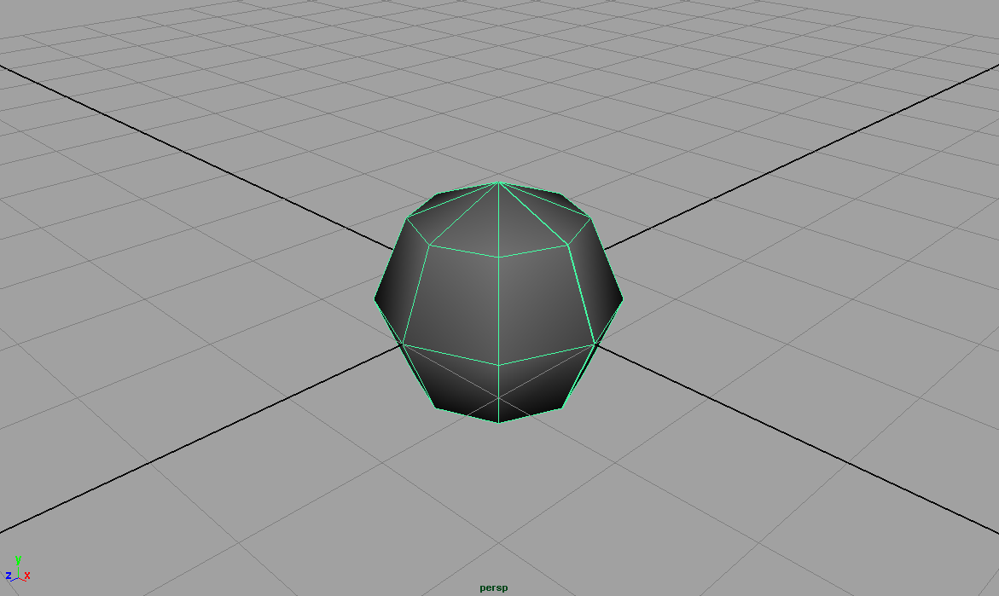

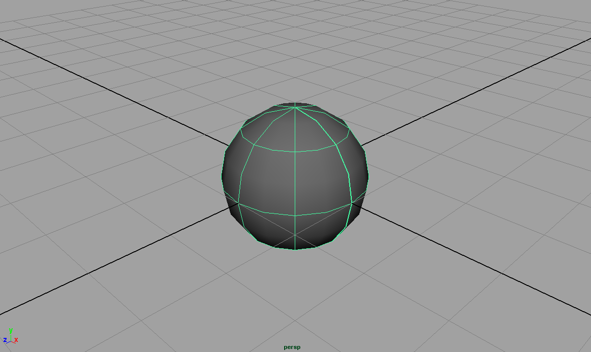

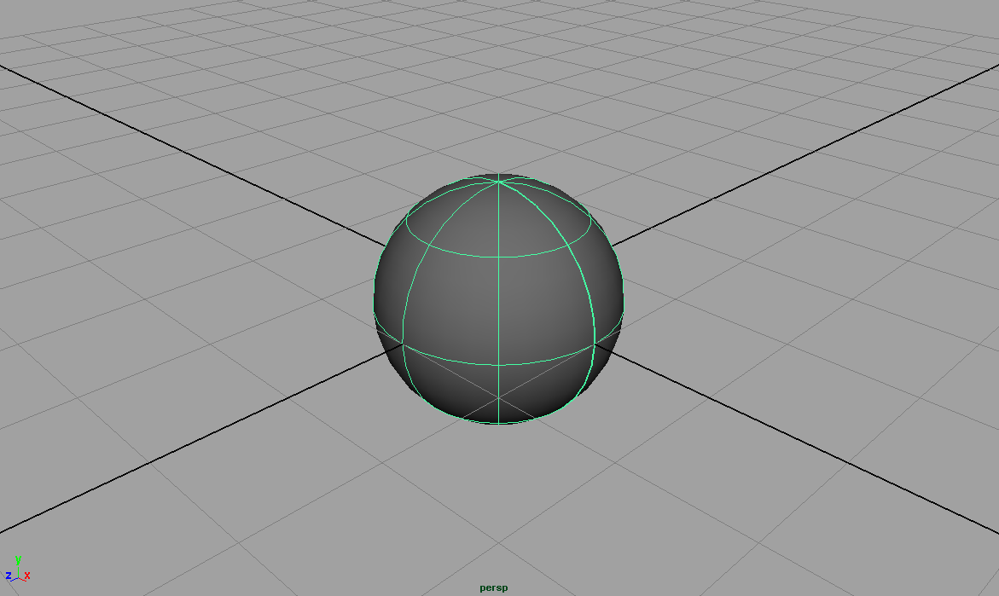

#### Polygon Objekte

Bei Polygon-Objekten wird beim Benutzen der Taste 2 (Smoothing with Polycage), oder 3 (Smooth Mesh Preview) ein Preview Smoothing. Mit 1 kann man den ursprünglichen Zustand wiederherstellen.

Diese Einstellung hat einen Einfluss (bei den meisten Renderengines) auf den Rendervorgang.

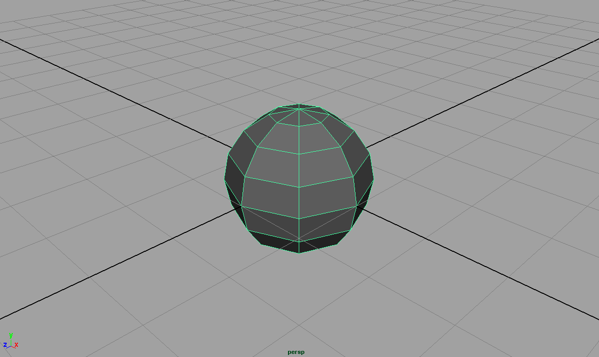

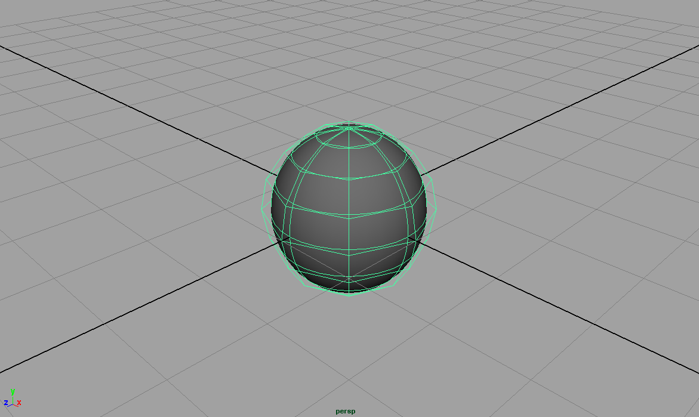

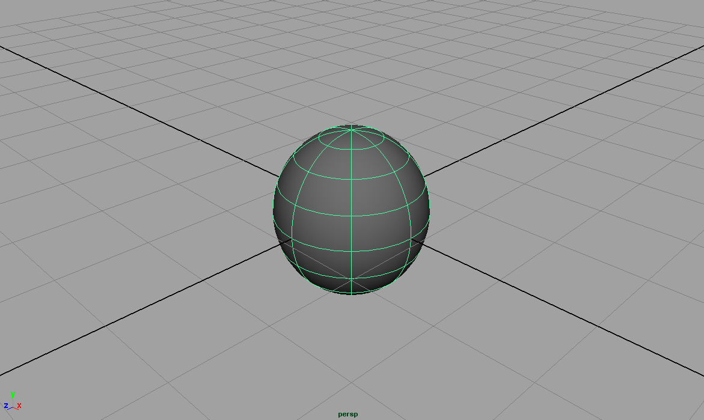

### Die Tasten 4 - 7

Am Anfang sind alle Panels von Maya im Shaded Modus (Taste 5). d.h. Maya stellt alle Objekte mit einer Oberfläche dar.
Als alternative kann man aber auch in die Gitteransicht wechseln (4). Taste 6 wechselt in den Modus Shaded with Texture.
Hat man dem Objekt eine Textur dem Objekt zugewiesen so lässt sich eine Vorschau mit der Taste 6 anschalten.
Sind Lichter in der Szene vorhanden lässt sich eine Vorschau der Lichter mit der Taste 7 aktivieren.

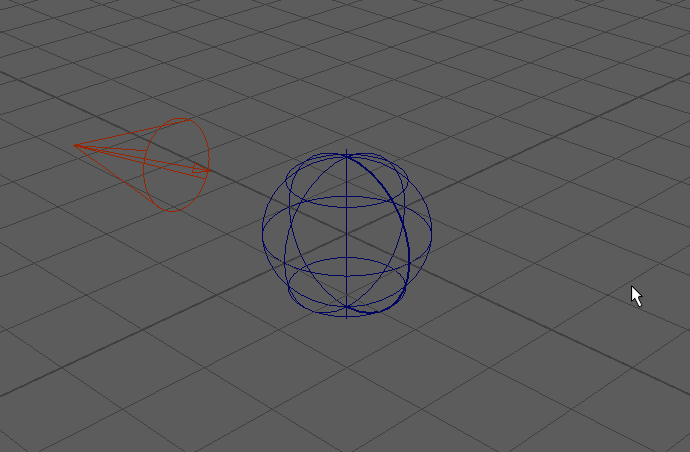

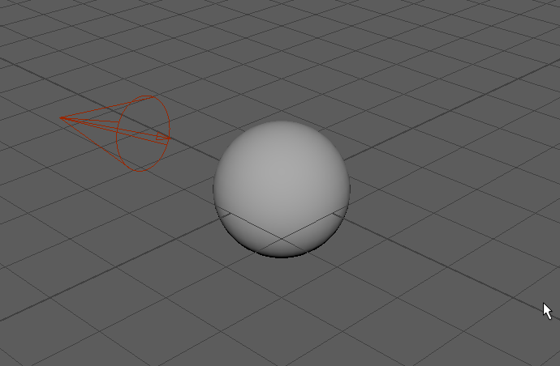

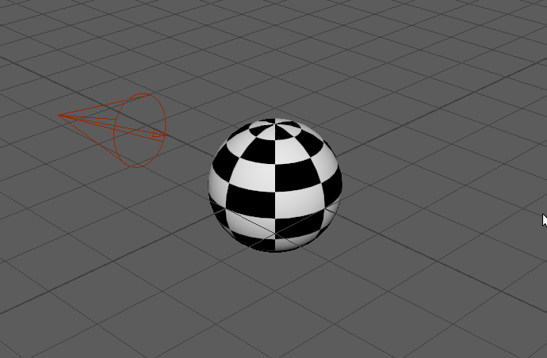

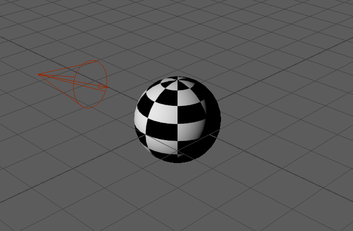

## Eigene Tastaturkürzel

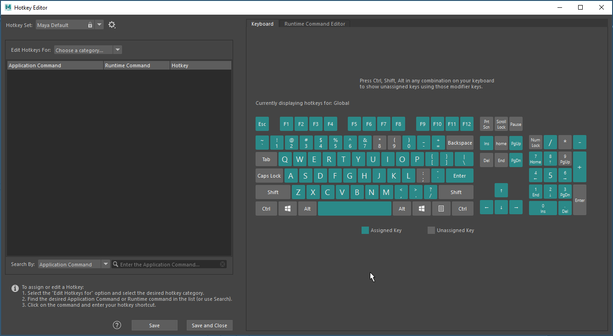

Falls man nicht mit den Standard-Keyboard shortcuts zurecht kommt, kann man in dem Hotkey Editor
(Window > Setting and Preferences > Hotkey Editor) sich sein eigenes Tastaturlayout anlegen.

Wechselt man den Workspace, muss man ggf. sein eigenes Tastaturlayout nochmals aktivieren.
