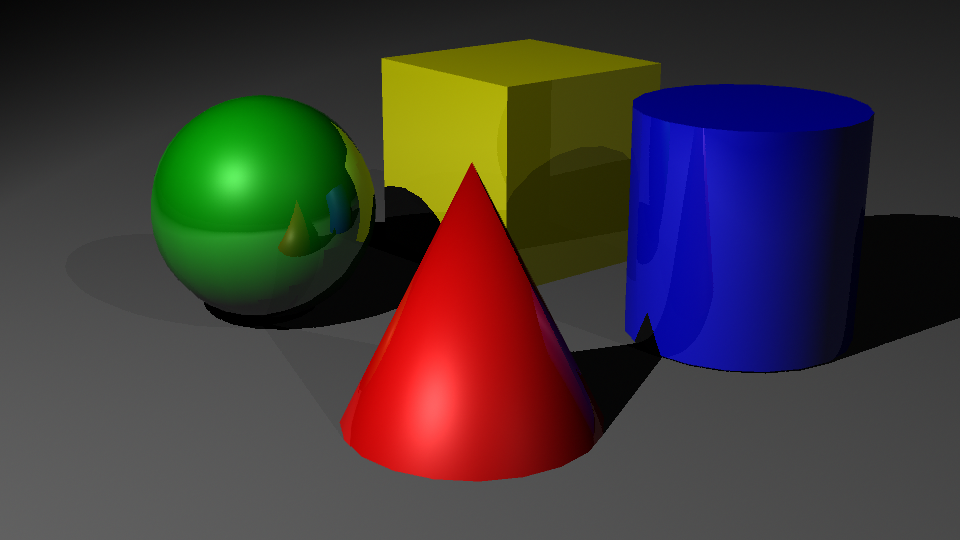
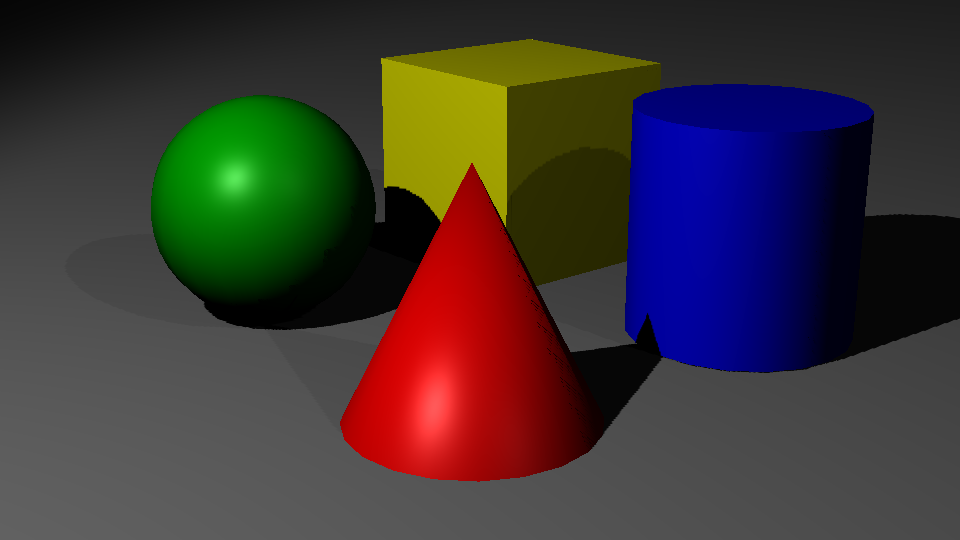
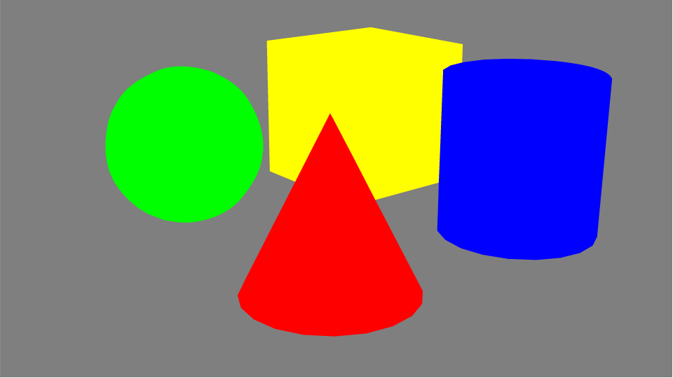
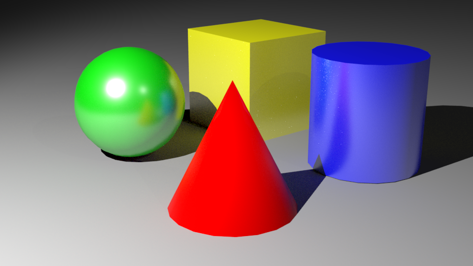
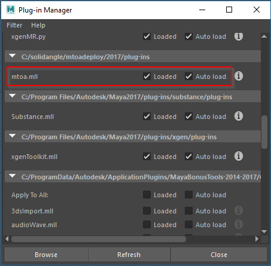

Um das Modell zu renderen wird das modell mithilfe einer Renderengine ausgerendert. Maya kann das Modell zu vielen verschidenen renderengines schicken. Wir werden "Solidangle Arnold" für unsere Animation verwenden.

## Mayas Standard Render Engines

Maya hat stellt neben Arnold noch weitere Render Engines zur Verfügung.

### (Legacy) Maya Software

Maya Software ist ein Hybrid Renderer der die Geschwindigkeitsvorteile eines Scanrenderers mit echtem Raytracing verbindet.
Wie der Name bereits andeutet wird beim Rendern nur die CPU verwendet.
Generell hat die Qualität des Bildes höhere Priorität als die Geschwindigkeit des ausrenderns.
Da dies eine native Maya Render Engine ist, kann sie auch z.B. Paint Effects direkt ausrendern.

**Verwendung:** Möchte man 3D Bilder wie um 1990 erstellen benutzt man diesen Renderer.
Die Konfiguration und Nutzung von diesem Renderer is sehr kompliziert und verglichen mit modernen Render Engines ist Maya Software sehr langsam.

Weitere Informationen:

- [Maya Software Hilfe Datei](http://help.autodesk.com/view/MAYAUL/2016/ENU//?guid=GUID-A0ACB70C-2E74-4BAD-AFDD-1D49A8B34EF2)

### Maya Hardware / Maya Hardware 2.0

Im Grunde ist es ein hardwarebeschleunigter Allzweck Renderer. Ungleich wie Maya Software wird das Bild mithilfe der Grafikkarte errechnet dadurch wird das Bild im Allgemeinen schneller berechnet.
  
Insbesondere das Ausrendern von Partikeleffekten kann dadurch stark beschleunigt werden.
Doch der Hardware Renderer kann keine Sub-D Objekte rendern und weitere Limitationen (z.B. wird IPR Rendering nicht unterstützt).

**Verwendung:** Man kann den Hardware Renderer für das Rendern von Partikeln einsetzen und einen weiteren Renderer für das Rendern von Objekten.
Die resultierenden Bilder werden dann mithilfe von einer Compositing Software zusammengefügt.
  
Weitere Informationen:

- [Maya Hardware 2.0 Hilfe Datei](http://help.autodesk.com/view/MAYAUL/2016/ENU//?guid=GUID-C4C61535-DC63-4ED6-89F0-3F4B37513F65)

### Maya Vector

Man kann nicht nur Pixel Bilder errechnen, sondern auch Vector basierte Bilder. Mit diesem Renderer kann man Bilder für Illustrationen oder Blaupausen des Modells zu erstellen.

Dieser Renderer unterstützt zusätzliche Formate wie Scalable Vector Graphics (SVG), Adobe Flash (SWF), Adobe Illustrator (AI) oder Postscript (EPS). Somit kann man diese Bilder mithilfe von z.B. Adobe Illustrator nachbearbeiten.

Falls Maya Vector nicht zur Verfügung steht muss das Plugin "VectorRenderer.mll" geladen werden.

**Verwendung:**

Weitere Informationen:

- [Maya Vector Hilfe Datei](http://help.autodesk.com/view/MAYAUL/2016/ENU//?guid=GUID-973D2F51-EB45-49FF-8767-6DE669A2CA5D)

### SolidAngle - Arnold

Weitere Informationen:

- [Arnold User Guide](https://support.solidangle.com/display/AFMUG/Arnold+for+Maya+User+Guide)

## Weitere Render Engines

Es gibt noch weitere Render Engines für Maya, für diese muss meist eine kostenpflichtige Lizenz erworben werden.
Studios setzen gerne Render Engines ein die sehr beliebt sind, sehr schnell und ein hoch qualitatives Bild erzeugen.

| Render Engine                                                              | Anmerkung                                                                                                                                                                                |
| -------------------------------------------------------------------------- | ---------------------------------------------------------------------------------------------------------------------------------------------------------------------------------------- |
| [Nvidia - Mental Ray](http://www.nvidia.com/object/nvidia-mental-ray.html) | Vor Maya 2017 war Mental Ray integriert als Standard Render Engine. (kostenfrei für non-commercial Projects)                                                                             |
| [Chaos Group - V-Ray](https://www.chaosgroup.com/vray/maya)                | Hat eine hohe Beliebtheit wegen der einfachen Konfiguration und schnellen guten Ergebnissen                                                                                              |
| [Pixar - Renderman](https://renderman.pixar.com/)                          | Die Renderengine die Pixar für ihre Filme verwendet. Liefert sehr gute Ergebnisse. Insbesondere durch die kostenfreie Community Edition hat die Renderengine einen hohe Bekanntheitsgrad |
| [RedShift](https://www.redshift3d.com/)                                    | Eine high speed GPU Render Engine                                                                                                                                                        |

## Arnold Installation

Arnold wird bei der Maya Installation mit installiert.
Es wird als Plugin in Maya geladen. Um Arnold zu verwenden,
muss man unter Window > Settings and Preferences > Plug-in Manager das Häkchen
für "mtoa.mll" bei "Loaded" und "Auto Load" gesetzt sein.

Manchmal wenn Maya abstützt lädt Maya nicht mehr alle Plug-Ins und dann steht Arnold nicht mehr zur Verfügung.
Mit dem Plug-In-Manager kann man Arnold dann nochmals laden.

## Render Engine als Standard Renderer einstellen

Standardmäßig ist Arnold ist als Standard Renderer definiert.
Falls das nicht der Fall sein sollte muss man unter Window > Settings and Preferences > Preferences
in der Kategorie **Settings - Rendering** bei "Prefered Renderer" Arnold auswählen.

Falls Arnold nicht mehr zur Verfügung steht (Plugin nicht geladen, Deinstalliert)
wird Maya den Maya Software Renderer verwenden.
