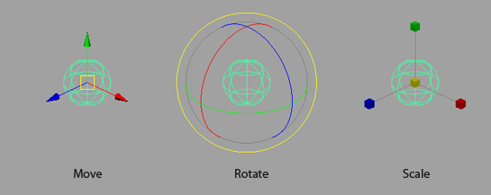
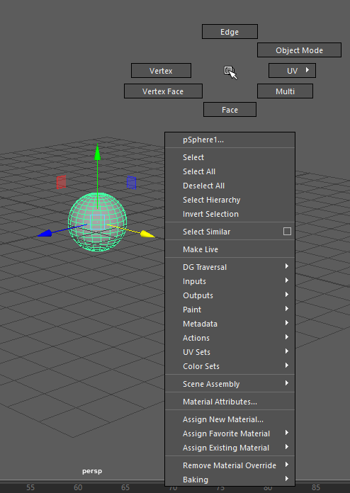

## Koordinatensysteme

Viele 3D-Programme benutzen ein kartesisches Koordinatensystem. Der Ursprung liegt im Punkt XYZ (0,0,0).
Die Startperspektive von Maya zeigt ein kleines Koordinatengitter (Grid) welches die XZ-Ebene auf dem NullPunkt repräsentiert.
Die positiven Y-Werte sind über der XZ-Ebene.

Unten rechts sehen wir die Achsen von dem Raum, X (rot), Z(blau) und Y (grün).
Die Y achse zeigt nach oben. Wir sehen den Raum durch die Camera "persp" und sehen ein Gitter was den "Boden" bzw. eine XZ Ebene mit Y=0.

## Maya Nodes

In Maya wird jedes Element (Kurven, Polygon-Objekte, Texturen, etc.) als Node bzw. als Netzwerk von verbundenen Nodes repräsentiert. Man kann sich die Nodes visualisieren lassen im Hypergraph. Shading Nodes werden im Hypershade visualisiert. Um Werte von Nodes zu verändern benutzt man den Attribute Editor oder die Channel Box.
Eine neu erzeugte Nurbs-Sphere hat vier Nodes (Create > Nurbs Primitive > Sphere):

1. Transform Node:Speichert alle Translationen, Rotationen und Skalierungen
1. Shape Node: Verwaltet alle Eigenschafften über das Aussehen des Objekts
1. Input Node: Enthält Informationen wie die Geometrie erzeugt wurde
1. Shading Node: Verwaltet die Material-Eigenschaften für den Render-Prozess

Beim Duplizieren (STRG-D) eines Objekts werden nicht die Input Nodes dupliziert! Als Alternative muss man Edit > Duplicate Special mit der Option „Duplicate Input Connections“ verwenden.

Eine alternative Darstellung im 3D-Raum ist die orthografische Ansicht, dies entspricht z.B. Blaupausen. Alle Projektionsstrahlen sind parallel zueinander. In Maya entspricht das der „Top“, „Side“ und „Front“-view.

[Oben links: „top-View“, Oben rechts: Perspective-View(„persp“) Unten links: „front-View“, Unten rechts: Side-View //TODO]01_Grundlagen/ArbeitenIm3DRaum/FourView.png

## Marking Menus

Maya bietet viele sogenannte Marking Menus. Diese sind im kontextabhängige Popup-Menüs, zeigen also je nach dem was man gerade Selektiert hat unterschiedliche Elemente an.

Wir öffnen solche Menüs mit der RMB und halten diese gedrückt. Um einen Befehl auszuführen ziehen wir die Maus in Richtung des Befehls und lassen die Maustaste wieder los.
