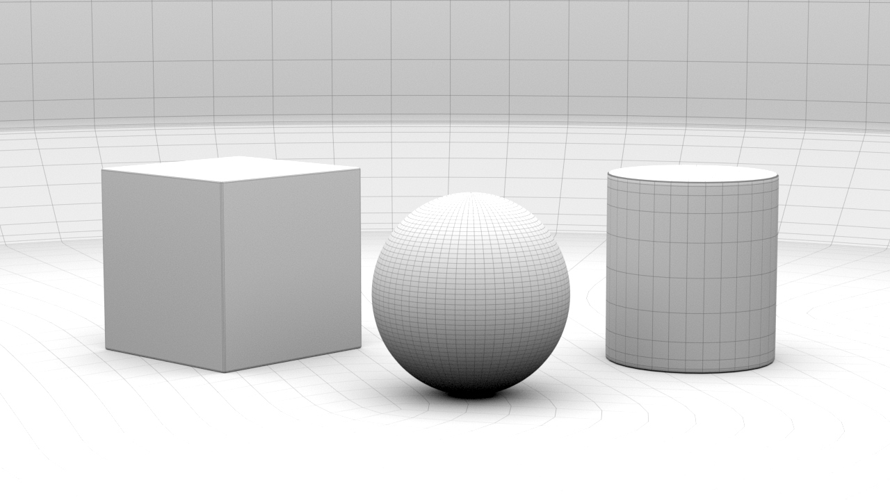

Zunächst brauchen wir Objekte. Diese müssen wir durch modellieren erschaffen. Bei dem Modellieren designen wir und erschaffen jedes einzelne Objekt was später in der Animation zu sehen ist.
Es gibt mehrere Ansätze um Objekte zu erzeugen:

- **Spline-Modelling (bzw. NURBS Modelling)**:
  Man zeichnet Kurven und erzeugt Flächen zwischen ihnen.

- **Box-Modelling**:
  Man manipuliert ein Primitiv (Sphere, Cube, Cylinder, Cone, etc.) solange bis es die gewünschte Form hat. Man fügt immer mehr Polygone hinzu, je nach Bedarf.

- **Sculpting / Clay-Modelling**:
  Im Prinzip fängt man mit einem Objekt an was viele Polygone hat und verformt es nach und nach zu dem Objekt was man sich wünscht, ähnlich wie wenn man mit Ton eine Skulptur anfertigt.

- **Procedual Modelling**:
  Man versucht ein Objekt mit mathematischen Parametern zu beschreiben, damit man danach eine Vielzahl von Variationen von dem Objekt erstellen kann. z.B. könnte die Höhe einer Säule ein Parameter sein, und durch verändern des Parameters könnte man eine Vielzahl von verschiedenhohen Säulen erstellen.

Es gibt auch Möglichkeiten 3D Objekte zu erzeugen ohne zu Modellieren.

- **3D Scanner**: Das sind Geräte die ein Objekt von allen Seiten abmessen und ein 3D Modell aus den Daten generieren. Mehr Informationen: [https://en.wikipedia.org/wiki/3D_scanner](https://en.wikipedia.org/wiki/3D_scanner)

- **Photogrammetry**: Mit einer Kamera macht man Fotos von verschiedenen Blickwinkeln und benutzt eine Software um aus den Photos ein 3d Objekt zu errechnen. Mehr Informationen: [https://en.wikipedia.org/wiki/Comparison_of_photogrammetry_software](https://en.wikipedia.org/wiki/Comparison_of_photogrammetry_software)
