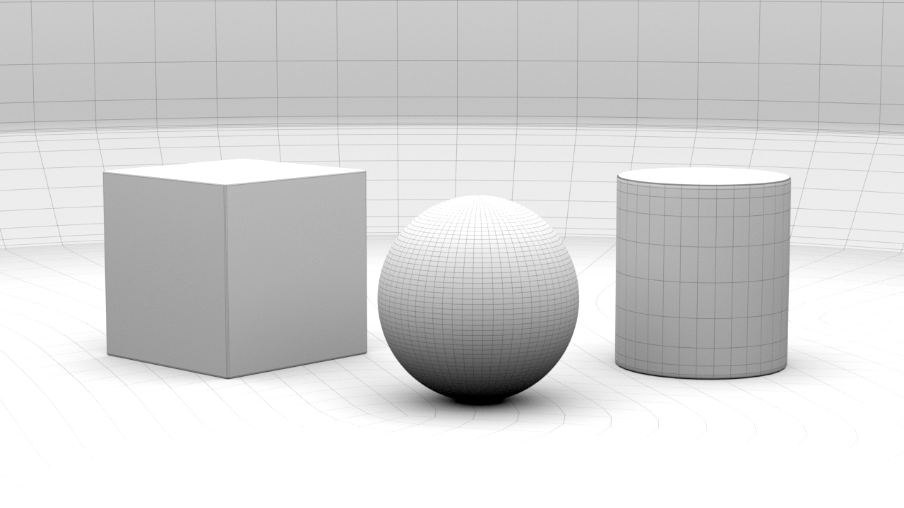

# Modelling: NURBS

Beim Curve-Modelling (auch Spline-Modelling genannt) zeichnet man die äußeren Kanten eines Objekt, wie in einer Blaupause und erzeugt dann Flächen zwischen diesen Kurven.
Diese Technik wird insbesondere dann genutzt wenn man präzise bestimmen möchte wie ein Objekt auszusehen hat.

Die Surface Tools von Maya nutzen das mathematische Modell namens Non-uniform rational basis spline, kurz NURBS. Insbesondere CAD Programme verwenden NURBS Geometrie.
Alle komplizierten mathematischen Berechnungen macht Maya im Hintergrund und man konzentriert sich nur auf die Form der Kurve.

In diesem Kapitel sollst du lernen:

- Wie man 3D Kurven zeichnet mit den Curve Tools
- Grundlagen von NURBS Objekten
