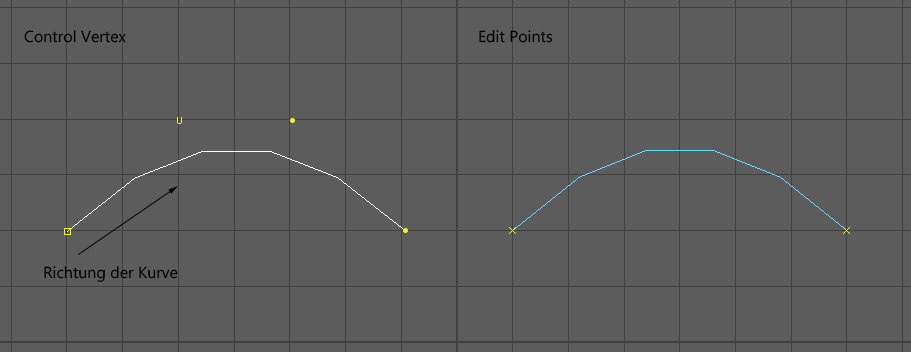
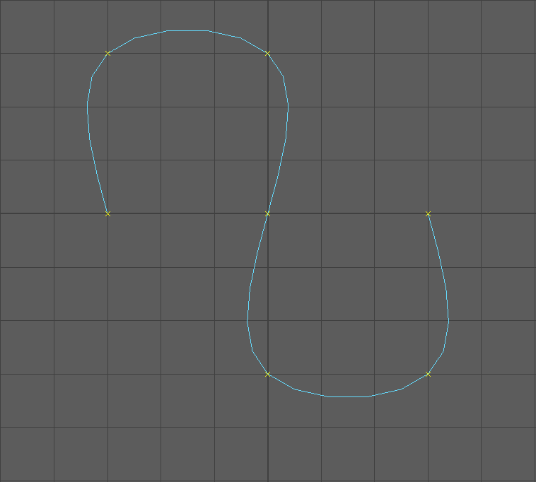
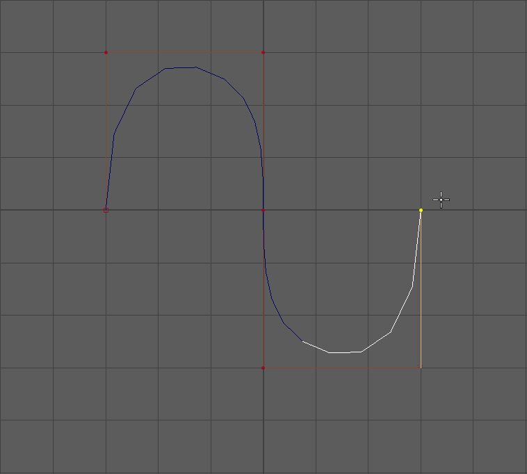
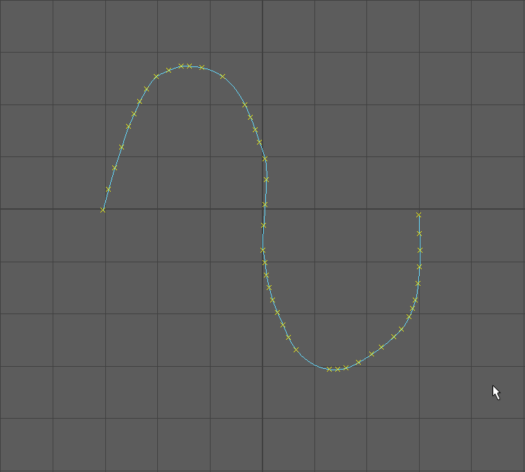
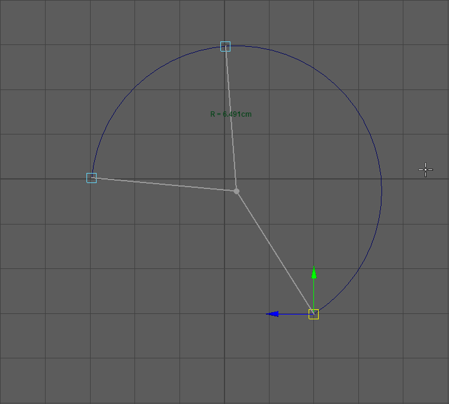
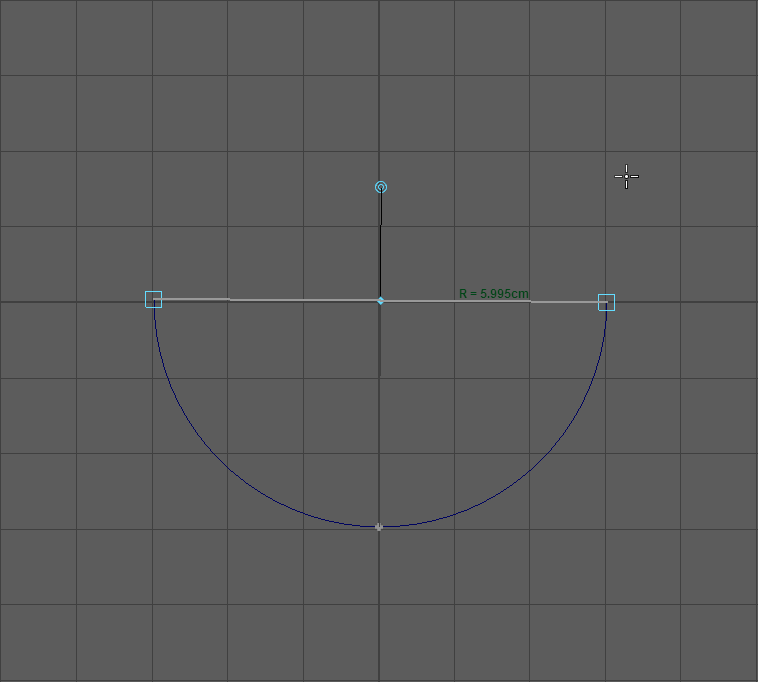
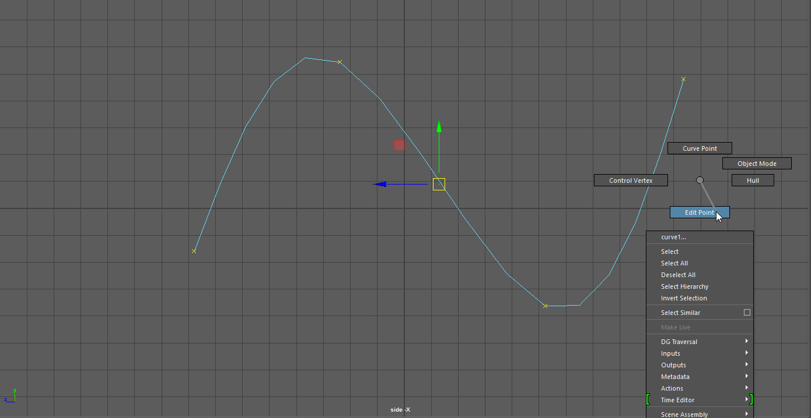
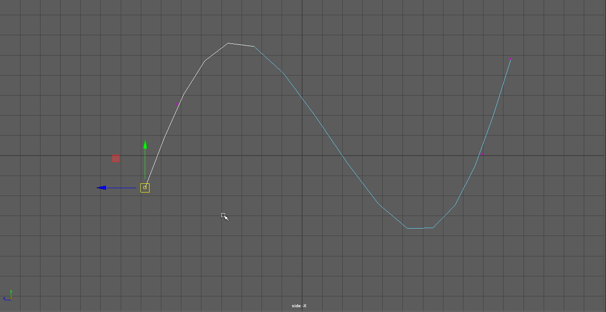
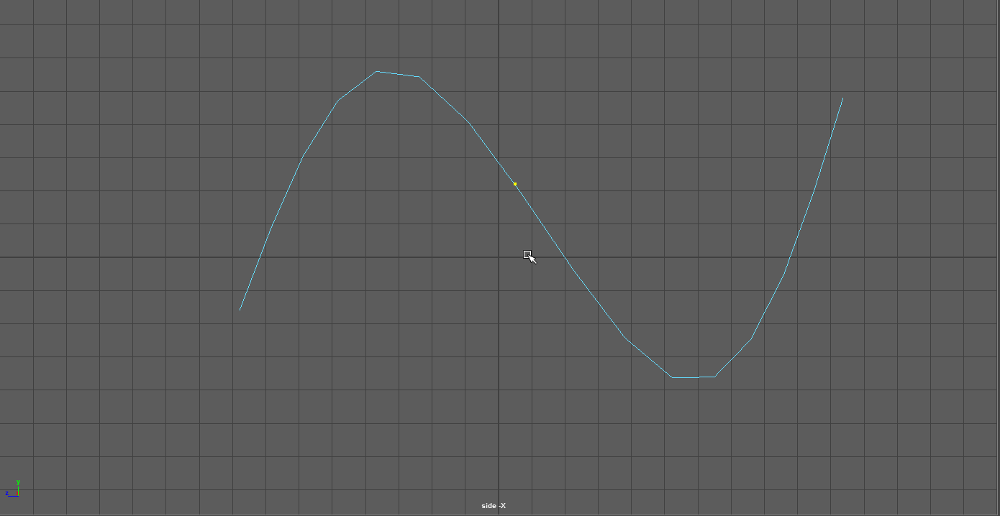

Kurven in Maya kann man für viele verschiedene Dinge verwenden.
Sie sind die Grundlage des Modellierens mit NURBS Surface Werkzeugen, finden aber auch ihren Einsatz mit z.B. dem Polygon Extrude Tool,
beim Rigging verwendet man sie um Pfeile für das Rig zu erstellen, in der Animation benutzt man sie um z.B. eine Pfadanimation zu erstellen.

## Arten von Kurven

Es gibt zwei Möglichkeiten um eine Kurve in Maya zu zeichnen, die NURBS Curves und die Bezier Curves.

Bezier Kurven sind leichter handzuhaben als NURBS Kurves und werden nicht nur zum Modellieren verwendet sondern auch im Graph Editor bei der Animation, daher werden werden uns primär mit Bezier Curves auseinandersetzen.

## 3D Kurven zeichnen

Bei dem setzen von Punkten für die Kurve, kann man nur Punkte auf eine Ebene, also eine 2D Kurve zeichnen. Danach wechselt man in eine andere Ansicht und manipuliert die Punkte, sodass sie die Information aus dem fehlenden Achse erhalten.

Man verwendet immer eine orthographischen Ansicht (top, side, front). Zeichnet man in einer perspektivischen Kamera, werden die Punkte auf der XZ Ebene gesetzt. Verändert man die Position der Kamera sieht man das die Kurve perspektivisch verzerrt wurde.

## NURBS Curve

Die NURBS Curve besteht aus "Edit Points (EP)", durch die die Kurve verläuft und "Control Vertex (CV)" Points, die die Krümmung der Kurve definiert.
Man bezeichnet die Linie zwischen zwei Edit Points als "Span".

Eine NURBS Kurve merkt sich auch was der Anfang und das Ende der Kurve ist, diese bestimmen die Richtung der Kurve, was einen Einfluss auf die Surface Tools hat.
Die Richtung der Kurve kann man im CV Modus ermitteln, in diesem Modus werden die ersten beiden CVs als hohle Quadrate dargestellt.

### NURBS Curve erstellen

NURBS Curves werden erstellt mithilfe des Menüs Create > Curve Tools.
Sie können auf zwei verschiedene Arten erstellt werden:

- **EP-Curves:** Beim Erstellen der Kurve werden die Edit Points gesetzt, es müssen mindestens zwei Punkte gesetzt werden damit eine Curve gezeichnet wird, es werden die CV Punkte automatisch generiert.
- **CV-Curves:** Beim Erstellen der Kurve werden die Control Vertex Points gesetzt, daher müssen mindestens 4 Punkte gesetzt werden damit eine Curve gezeichnet wird.

#### NURBS Curve zeichnen

Bei dem EP-Curve oder CV-Curve setzt man die Punkte mit LMB ist man fertig mit der Kurve so muss einmal Enter gedrückt werden um den Zeichenmodus zu beenden.

In der Praxis benutzt man für das zeichnen von komplexen NURBS Curves das "CV-Curve" Tool, da man beim setzen der Punkte die Krümmung definiert wird.
Beim EP-Curve Tool wird die Krümmung erst nach setzen des Punktes generiert und bei dem setzen von einem neuen Punkt wird die Krümmung des vorhergehenden Spans angepasst.
So ist das Ergebnis des Tools unvorhersehbar und eignet sich nur für eine einfache gerade Linie, definiert durch zwei Punkte.

Kurven werden immer in einer orthographischen Ansicht (also die "top", "side" und "front" View) gezeichnet und dann ggf. in der 3. Achse angepasst.
Man sollte es vermeiden in einer perspektivischen Ansicht Kurven zu zeichen, da alle Punkte auf der XZ-Ebene gesetzt werden
was zur Folge hat das die Kurve perspektivisch verzerrt gezeichnet wird.

### Weitere Werkzeuge

#### Pencil Tool

Mit diesem Werkzeug kann eine Freihand Curve gezeichnet werden. Man muss LMB gedrückt halten,
die Curve zeichnen und mit loslassen der Taste wird die Curve erstellt.
Dieses Tool generiert meistens eine hohe Anzahl von EPs und erschafft eine sehr ungenaue Curve, was das spätere arbeiten mit der Curve erschwert.

Man kann die Curve glätten und die Anzahl der EP reduzieren mit dem Edit Curves > Rebuild Curve Werkzeug.

#### Three Point Circular Arc

Mit diesem Werkzeug kann man ein Kreissegment erstellen. Man definiert drei Punkte und es wird eine Kreislinie zwischen diesen Punkten erstellt.

#### Two Point Circular Arc

Auch dieses Werkzeug erstellt ein Kreissegment. Man definiert den Anfang und das Ende des Kreises und es wird ein Halbkreis erstellt. Durch klicken auf den Modifier kann man bestimmen ob das Kreissegment über oder unterhalb der beiden Punkte erstellt wird. Zusätzlich lässt sich der Mittelpunkt des Kreises verschieben um ein anderes Kreissegment zu erhalten.

#### Circle

Mit Create > NURBS Primitives > Circle lässt sich ein Kreis erstellen.

#### Square

Mit Create > NURBS Primitives > Square lässt sich ein Quadrat erstellen. Ähnlich wie beim NURBS Box wird hier eine Gruppe von geraden Linien erstellt und sollte deswegen gemieden werden.

## Curves Components

Eine Curve besteht wieder aus seinen eigenen Komponenten die man anpassen kann.

- Edit Point (EP)
- Control Vertex (CV)
- Curve Point

Genau wie bei den Surface Objekten mit RMB auf das Objekt gedrückt halten, sieht man ein Marking Menu, und kann in den gewünschten Modus wechseln. Alternativ kann man die Kurve auch zuerst selektieren und dann irgendwo im Panel RMB drücken.

### Edit Point

Mit Edit Points kann man schnell abzählen aus wievielen Spans eine Kurve besteht. EPs werden als "x" dargestellt um sie von CVs zu Unterscheiden.
Man kann ihre Position mit dem Move Tool (W) verändern. Da es ein einzelner Punkt ist haben das Rotate und Scale Tool keinen Einfluss auf den Punkt.

Erzeugt man eine Surface aus der Kurve, werden aus den EP Points, Isoparms.

### Control Vertex

Wie bei den Surface Objekten beinflussen die CVs indirekt die Form der Kurve.

Bei Curves werden zusätzlich der erste CV als hohles Quadrate angezeigt, um den Anfang der Kurve zu verdeutlichen. Die restlichen CVs werden als kleine Kreise dargestellt.

Man kann ihre Position mit dem Move Tool (W) verändern. Da es ein einzelner Punkt ist haben das Rotate und Scale Tool keinen Einfluss auf den Punkt.

### Curve Point

Ein Curve Point ist ein selektierter Punkt auf der Kurve, der nicht verändert werden kann. (Ähnlich wie der Isoparm Modus bei Surfaces)

Man kann mit Edit Curves > Insert Knot diesen Punkt als Edit Point der Kurve hinzufügen. So erhält man einen neuen Edit Point und die entsprechende Anzahl von CVs.

