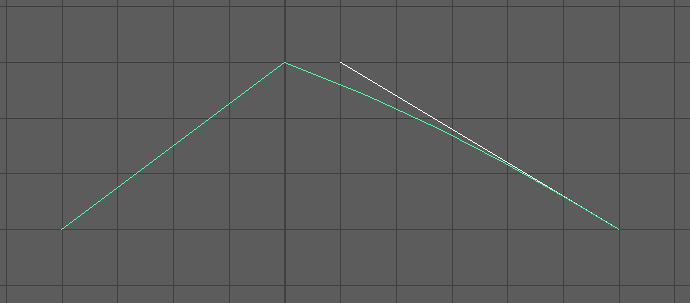
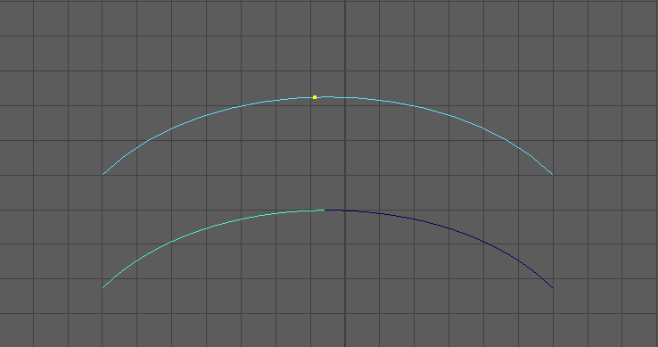
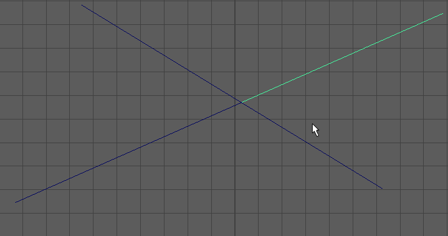
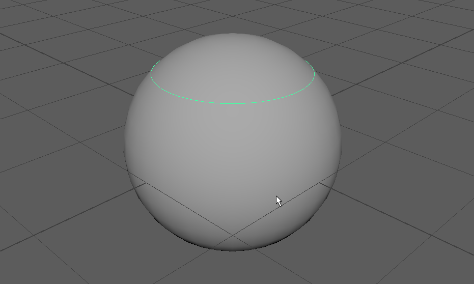

Wir schauen uns nun die Werkzeuge an mit denen man Curves manipulieren kann.
Hier ist eine Auswahl an häufig benutzten Curve Tools.
Alle Befehle findet man im Menü Curves.

## Attach Curves

Mit "Attach Curves" kann man mehrere Kurven zu einer einzelnen Kurve zusammenfügen. Die Reihenfolge in der die Kurven selektiert werden vor allem in größeren Verbänden spielt eine Rolle. Es wird immer das Ende der ersten Kurve mit dem naheliegensten Start- bzw. Endpunkt der nächsten Kurve verbunden.

In den Optionen lassen sich zwei Modi auswählen:

Im Modus „Blend“ werden beide Kurven ineinander übergeblendet.
Der „Blend Bias“-Faktor stellt eine Gewichtung dar, welche der beiden ausgewählten Kurven von den Veränderungen weniger beeinflusst wird. Ein Wert von 0.5 lässt beide Kurven gleichviel manipuliert werden. Bei einem Faktor von 1.0 wird die erste Kurve gering beinflusst, bei 0.0 entsprechend die zweite. Falls das nicht den gewünschten Effekt erzielt kann man auch höhere Werte als 1.0 bzw. niedrigere Werte als 0.0 benutzt werden.

Im Modus „Connect“ wird die erste Kurve vollkommen unberührt gelassen und die zweite Kurve
wird verformt um eine direkte Verbindung zum Endpunkt der ersten Kurve herzustellen.
In vielen Fällen führt das zu einer sehr spitzen verbindung um einen sanfteren Übergang
zu bekommen kann man das Häckchen bei „Keep Multiple Knots“ gesetzt werden.

Die Option "Keep Originals" stellt sicher dass die ursprünglichen Kurven erhalten bleiben und eine neue Kurve wird erzeugt. Meistens werden die ursprünglichen Kurven meist nicht mehr benötigt werden kann man die Option deaktiveren.

## Detach Curves

Mit „Detach Curves“ kann man eine Kurve durchtrennen (nicht zu verwechseln mit Cut Curves).
Um das Tool zu verwenden muss man zunächst einen "Curve Point" oder einen "Edit Point" auf der Kurve selektieren (Q).Dann kann man im Menü „Detach Curves“ auswählen.

## Cut Curves

Zwei Kurven können mittels „Cut Curves“ an ihrem Schnittpunkt getrennt werden. Es entstehen dementsprechend vier Kurven.
Open/Close Curves
Mit Open/Close Curves wird die Kurve zu einem Kreis geschlossen.

## Duplicate Surface Curves

Selektiert man ein Isoparm auf einem Nurbsobjekt, so lässt sich dieses Isoparm als eigene Kurve extrahieren mit „Duplicate Surface Curves“.

