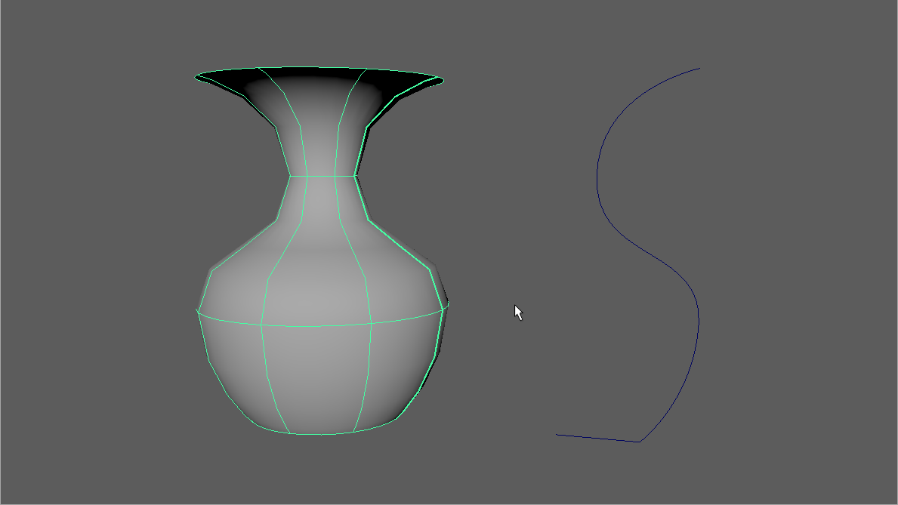
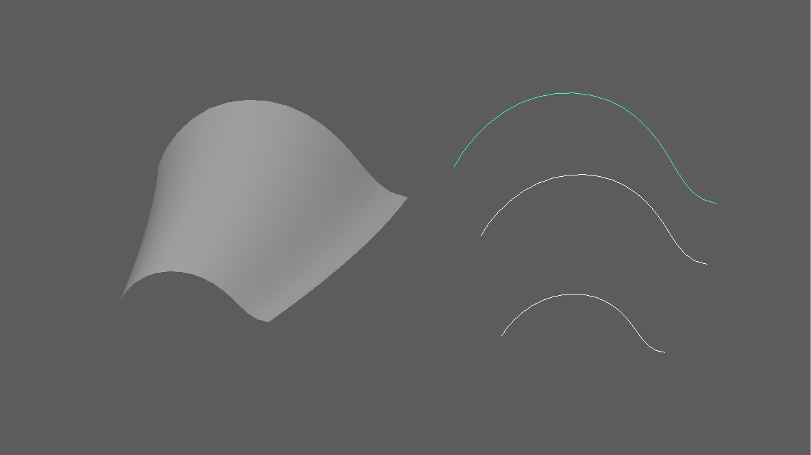
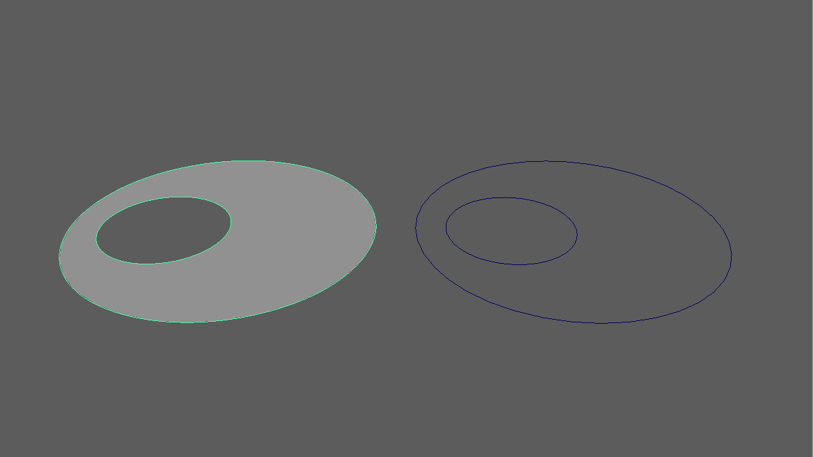
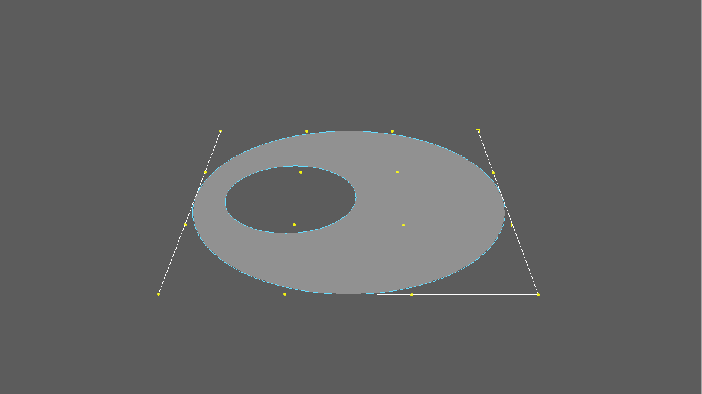
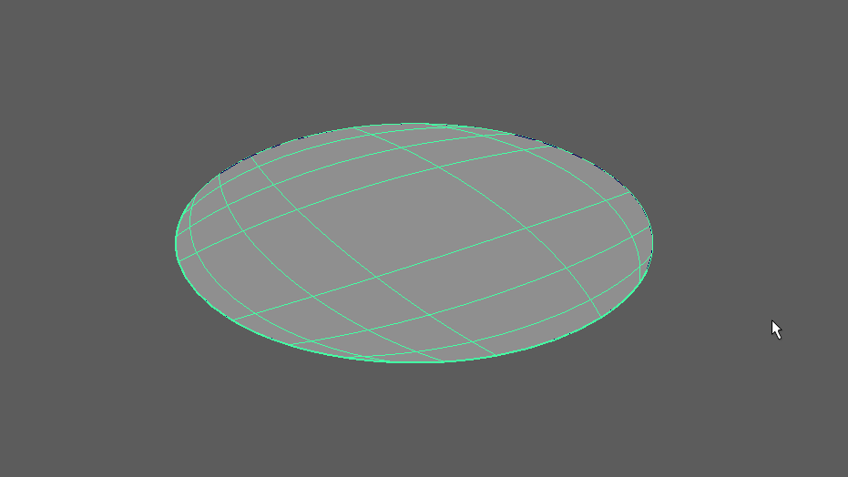
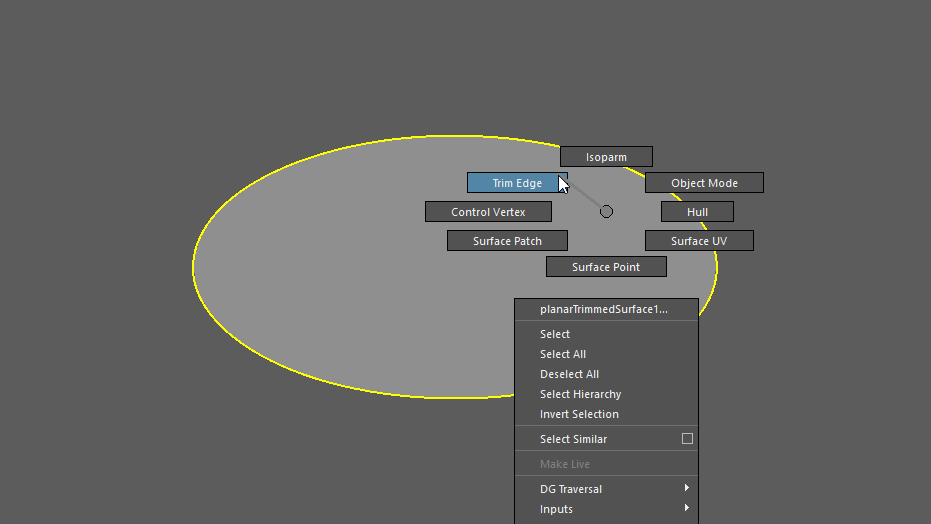
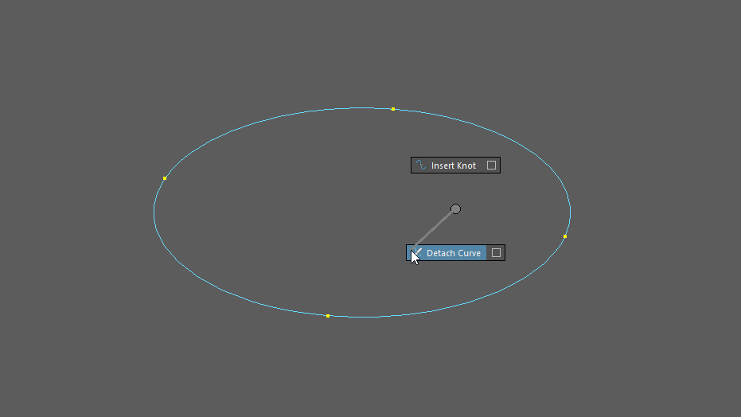

All diese Tools findet man im Modul „Surfaces“ unter Surfaces. Für eine bessere Übersicht in den Beispielbildern wurden die Objekte verschoben, um die Ursprungskurven sichtbar zu machen.

Die Surface Tools erzeugen automatisch einen Construction History-Node.
Die Kurven sind dann mit der Geometrie verbunden.
Verändert man die Kurven wird automatisch die Geometrie neu berechnet mit der neuen Kurve.
Wünscht man diese Verbindung zu trennen, selektiert man die Geometrie und wählt
Modify > Delete by Type > Construction History (Strg-Alt-D)

## Revolve Tool

Das Revolve Tool rotiert eine Kurve um eine Achse um einen Schwingkörper zu erzeugen. Ein solcher Körper ist auch das NURBS Primitive Sphere. Um das Revolve Tool zu verwenden muss man eine Kurve ausgewählt haben. Die Kurve wird dann um eine Achse (Default y-Achse des Pivot Points) geschwungen. An den Editpoints der Kurve werden Isoparms erzeugt. Durch die Anzahl der „Sections“ wird die Zahl der Isoparms in U-Richtung festgelegt.

Standartmäßig wird ein Schwingkörper um die gesamte Achse also von 0°-360° erzeugt. Möchte man andere Werte eingeben öffnet man den ChannelBox Editor -> Input -> revolve und setzt neue Werte für „Start Sweep“ (Startwinkel) oder „End Sweep“ (Endwinkel).

Anmerkung: Der Schwingkörper ist vollkommen geschlossen, jedoch wird der Anfang der Fläche markiert als „Seam“ (als dickere Isoparmlinie angezeigt). Man kann den Seam verschieben indem man einen anderen Isoparm selektiert und „Edit Nurbs > Move Seam“.

## Loft

Ein Loft erzeugt eine Fläche zwischen mindestens zwei Kurven.
Sollen mehrere Kurven verwendet werden, ist die Reihenfolge in der sie selektiert werden von Bedeutung.
Beim erstellen der Geometrie wird jeder Edit Point mit einem Isoparm mit dem Edit Point der anderen Kurve verbunden. Man sollte darauf achten, dass die verwendeten Kurven über die gleiche Anzahl von Edit Points verfügen. Ansonsten erhält man eine ungleiche Verteilung von Isoparms auf dem neuen Objekt und kann zu Problemen führen. Um die Anzahl der Edit Points anzugleichen, ist Edit Curves > Insert Knot sehr hilfreich. (Siehe „Curve Point“ Seite )

## Planar

Ein Planar ist eine Fläche, die definiert wird durch eine in einer Ebene liegende geschlossene Kurve (z.B. Kreise, Rechtecke). Es ist auch möglich mehrere Kurven zu verwenden. Liegt eine Kurve innerhalb einer anderen Kurve, so wird das innere Objekt ausgeschnitten.

Ein Planar ist ein rechteckiges Nurbs Planar. Wenn man z.B. ein kreisförmiges Planar erzeugt, so ist es nur optisch ein Kreis. Man hat keine CV-Points um den Rand zu manipulieren. Der Kreis wurde auf die Fläche projeziert und dann mit dem Trim-Tool ausgeschnitten. Daher ist der Rand eines Planars kein Isoparm sondern eine Trim Edge.

Planar Objekte sollten vermieden werden. In manchen Situationen bieten sie aber eine schnellere und einfachere Lösung. Alternativ können Boundaries (Siehe „Boundary“ Seite ) verwendet werden.

## Extrude

Das Extrude Tool (im NURBS Menü) benötigt zwei Kurven, eine Profil und eine Pfadkurve. Erzeugt eine Fläche indem es eine Profil-Kurve entlang einer Pfad-Kurve gezogen wird. Die Reihenfolge wie man die Curves selektiert definiert dessen Aufgabe.
Hierfür gibt es drei Modi:

- Tube: Beide Kurven werden benutzt
- Flat: Die resultierende Geometrie wird als Fläche erzeugt
- Distance: Die Fläche wird nur aus einer Pfad-Kurve und einer gegebenen Distanz erzeugt. (ähnlich wie Tube Modus mit einer geraden Linie als Pfadkurve)

## Boundary

Ein Boundary besteht aus 3 oder 4 Kurven und interpretiert eine Fläche zwischen diesen Kurven. Um das beste Ergebnis zu bekommen sollte man die Endpunkte der Kurven direkt übereinanderliegen (mithilfe von Curve Snapping) und sollten die gleiche Anzahl von Edit-Points haben.

Möchte man eine Planar mit einem Boundry ersetzen, so muss man zunächst den Rand des Planars selektieren im Trim Edge-Modus.

### Schritt 1

Mit Curves> Duplicate Surfaces Curves erhalten wir eine Kurve.
Das Planar kann gelöscht werden

### Schritt 2

Auf dieser Kurve selektieren wir 4 Curve Points und durchtrennen die Kurve Curves > Detach Curves oder Shift-RMB > Detach Curves.

### Schritt 3

Wir müssen nochmals sicherstellen, das es 4 Kurvensegmente gibt, manchmal je nach position des Seams wird bei der Operation 5 Segemente erstellt. Falls ein zusätzliches exisitert mit Curves > Attach Curves zwei Kurven verbinden.

Nun haben wir die Richtige Anzahl von Kurven um ein Boundry zu erzeugen Surfaces > Boundry
