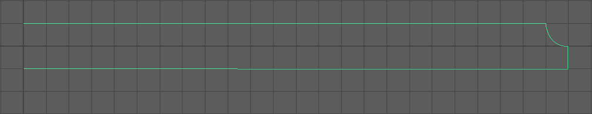

Wir werden nun einen Tisch erstellen auf dem wir das Weinglas abstellen können.

Hierfür werden wir diese Werkzeuge einsetzen:

- Bezier-Curve-Tool
- Revolve
- Extrude
- Duplicate

## Vorbereitung

Wir suchen uns Bilder von runden Cafe Tischen die meisten vor dem Cafe auf der Strasse stehen.
Dann analysieren wir den Tisch:
Ein Tisch besteht aus zwei Teilen, einer Tischplatte und Tischbeine.
Die Tischplatte ist Geometrisch gesehen ein Zylinder mit einem interessanten Profil und die Tischbeine sind mehrere identisch verformte Zylinder.
Anstatt einen Zylinder zu verformen werden wir uns das NURBS Extrude Tool verwenden.

## Modellieren

### Schritt 1: Tischplatte

Die Tischplatte modellieren wir mit der gleichen Technik wie das Weinglas.

Wir zeichnen als erstes die Profilkurve mit dem Bezier-Curve-Tool. (in der "side" View / side -X)

Um die spitze Kante zu erhalten, den linken Handle mit Strg zu einem 90° Winkel anpassen.

Nun können wir wieder mit dem Surfaces > Revolve die Geometrie erstellen.

Falls die Platte schwarz erscheint, dann zeigen die Normalen in die falsche Richtung.

Dies kann man korrigieren in dem man die Platte selektiert und Surfaces > Reverse Direction.

Speichern unter **Tisch_01.mb**

## Schritt 2: Tischbeine

Für die Tischbeine werden wir das NURBS Extrude Tool verwenden.
Das NURBS Extrude Tool benötigt zwei Kurven, eine Profil Kurve und ein Pfad.
Die Profilkurve wird dann entlang des Pfades gezogen um die Geometrie zu erzeugen.

Zunächst zeichnen wir die Pfad-Kurve mit dem Bezier-Curve-Tool tool (in der "side" View / side -X)

Als Profil-Kurve benutzen wir einen Kreis. Create > NURBS Primitives > Circle. Der Kreis wird innerhalb der Tischplatte erzeugt.
Um den Kreis zu sehen wechseln wir in den Wireframe-Modus 4.

Damit wir den Kreis einfach selektieren können und nicht versehentlich die Tischplatte selektieren, deaktivieren wir "Surface Selection".
Hierfür in der Status Line "Selection Mask Items" aufklappen und Surfaces deaktivieren.

Um das Extude Tool verwenden zu können müssen wir in der richtigen Reihenfolge die Profil und Pfad-Kurve selektieren.
Daher selektieren wir als erstes die ProfilKurve, mit dem Select Tool Q den Kreis selektieren anschließend mit Shift-LMB die Pfad-Kurve.
Nun erstellen wir den Extrude mit Surfaces > Extrude (option)

In den Einstellungen

Nun können wir wieder die "Surface Selection" aktivieren.

Falls das Tischbein schwarz erscheint selektieren und Surfaces > Reverse Direction.

Nun kann man die dicke des Tischbeins anpassen, indem man den Kreis skaliert R. Alternativ kann man die Werte ScaleXYZ auf einen Wert wie z.B. 0.75 setzen.

Speichern unter **Tisch_02.mb**

## Schritt 3: Beine duplizieren

Wir brauchen nun zwei weitere Tischbeine. Um diese zu erstellen, werden wir das fertige Bein duplizieren.
Mit Edit > Duplicate(Strg-D) wird eine Kopie des selektierten Objekts erstellt.
Die Kopie ist genau an dem gleichen Ort wie das Original und wird automatisch selektiert.

Wir selektieren das Bein und drücken Strg-D.
Das duplizierte Bein rotieren wir um 120° um die Y Achse. (ChannelBox **RotateY=120**)

Für das dritte Bein selektieren wir ein Bein und duplizieren es Strg-D.
Das duplizierte Bein rotieren wir um -120° um die Y Achse. (ChannelBox **RotateY=-120**)

Wir müssen aber nun feststellen, das die Rohre hohl sind.
Um einen Abschluss von den Tischbeinen zu erstellen, selektieren wir den äußersten Rand in "Isoparm" Mode
Mit Surface > Planar können wir einen einfachen Abschluss des Rohres hinzufügen.
Dies muss für jedes Bein wiederholt werden. (Wie gehabt, falls das Planar schwarz erscheint mit Reverse Direction die Richtung korrigieren)

Speichern unter **Tisch_03.mb**

## Abschließende Schritte

Um einfacher mit diesem Objekt zu arbeiten werden wir nun einige Abschließende Schritte durchführen.

## Unnötiges Löschen

Es können alle Kurven gelöscht werden. Hierfür kann man wieder in den "Selection Masks" Surfaces deaktivieren um die Kurven einfacher zu selektieren.

## Objekte Gruppieren

Wir selektieren alle Flächen des Tisches indem wir ohne ein Objekt selektiert haben RMB > Select all.

Wir gruppieren die Selektion mit Edit > Group (Strg-G) und benennen sie "Tisch" in der ChannelBox (Doppelklick auf den Namen "group1").
Hat man die Selektion der Gruppe bereits aufgehoben, kann man ein Objekt selektieren und mit der Pfeiltaste nach Oben die Gruppe selektieren.

Der Pivot Point der Gruppe wurde auf den Ursprung gesetzt, Mit gedrückter Taste D, kann man ihn zu dem Fuß des Tisches verschieben.
Mit dem Move Tool und gedrückter Taste X (Grid Snapping) können wir nun den Tisch an den Ursprung setzen.

## Größe des Tisches

Der Tisch muss nun auf seine reale Größe skaliert werden. Ein solcher Tisch hat eine Höhe von 74cm und eine Breite und Tiefe von 70cm.
Am einfachsten kann man die korrekte Größe Setzen indem wir zunächst einen Polygon Würfel (Create > Polygon Primitives > Cube) erzeugen mit diesen Maßen.

Diese Werte im ChannelBox eingeben:

| Attribute   | Value |
| ----------- | ----- |
| Translate Y | 37    |
| Width       | 70    |
| Height      | 74    |
| Depth       | 70    |

In der Side-View in den Wireframe Modus #[span.shortcut 4] und nun die Tisch Gruppe selektieren und mit dem Scale Tool R den Tisch solange skalieren sodass der Tisch in den Würfel passt.

Den Würfel kann man nun wieder löschen.

Nun ist das Objekt fertig, wir können nun mit Edit > Freeze Transformations den Transformation Node zurücksetzen ohne die Transformation zu verlieren.

Speichern unter **Tisch_final.mb**
