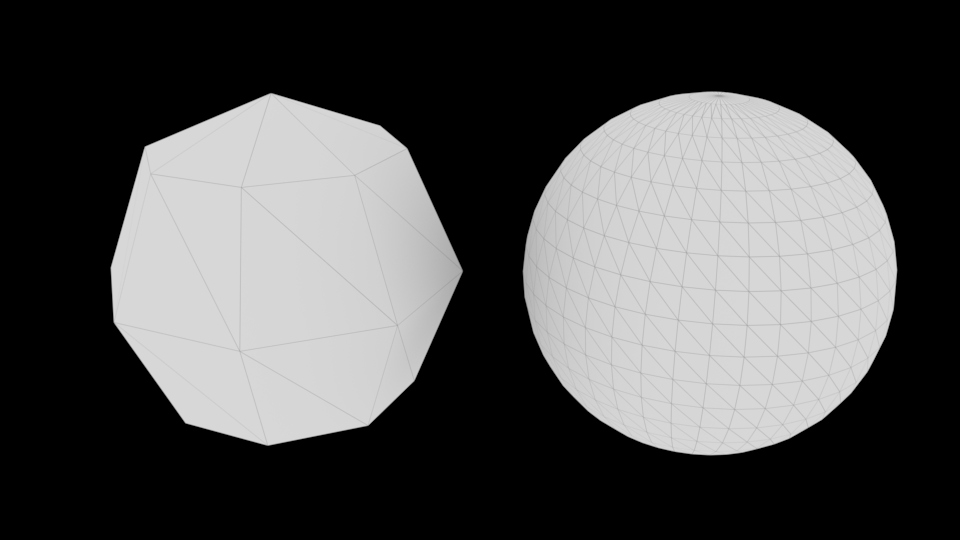

Für den Rendervorgang wird das NURBS Objekt automatisch in ein Polygon Objekt umgewandelt (Tesselation).
Leider passiert es in vielen Fällen dass ein Objekt „eckig“ statt rund gerendert wird.

Nun hat man die Möglichkeit die Tesselation anzupassen, oder das Objekt permanent von NURBS zu Polygon umzuwandeln.
In der Praxis wandelt man das Objekt immer in ein Polygon Objekt um.

## Anpassung der Automatischen Tesselation

Wir müssen zunächst ein NURBS Objekt selektieren. Dann können wir im Attribute Editor in dem Reiter Shape Node > Tesselation aufklappen.
Hier aktiveren wir "Display Render Tesselation" und "Enable Advanced Tesselation".
_(Advanced Tesselation liefert signifikant bessere Ergebnisse als Simple Tesselation)_

**Hinweis:** Mit Viewport 2.0 kann man die Veränderungen der Tesselation nicht sehen, man muss den Viewport Render auf "Legacy Default Viewport" oder "Legacy High Quality Viewport" wechseln.

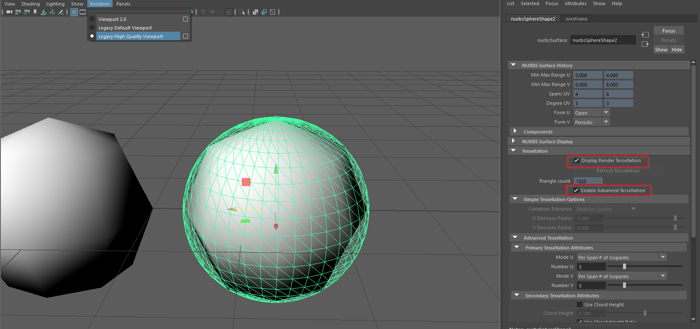

Die einfachste Art die Tesselation Einzustellen ist unter dem Abschnitt "Advanced Tesselation" > "Primary Tesselation Attributes"

Zunächst setzen wir die Grundwerte auf:

- Mode U: "Per Span # of Isoparms"
- Number U: 3
- Mode V: "Per Span # of Isoparms"
- Number V: 3

Dieser Modus sagt aus, das für jede Isoparm, 3 Polygon Edges angelegt werden.

Durch manipulieren der Regler für Number U bzw. V sieht man ob das Resultat besser oder schlechter wird.
Man sollte versuchen die beste Abrundung mit dem niedrigsten Wert zu erhalten, da hohe Werte in eine ineffiziente Szene resultieren und erhöhen merkbar die Renderzeit.

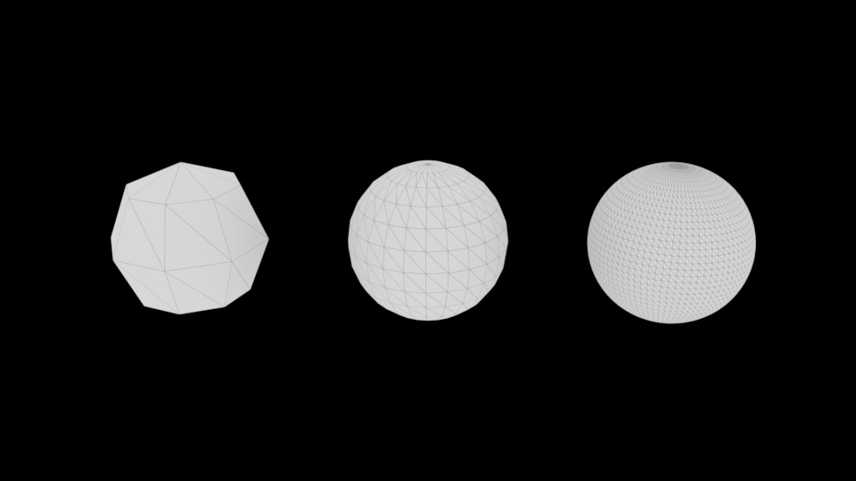

Am Ende sollte man wieder "Display render Tesselation" ausschalten.

## NURBS zu Polygon Umwandlung

Um NURBS Objekte in Polygon Objekte umzuwandeln wählt man Modify > Convert NURBS to Polygon.

Hier setzen wir die Grundwerte:

- Type: Quads (Weil man mit Quad Geometrie einfacher arbeiten kann)
- Tesselation method: General
- UType, VType: "Per span # of iso parms"
- UNumber, V Number: 3

Mit Edit > Save Settings können wir diese Einstellung als Standard Abspeichern. Diese Einstellung ist dann auch gültig für die Allgemeine Einstellung sowie die Surface Tools Einstellung.

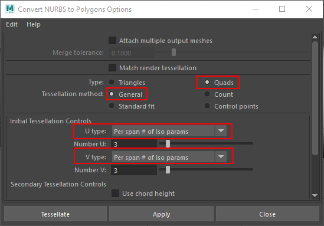

Um ein Objekt umzwandeln klicken auf den Knopf Tessellate. Nun können wir in der Channelbox bei den Inputs "nurbsTessellate" aufklappen und die Werte Number U und Number V anpassen (z.B. mit LMB auf dem Wert hin und her ziehen) und bekommen sofort eine Vorschau von der resultierenden Geometrie.

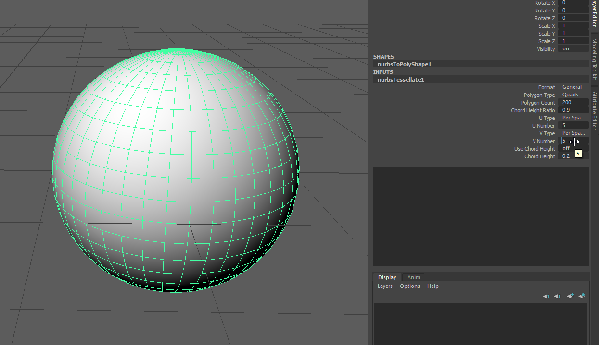

## Surface Tools Einstellungen

Für jedes Tool hat man die Möglichkeit in den Optionen anstatt NURBS Geometrie, Polygon Geometrie zu erzeugen.
Mit dieser Option wird ein NURBS Objekt erzeugt und dann automatisch ein Convert NURBS to Polygon ausgeführt.

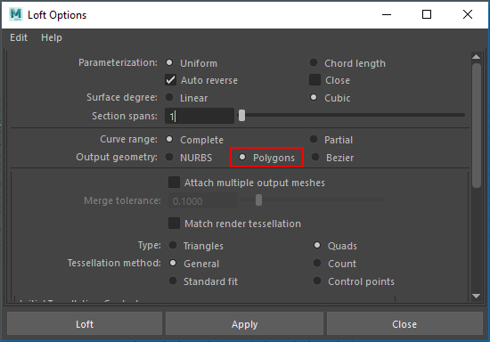

## Allgemeine Tool Einstellung

Wir können auch alle Surface Tools auf einmal umstellen mit Window > Setting and Preferences > Preferences.

Unter der Einstellung Settings / Modeling kann man einstellen

- Output geometry as: Polygon

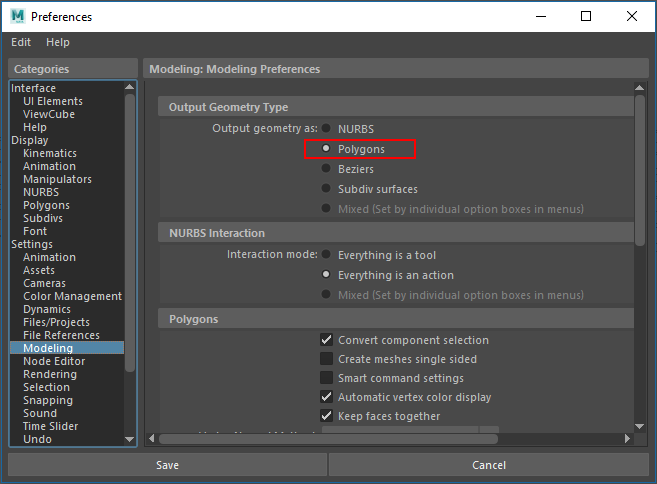

# Praxis Beispiel: NURBS Stuhl in Polygone umwandeln

In der Praxis stellt die Umwandlung von NURBS zu Polygonen einen vor vielen Problemen. Zum Teil muss man das Modell nochmals neu modellieren und man muss systematisch jede einzelne Fläche umwandeln.

Idealerweise arbeitet man von Anfang an mit Polygonen um diesen Umwandelungsprozess zu vermeiden.

## Schritt 1

Wir öffnen die fertige Datei aus "Praxis: Stuhl".

## Schritt 2

Wir öffnen zunächst den Outliner damit wir systematisch jede Fläche in Polygone umwandeln können.

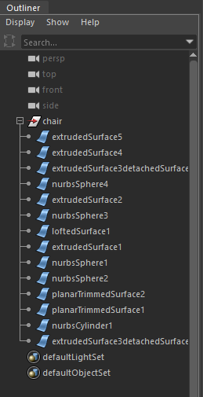

## Schritt 3

Wir selektieren "extrudedSurface5" (Das Dekorative Element) und wandeln sie mit dem Modify > Convert NURBS to Polygon und den Grundeinstellungen.

- Type: Quads
- Tesselation method: General
- UType, VType: "Per span # of iso parms"

Bei den Objekten die aus einem Extrude entstanden sind, können wir die U Number auf 1 setzen.
Danach passen wir die V Number an sodass die Abstufen stimmen.

Anschliessend passen wir die U Number auf 1 an und die V Number auf 6.

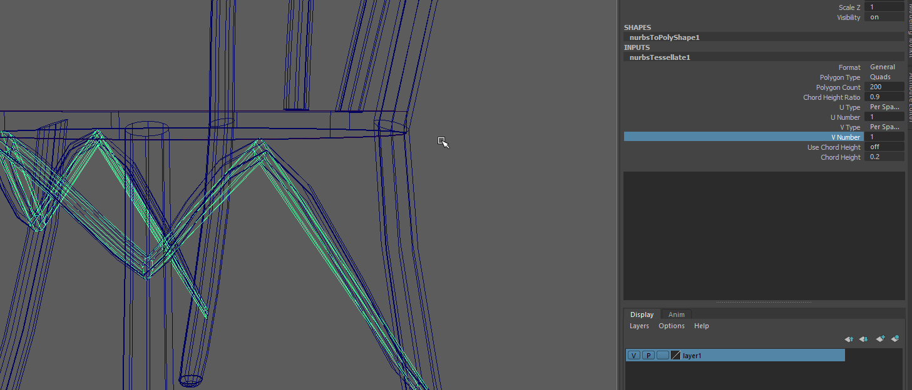

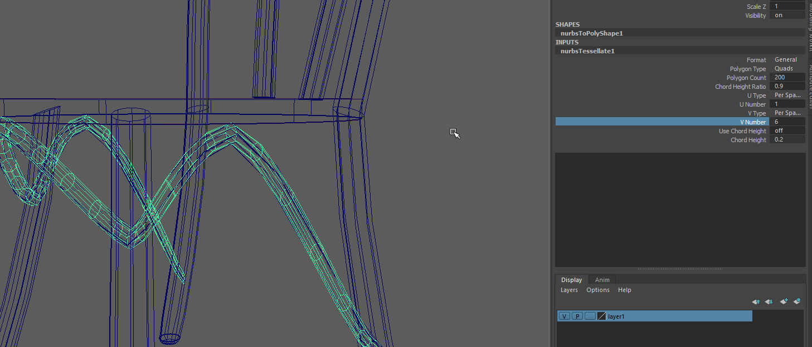

Nun kann man das Objekt "extrudedSurface5" selektieren und löschen.

Das gleiche wiederholen wir für "extruded Surface4" (Stuhllehne Details)

## Schritt 4: Vorderen Beine

Die beiden vorderen Beine umwandeln mit:

- U Number: 1
- V Number: 3

## Schritt 5: Abschluss der Beine

Wir löschen jetzt auch alle "nurbsSphere" Objekte die wir als Abschluss verwendet haben.
In einem späteren Schritt machen wir einen neuen Abschluss.

## Schritt 6: Sitzfläche

Es ist einfacher die Sitzfläche mit einem Polygon Zylinder auszutauschen.
Daher löschen wir einfach die drei Oberflächen aus dem die Sitzfläche gemacht ist und tauschen ihn mit Create > Polygon Primitives > Cylinder aus

- Translate Y: 34
- Radius: 18

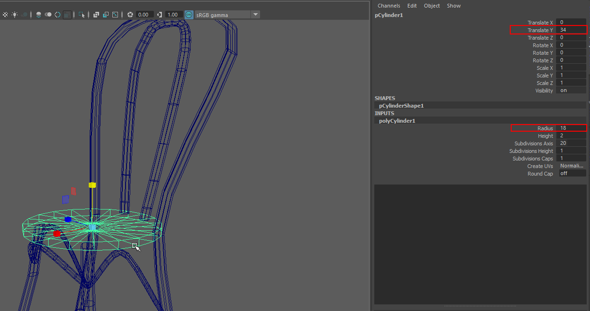

## Schritt 7: Lehne

Die Lehne besteht aus 3 Surface Objekten, wir können das Verbindungsstück löschen und die gespiegelte Seite.

Die letzte Surface wandeln wir wieder mit Modify > Convert NURBS to Polygon um.

- U Number: 1
- V Number: 6

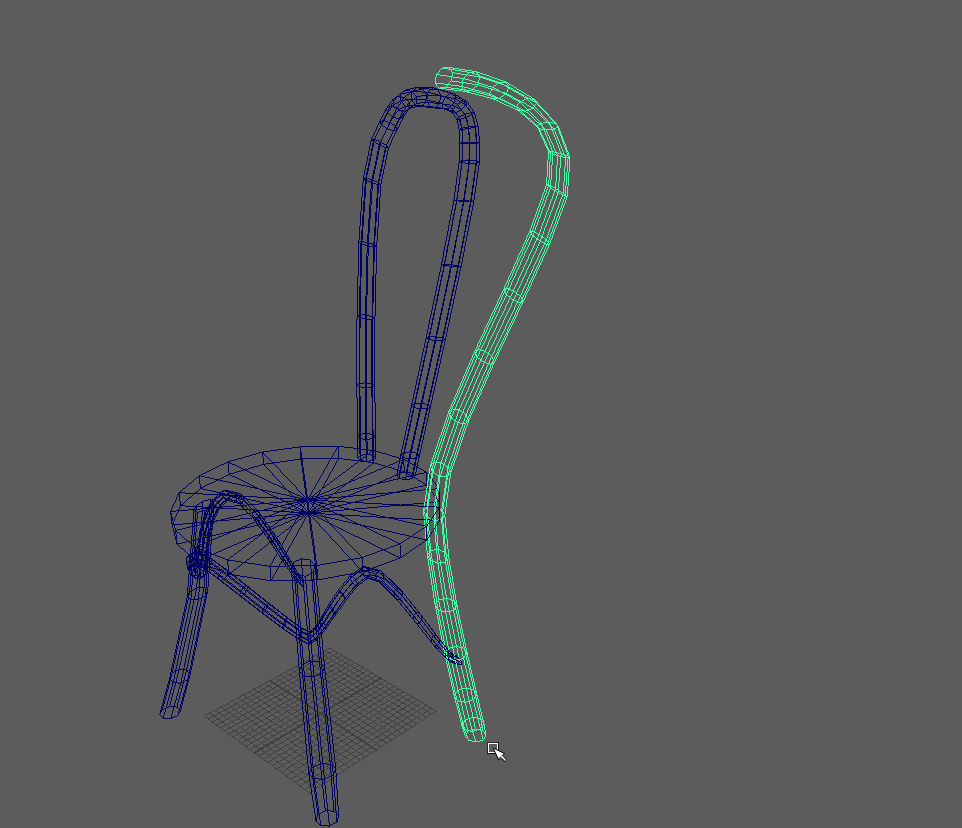

Nun können wir mit Mesh > Mirror die Stuhllehne duplizieren.

- Axis: Z
- Direction: +

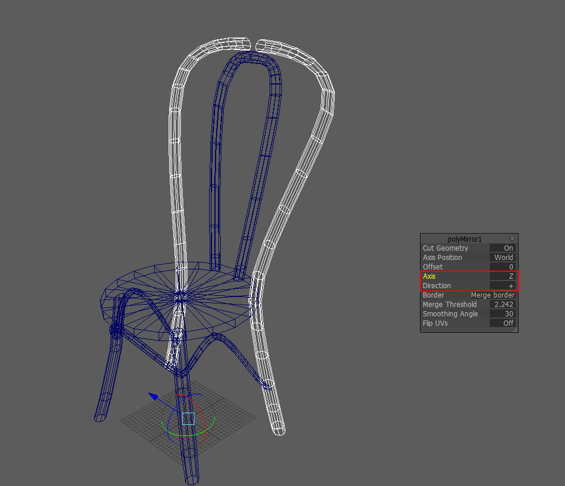

Um das Verbindungsstück wieder herzustellen, selektieren wir die oberen Edges und erzeugen eine Bridge Edit Mesh > Bridge.

## Schritt 8: Abschluss der Beine

Nun können wir alle Objekte selektieren und mit Mesh > Combine zu einem einzigen Objekt zusammenfügen.

Wir können nun die unteren Rand der Beine selektieren (im Edge Modus) und wählen Mesh > Fill Hole

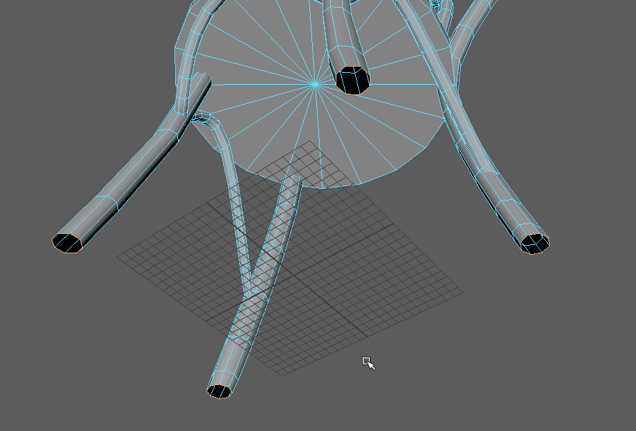

Die neuen Faces selektieren wir nun im Faces Modus und mit Edit Mesh > Poke wandeln wir das n-Gon in Dreiecke um.

Nun selektieren wir wieder den unteren Rand der Beine (Edge Modus).
Mit Edit Mesh > Bevel (Segments 2)

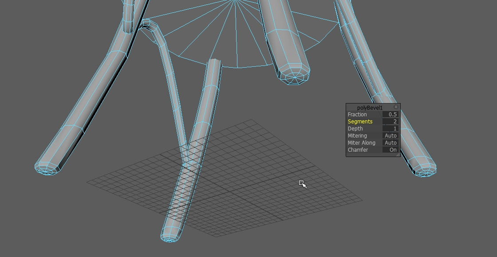
