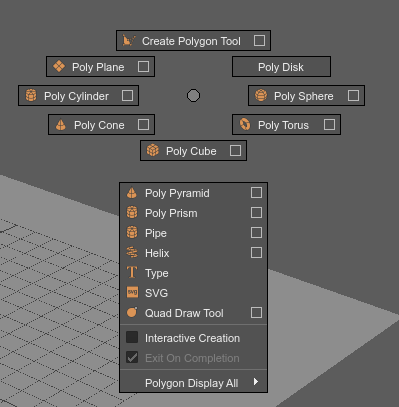
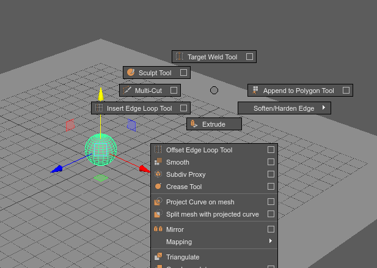
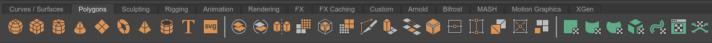

Wie bei dem NURBS-Modelling werden wir den Workspace _"Modelling - Standard"_ verwenden.

## Menu

Das Modul "Modeling" (**F2**) muss ausgewählt sein.
Für das arbeiten mit Polygonen interessieren uns insbesondere die Menüpunkte:

- **Create > Poly-Primitives**: In diesem Menü kann man Primitive Objekte wie Sphären erstellen.
- **Mesh**: Mit diesem Menü kann man Meshes im Object Mode modifizieren.
- **Edit Mesh**: Mit diesem Menü manipuliert man Meshes auf der Componenten Ebene.
- **Mesh Tools**: Mit den Tools lassen sich die Meshes auf Componenten Ebene erweitern und modifizieren.
- **Mesh Display**: Mit den Display Werkzeugen verändert man die interpretation des Meshes.
- **UV**: Das UV Menü erlaubt einem die 3D zu 2d projektion für das Texturieren anpassen.

In der Praxis benutzt man diese Menüs eher selten, da man schneller die Funktionen über die spezifischen Marking Menus erreicht.

### Marking Menus

Um sich den Weg in die verschiedenen Menüs zu sparen, gibt es ein selektionsabhängiges Marking Menü.
Wenn man **Shift-RMB** auf

## Shelf

Es gibt auch eine Shelf "Polygons" in denen man häufig genutzte Menüpunkte wiederfindet.

## Temporär Bildschirm füllend arbeiten

Bei dem Modellieren brauchen wir die meisten UI-Elemente nicht.
Wenn man beim Modellieren seinen Bildschirm maximal auszunutzen möchte kann man mit dem Tastaturkürzel
**Strg-Leertaste** alle UI-Elemente wie die Toolbox, Shelf und Attribute Editor und aus- bzw. einblenden.
