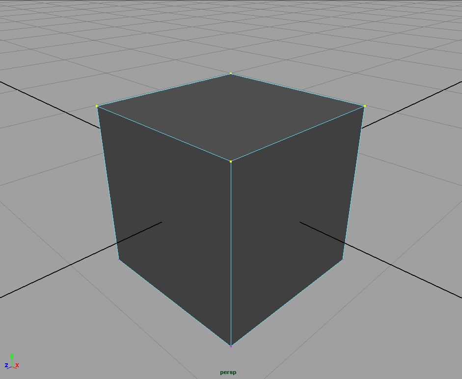
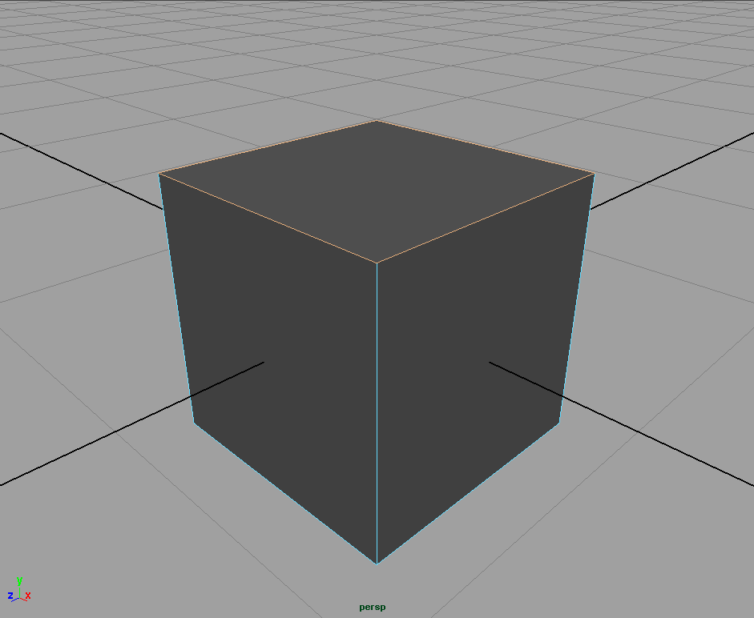
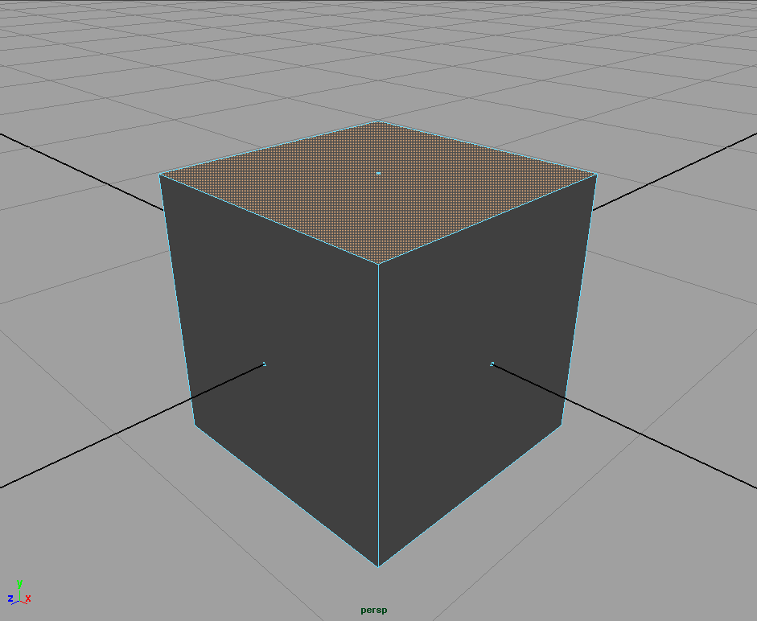

Ein Polygon ist eine durch eine endliche Anzahl von geraden Linien aufgebaute Figur. Man braucht mindestens 3 Linien bzw. 3 Punkte um eine Ebene aufzuspannen bzw. um ein Polygon Objekt zu erzeugen. Es gibt drei verschiedene Arten um eine Polygon Geometrie zu erzeugen:

1. Man setzt Vertexpunkte in den Raum, die ein Polygon ergeben.
2. Man manipuliert ein Primitiv (Sphere, Cube, Cylinder, Cone, etc.) solange bis es die gewünschte Form hat.
3. Man zeichnet Kurven in den Raum und lässt eine Fläche anhand der Kurven erzeugen.

Üblicherweise fängt man mit einem Poly-Cube Primitiv an und manipuliert ihn, daher der Begriff „Box-Modelling“.

## Components

Neben dem Objekt-Modus lassen sich auch Komponenten eines Objektes selektieren und modifizieren. Hierfür RMB auf das Objekt klicken und wählt den entsprechenden Darstellungsmodus aus dem Selektions-Menü aus.

1. Vertex Ein Vertex ist ein Punkt im Raum. Man kann nur eine Translation (MoveTool W) auf sie anwenden. Ein Vertex sollte nur in Verbindung mit einer Edge exisiteren.
2. Edge Eine Edge ist durch zwei Vertex Punkte definiert. Eine einzelne Edge ist eine fehlerhafte Geometrie und sollte nur in Verbindung mit einem Face existieren.
3. Face Eine Face ist definiert durch umliegende Edges. Für eine optimale Geometrie sollten alle Faces eines Objekts entweder Triangles (3 Edges) oder Quads (4 Edges) haben.

obere vier Vertex Punkte selektiert

obere vier Edges selektiert

obere Face selektiert

> Mit display Face Centers wird ein Punkt in der Mitte von Faces angezeigt. Dies erleichtert Faces zu selektieren. Unter **Window > Setting & Preferences > Preferences** geht man in der linken Leiste auf Selection und wählt dann unter Polygon Selection - Select Faces with Center.

## Weitere Eigenschaften von Polygon Objekten

### Unnatürlich scharfe Kanten

Rendert man Polygone aus haben sie meist sehr scharfe Kanten z.B. die eines Würfels. Solche extrem kantigen Objekte exisitieren in der Natur nicht. Kanten in der Natur sind leicht abgerundet, z.B. durch Abnutzung. Um diesen typischen 3D-Look zu vermeiden, muss man an Kanten einen Bevel anwenden. Hierfür wählt man die Edges aus die man abstumpfen möchte und geht auf Edit Mesh > Bevel. Bereits ein Offset-Wert von 0.01 ist ausreichend um den typischen 3D-Look zu vermeiden. Optional lassen sich die Kanten abrunden indem man die Anzahl der Segments erhöht.

### Normalen

Normalen bestimmen welche Seite außen und welche Seite innen sich befindet. Bei einer korrekten Objekt zeigen alle Normalen konform in die gleiche Richtung. Um die Normalen anzuzeigen geht man auf Display > Polygons > Face Normals. Es werden mit grünen Strichen die Richtung der Oberfläche angezeigt. Eine Alternative Möglichkeit ist im Panel-Menü unter Lighting > Two Sided Shading zu deaktiveren. Drückt man 5, wird nun die Innenseite Eines Objektes schwarz (unbeleuchtet) dargestellt.

Es passiert leicht durch z.B. skalieren, dass die Normalen nicht mehr richtig sind. Mit Normals > Conform werden die Faces korrigiert. Die Mehrheit der Faces bestimmt die Richtung des Objekts. Unter Umständen muss man per Hand die Normalen richtig setzen. Mit Normals > Reverse lassen sich einzelne Faces korrigieren oder auch das gesamte Objekt.

Im Beispiel ist der obere Teil des linken Diamanten fehlerhaft, dies erkennt man in der Normals Anzeige, da die grünen Striche nicht nach außen gehen. Einfacher erkennt man die Fehler wenn Two Sided Shading deaktiviert ist, da sieht man sofort der obere Teil ist einfach schwarz. Mit Normals > Conform, lässt sich das Problem lösen, jedoch sind die Seiten vertauscht. Also selektiert man das Objekt und macht ein Normals > Reverse. Dann ist das Objekt vollständig korrigiert.

> Anmerkung: Bei NURBS tritt manchmal das gleiche Problem auf. Man kann dies korrigieren mit **Edit Nurbs > Reverse Surface Direction**.
