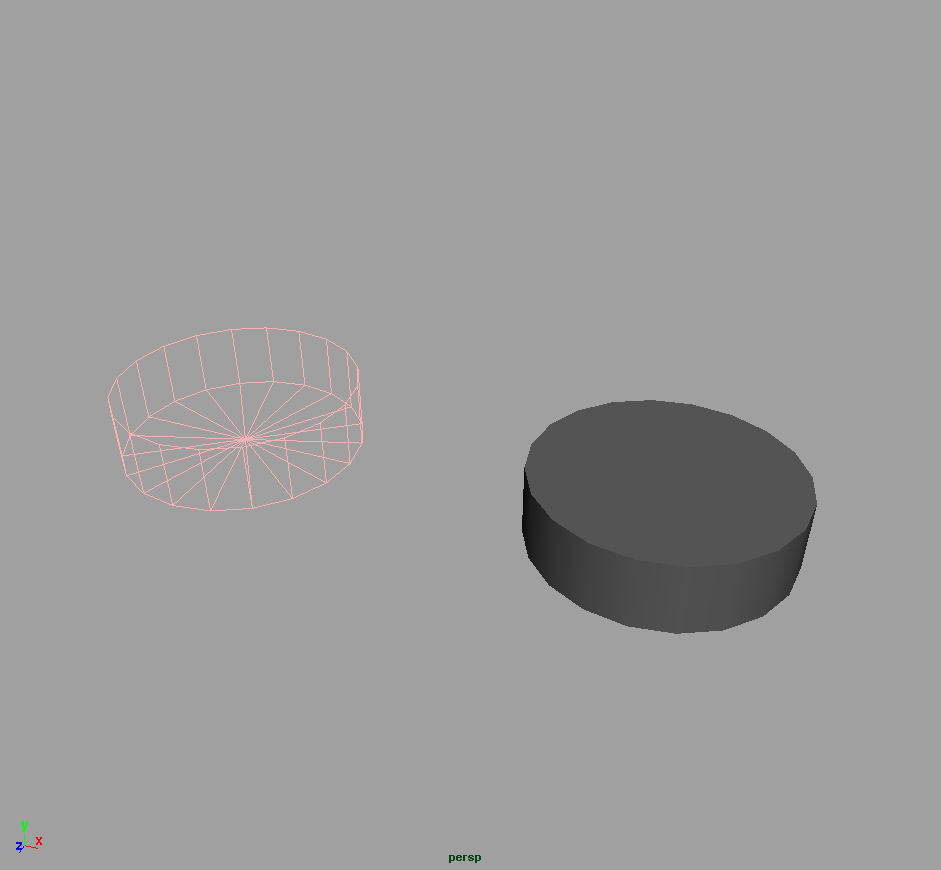

## Extrude

Das **Edit Mesh > Extrude Tool** macht ein neues Face und verbindet sie mit den ursprünglichen Polygonen. Der Manipulator vom Extrude Face kombiniert das Transform, Skalier und Rotationstool. Um zwischen den Modi zu wechseln klickt man einmal auf das jeweilige Tool und die jeweiligen Achsen werden dann singulär angezeigt (Pfeile für Move, Cubes für Skalieren, Kreis für Rotate) Mit dem kleinen blauschwarzen Schalter wechselt man zwischen Objekt-Koordinaten und Welt Koordinaten.

## Interactive Split Tool/ Split Polygon Tool

Das Edit Mesh > Split Polygon Tool erlaubt eine beliebige Edge auf einer Face hinzuzufügen. Dieses hat den Vorteil, das man in den Tool-Settings die Anzahl von „Snap magnets“ einstellen kann. Um das Tool zu verwenden, klickt man auf mindestens zwei Punkte auf Edges einer Face und drückt anschließend Enter.

## Edge Loop Tool

Das Edit Mesh > Edge Loop Tool fügt einen Ring von Edges dem Objekt hinzu. So werden aneinanderliegenden Faces gleichzeitig getrennt. Dies ist einfacher als mit dem Split Tool einzeln jede Face zu trennen. Um das Tool zu verwenden, klickt man auf die naheliegenste Edge an der man den Ring einfügen will.

## Boolean Operations

Unter Mesh > Booleans findet man die drei Typen von Boolschen Operationen die man auf 3D Objekte anwenden kann.

Union verschmilzt zwei Objekte miteinander.
Difference entfernt das zweite Objekt aus dem ersten Objekt und Intersection erzeugt die Schnittmenge beider Objekte.

Union

Difference

Intersection

In manchen Fällen kann die Boolesche Operation fehlschlagen. Was in den meisten Fällen daran liegt das die Normalen der Faces in verschiedene Richtungen zeigen. Mit Normals > Conform lässt sich das Problem in vielen Fällen beheben. Eine andere Variante das Problem zu umgehen ist, die betreffenden Faces von den Objekten mit Extract als eigene Objekte zu erstellen und dann die Boolesche Operation auszuführen. Anschließend fügt man die extrudierten Faces mit Mesh > Combine, Edit Mesh> Merge bzw. Mesh > Cleanup wieder zusammen. Anmerkung: Boolesche Operatoren erzeugen schnell neue interessante Formen, aber die resultierende Geometrie besteht meistens nicht mehr nur aus Quads/Triangles und muss unter Umständen nachträglich korrigiert werden.

## Tool Settings

Man kann für die Move, Rotate und Scale Tools noch weitere Einstellungen vornehmen. Hierfür muss man die „Tool Settings“ (Window > Settings and Preferences > Tool Settings) öffnen.

### Reflection

Ermöglicht symmetrisches arbeiten mit symmetrischen Objekten. Aktiviert man Reflection so sollte man auch die „Reflection Axis“ bestimmen. Wurde das Objekt nur auf einer Seite verändert kann es passieren, dass nicht die richtigen Polygone auf der gegenüberliegenden Seite ausgewählt werden. Es hilft wenn man in den Tool Settings „Reflection Space“ auf World setzt. Um die Funktionalität wieder herzustellen um direkt symmetrisch zu arbeiten löscht man die Hälfte des Objekts löschen (ggf. mit Edge Loops oder dem Split-Polygon Tool die Hälfte genau definieren). Anschließend im Objekt-Modus Mesh > Mirror Geometryq und die entsprechende Achse auswählen um wieder einen vollen Körper zu bekommen.

### Soft Selection

Der „Soft Selection“-Modus ermöglicht umliegende Objekte/Componenten zu selektieren. Mit dem Keyboard Shortcut (B) aktiviert und deaktiviert man die Soft Selection.

- Falloff Mode: bestimmt welche Objekte betroffen sind: Die Modi Volume und Surface sind beschränkt auf das selektierte Objekt. Die Modi Global und Object beeinflussen multiple Objekte.
- Falloff-Radius: definiert die selektierten Objekte durch die Selektion und dem maximalen Abstand definiert durch den "Falloff-Radius".
- Falloff Curve: bestimmt wie stark die Objekte beeinflusst werden von der Selektion. Ändert man die Form der Kurve kann die Selektion angepasst werden.
- Falloff Color: beinflusst nur die Darstellung im Viewport

## Weitere Eigenschaften

## Unnatürlich scharfe Kanten

Cube ohne Bevel

Cube mit Bevel (Offset= 0.01)

Cube mit Bevel (Offset = 0.2, Segments=5)

Rendert man Polygone aus haben sie meist sehr scharfe Kanten z.B. die eines Würfels. Solche extrem kantigen Ob-
jekte exisitieren in der Natur nicht. Kanten in der Natur sind leicht abgerundet, z.B. durch Abnutzung. Um diesen
typischen 3D-Look zu vermeiden, muss man an Kanten einen Bevel anwenden. Hierfür wählt man die Edges aus die
man abstumpfen möchte und geht auf Edit Mesh > Bevel. Bereits ein Offset-Wert von 0.01 ist ausreichend um den
typischen 3D-Look zu vermeiden. Optional lassen sich die Kanten abrunden indem man die Anzahl der Segments
erhöht.

## Normalen

Normalen bestimmen welche Seite außen und welche Seite innen sich befindet. Bei einer korrekten Objekt zeigen alle
Normalen konform in die gleiche Richtung. Um die Normalen anzuzeigen geht man auf Display > Polygons > Face
Normals. Es werden mit grünen Strichen die Richtung der Oberfläche angezeigt. Eine Alternative Möglichkeit ist
im Panel-Menü unter Lighting > Two Sided Shading zu deaktiveren. Drückt man 5, wird nun die Innenseite Eines
Objektes schwarz (unbeleuchtet) dargestellt.

Es passiert leicht durch z.B. skalieren, dass die Normalen nicht mehr richtig sind. Mit Normals > Conform werden die
Faces korrigiert. Die Mehrheit der Faces bestimmt die Richtung des Objekts. Unter Umständen muss man per Hand
die Normalen richtig setzen. Mit Normals > Reverse lassen sich einzelne Faces korrigieren oder auch das gesamte
Objekt.

Im Beispiel ist der obere Teil des linken Diamanten fehlerhaft, dies erkennt man in der Normals Anzeige, da die
grünen Striche nicht nach außen gehen. Einfacher erkennt man die Fehler wenn Two Sided Shading deaktiviert ist,
da sieht man sofort der obere Teil ist einfach schwarz.

Mit Normals > Conform, lässt sich das Problem lösen, jedoch sind die Seiten vertauscht. Also selektiert man das
Objekt und macht ein Normals > Reverse. Dann ist das Objekt vollständig korrigiert.

Normals anzeige

Two Sided Shading Deaktviert

Normals Conform

> Anmerkung: Bei NURBS tritt manchmal das gleiche Problem auf. Man kann dies korrigieren mit Edit Nurbs >
> Reverse Surface Direction.
