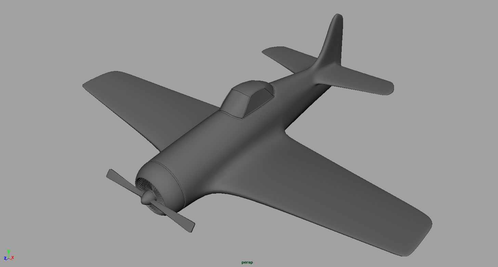

## Materialien

- [Blaupausen](../../../assets/04b_modelling-polygon/images/05_plane/blueprints/BareCat-Blueprint.zip)

## Analyse

Das Flugzeug ist achsen-symmetrisch, wir müssen also nur eine Hälfte des Flugzeuges modellieren.
Man kann das Flugzeug in mehrere Segmente aufteilen:

- Hauptkörper (Zylinder)
- Rotor (Würfel)
- Flügel (Würfel)
- Heck (Würfel)
- Cockpit (Zylinder)

## Vorbereitungen

Bevor wir mit dem Modellieren anfangen legen wir uns ein neues Maya Projekt an und importieren die Blaupausen.

Mit File > Project Window legen wir ein neues Projekt an.
In dem Dialog auf **"New"** klicken und "Barecat" als "Current Project" eintragen, die restlichen Werte belassen wir auf die Standardeinstellungen.

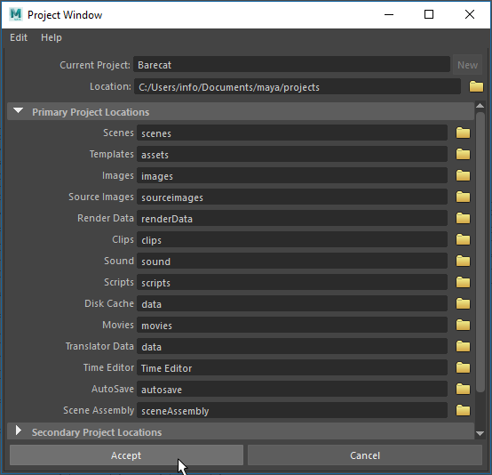

Das Projekt wird angelegt wenn man auf **"Accept"** klickt.

## Blaupausen importieren

Wir kopieren nun die Blaupausen im Dateisystem in den Projektordner "source04b_modelling-polygon/images" (maya/projects/Barecat/source04b_modelling-polygon/images).

Zurück in Maya wechseln wir nun zur "Four View" (kurz die Leertaste drücken).
Für die Ansichten "top", "side" und "front" gibt es Blaupausen.
Um sie zu importieren wählen wir das entsprechende Panel-Menüs und klickt auf
View > Image Plane > Import Image und wählt die entsprechende Blaupause.

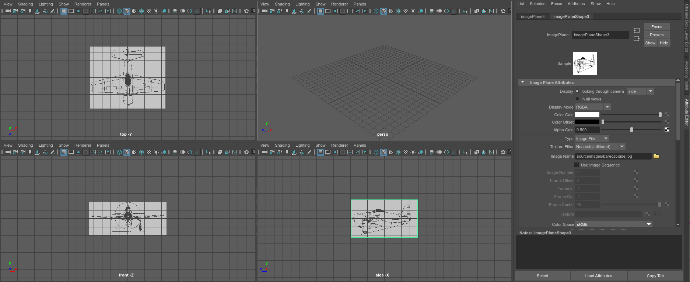

Um besser mit den Bildern zu arbeiten passen wir noch einige Einstellungen an:
Das Attribut Attribute Display setzen wir auf "looking through camera". Nun wird das Bild nicht mehr in der persp Ansicht angezeigt.

Um das Bild halbtransparent anzuzeigen setzt man den Wert "Alpha Gain" auf 0.5.

## Modellieren des Grundkörpers

Für den Grundkörper erstellen wir einen Poly-Cylinder (Create > Poly Primitives > Poly Cylinder) und setzen RotateX = 90.

Wir wechseln in die Side View, aktivieren im Panel Menü Shading > X-ray und positionieren den Zylinder am Anfang des Körpers und machen ihn so flach wie die Rotoraufhängung ist.

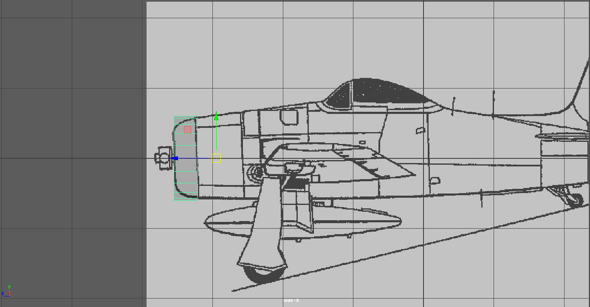

Im Faces-Modus selektieren wir den ‚Boden‘ des Zylinders.
Wir benutzen nun das Extrude Tool (Edit Mesh > Extrude) um weitere Faces zu erzeugen. Für das Tool müssen wir darauf achten immer gleichmäßig zu skalieren und zu positionieren. Beim Extrudieren sollte man etwas vorrausplanen, wir werden das Cockpit, Flügel, Heck, und Heckflügel auch alle mit einem weiteren Extrude erstellen, daher sollte man für jedes Segment einen eigenen Extrude machen.

Beim Extrudieren orientiert man sich an der Top und der Side View und skaliert und bewegt man die neuen Faces.

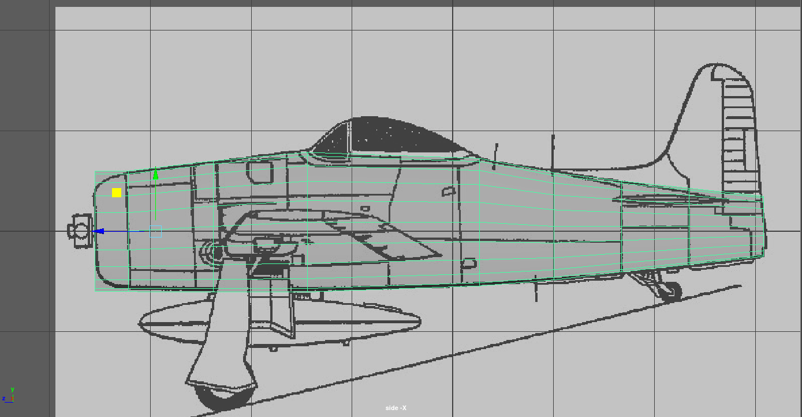

Um die Rotoraufhängung zu modellieren selektieren wir die vordere Edge und wählen Edit Mesh > Bevel mit einer Fraction von 0.8 und Segments 4.

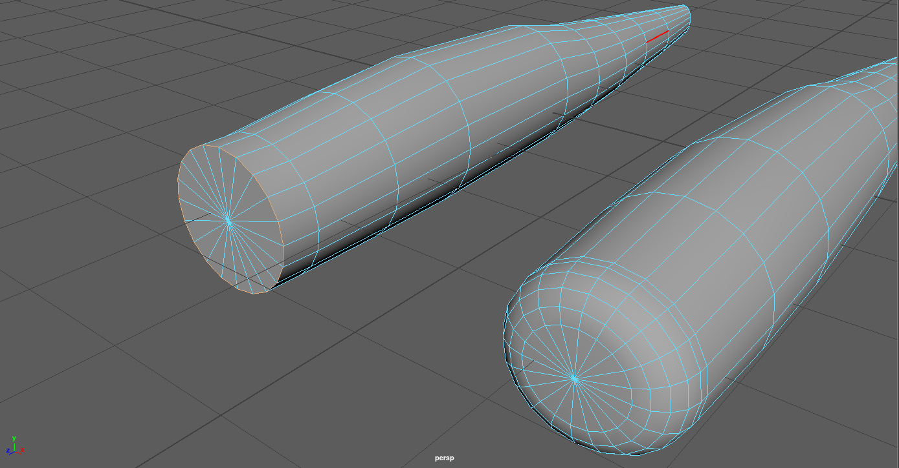

Wir selektieren die vorderen Faces des Bevel und machen einen weiteren Extrude für die Rotor aufhängung.

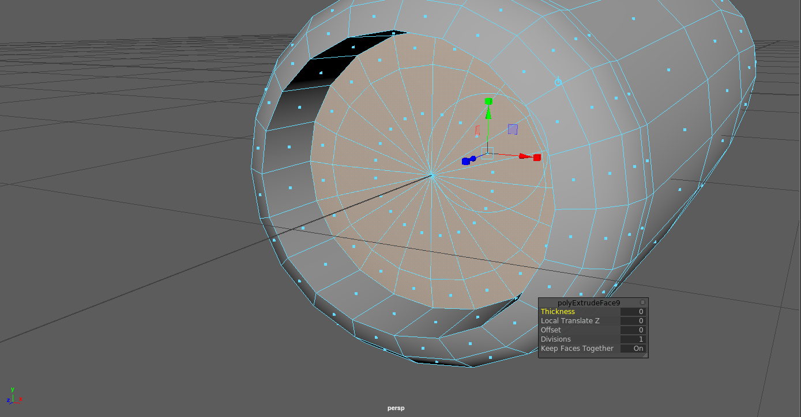

Im Edge Modus, selektieren wir die zwei harten Kanten die gerade durch den Extrude entstanden sind. Am einfachsten geht das indem man auf die Edge einen Doppelklick macht. Edit Mesh > Bevel Fraction 0.1, Segments 2

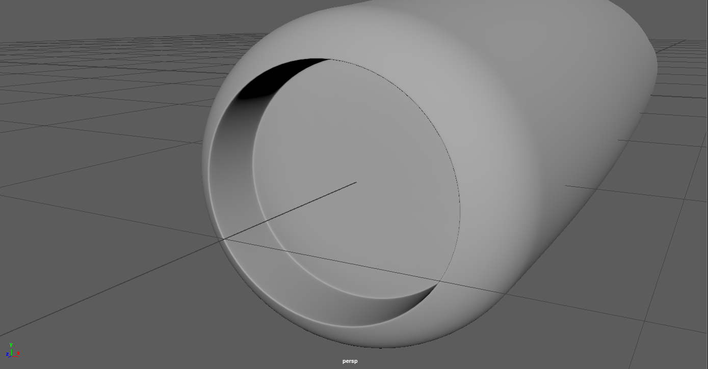

## Flügel

Zuerst passen wir die Basis des Flügels an. In der Side View, im Vertex-Mode die Vertex Punkte identifizieren, die sich an der Flügelbasis befinden (ggf. noch eine weitere Edge Loop einfügen). Diese leicht modifizieren damit sie der Flügelform angepasst sind.

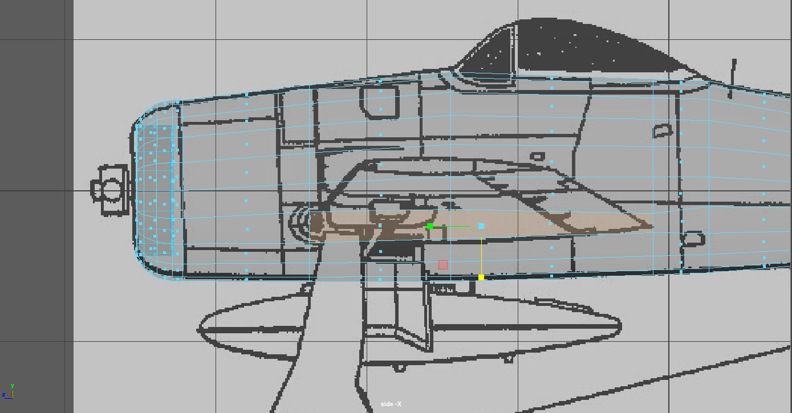

Damit wir die Flügel nur einmal modellieren müssen, löschen wir nun die Hälfte des FLugzeuges. Wir wechseln in die Front View und im Faces Modus selektieren wir alle Faces die im -X Bereich liegen. Mit Del löschen.

Nun selektieren wir wieder die Flügelbasis im Faces Modus und erzeugen grobe Flügel,indem man wieder mehrfach das Extrude Tool benutzt.
Wechselt man das Extrude Tool in Welt Koordinaten (der blauschwarze Schalter) erhält man völlig flache Flügel.

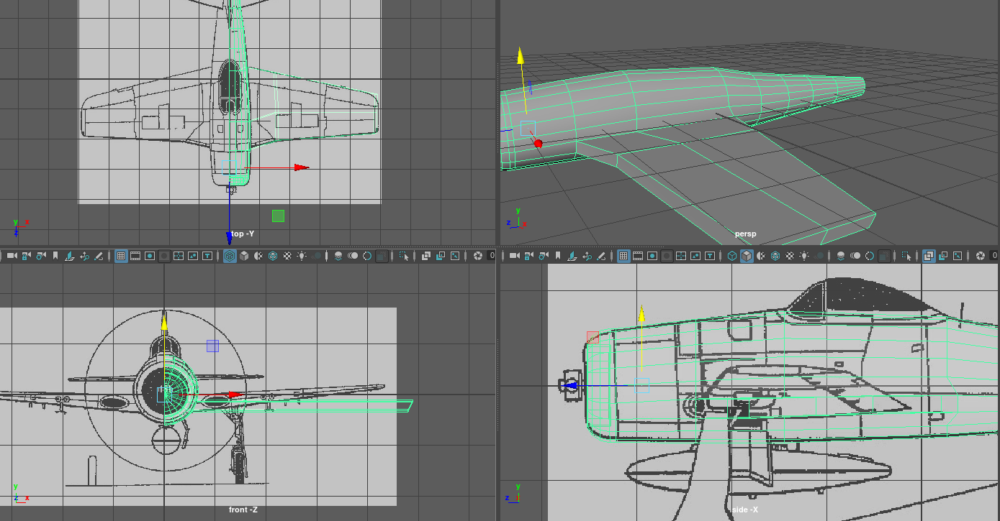

Abwechselnd in der Top und der Front View passt man die Vertex Punkte mit dem Move Tool (W) an die Vorlage an.

Zum Abschluss benutzen wir das Edge Loop Tool um die Kanten des Flügels zu stabilisieren für den späteren Polysmooth vorgang. Drückt man 3 sieht man die Poly Smooth Voransicht. Mit der Taste 1 kommt man zurück in den Poly-Modus.

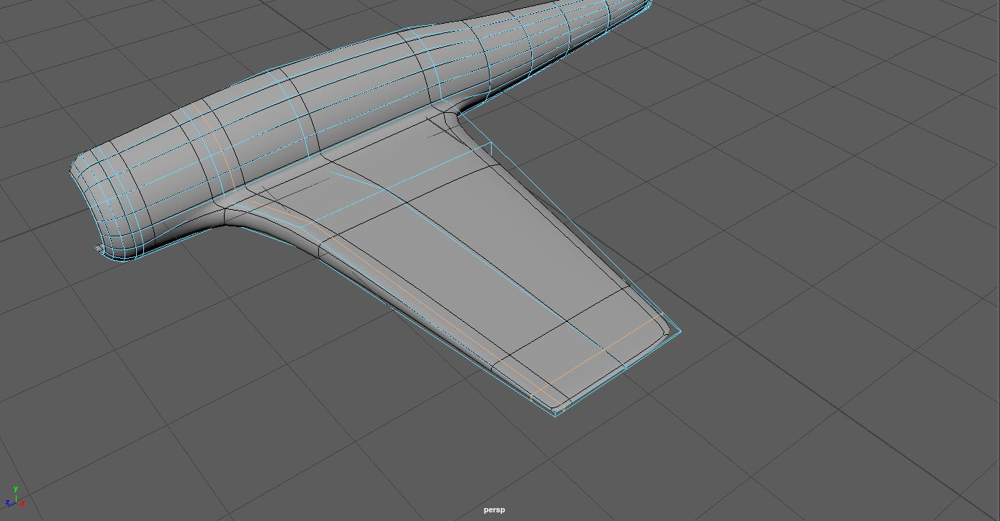

## Heck

Ähnlich wie der Flügel wird das Heck extrudiert. Zunächst die Faces selektieren, die die Basis von dem Heck bilden und zweimal im World-Modus nach oben extrudieren. Die Vertexpunkte mithilfe der Referenzbilder anpassen.

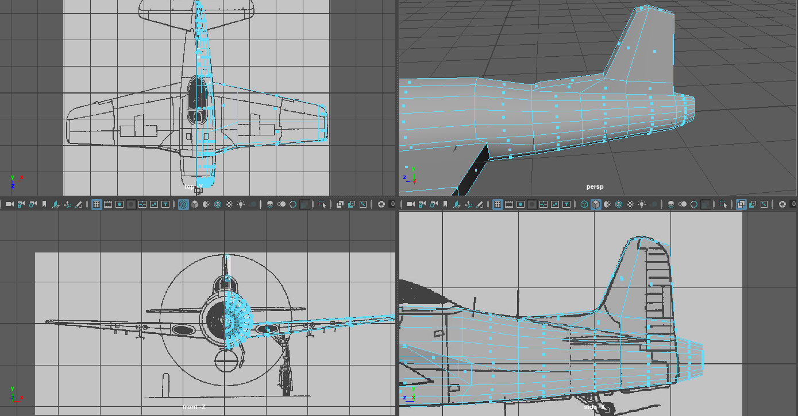

In der Persp- Ansicht sieht man, dass nun zusätzlich Faces auf der X-Achse erzeugt wurden. Diese werden nicht gebraucht und werden beim Spiegeln zu einem ganzen Flugzeug
Probleme machen. Daher selektiert man und löscht sie.

## Heckflügel

Der Heck Flügel wird erstellt identisch wie der Flügel. Wir identifizieren wieder die Basis, passen sie im Vertex Modus an, und im Faces Modus Extrudieren wir sie.

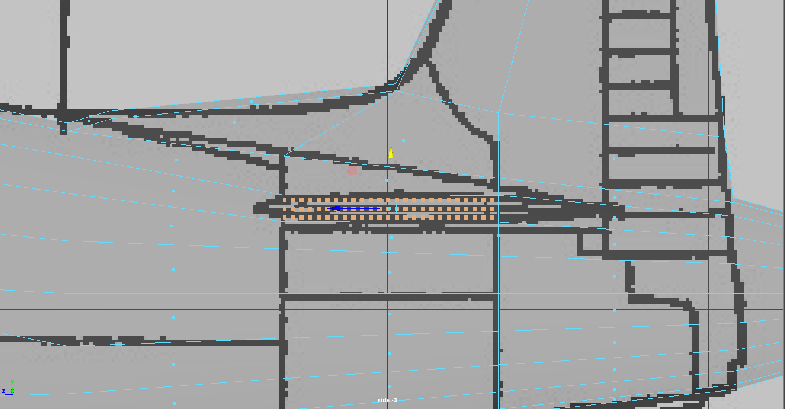

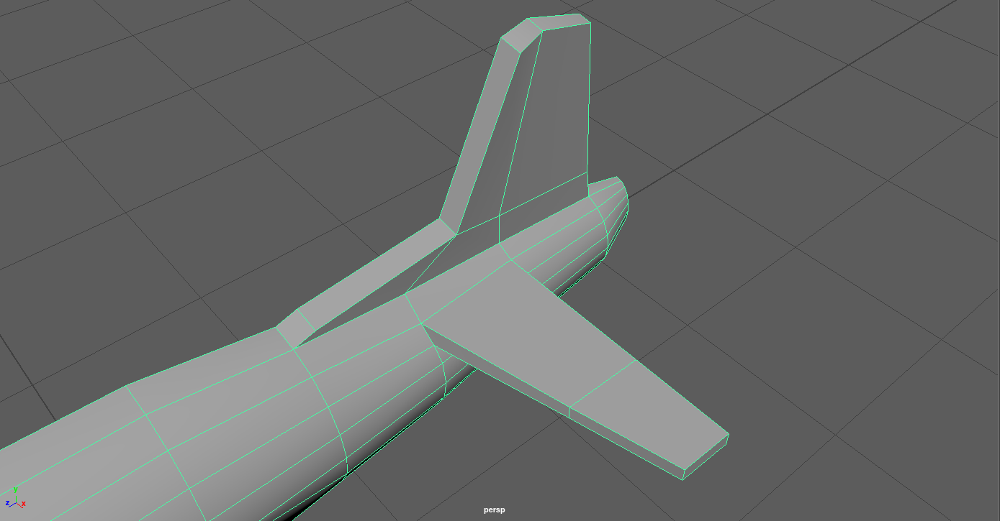

## Cockpit

Für das Cockpit muss zunächst die Grundform des Cockpits durch verschieben der Vertexpunkte auf der Oberseite des Flugzeugs festgelegt werden.

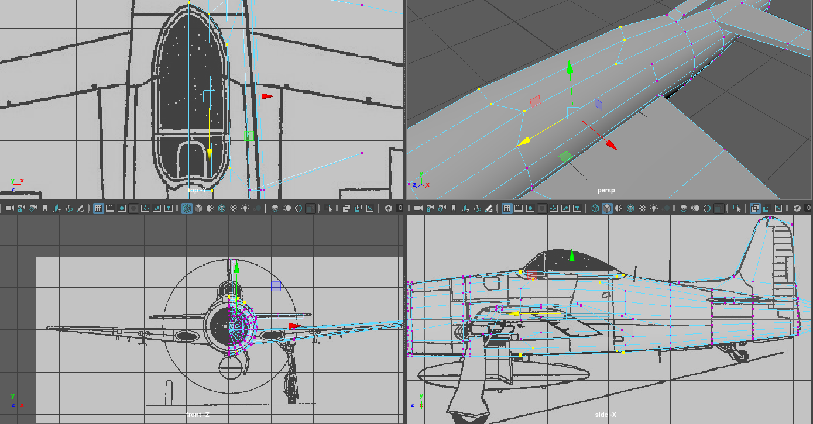

Wieder mit mit Extrudes und der Verschiebung von Vertex Points die Form des Cockpits anpassen. Da wir nur mit einer Hälfte des Flugzeuges Arbeiten müssen wir darauf achten das die Punkte die direkt auf der an der X-Achse liegen nicht versehentlich in den -X Bereich verschieben.

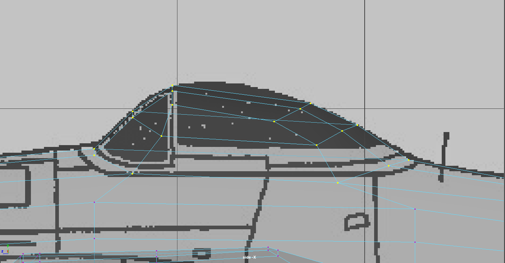

Falls einem nicht genügend Vertex Points zur verfügung stehen um die gewünschte Form zu erhalten, muss man mithilfe des Edge Loop Tools sich Zusätzliche Punkte hinzufügen.

Wie bei dem Heck müssen die überflüssigen Faces auf der Innenseite des Modells entfernt werden.

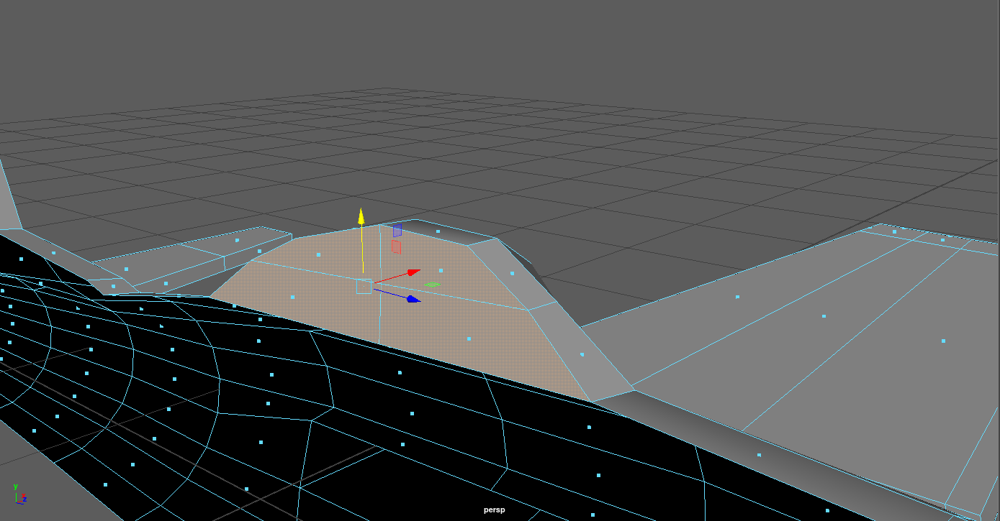

Wir überprüfen nochmals ob die Vertex Punkte auf der X-Achse nicht im -X Bereich liegen. Falls doch kann man sie korrigieren indem man das Move Tool mit Gridsnapping (X-gedrückt halten) verwendet und dann auf den Pfeil der entsprechenden Achse klicken.

## Rotor

### Rotoraufhängung

Create> Polygon > Cone (RotateX = 90, Radius = 0.1, Height = 0.1) und an die Spitze des Flugzeugs setzen.

Die Face die den Boden der Cone bildet selektieren und mit Extrude zu dem Boden des Motors erweitern, anschliessend die Face löschen.

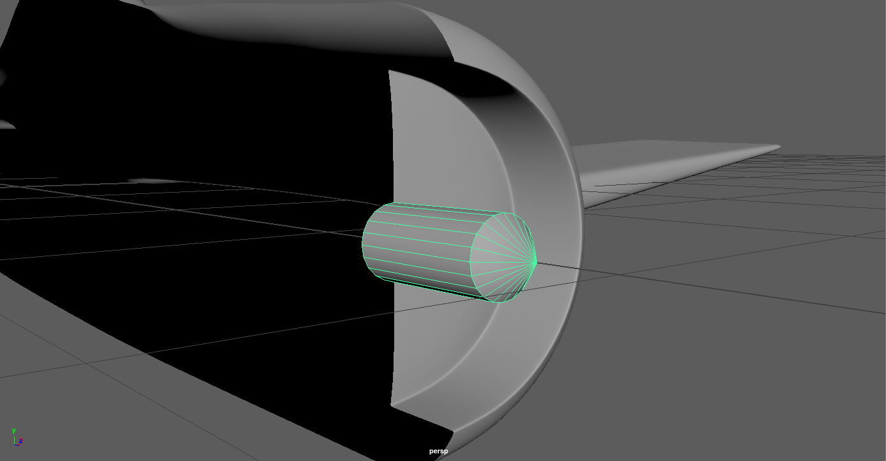

### Rotorblätter

Aus einem Polycube (Create > Polygon > Cube) (ScaleX 0.4, ScaleY 0.05, ScaleZ 0.2) formen wir ein einzelnes Rotorblatt. Der Würfel muss so verändert werden, dass er zwischen der Rotoraufhängung und dem Flugzeug passt. Zusätzlich bekommt der Würfel eine Schräge, indem wir die hintere Face nach oben verschieben.

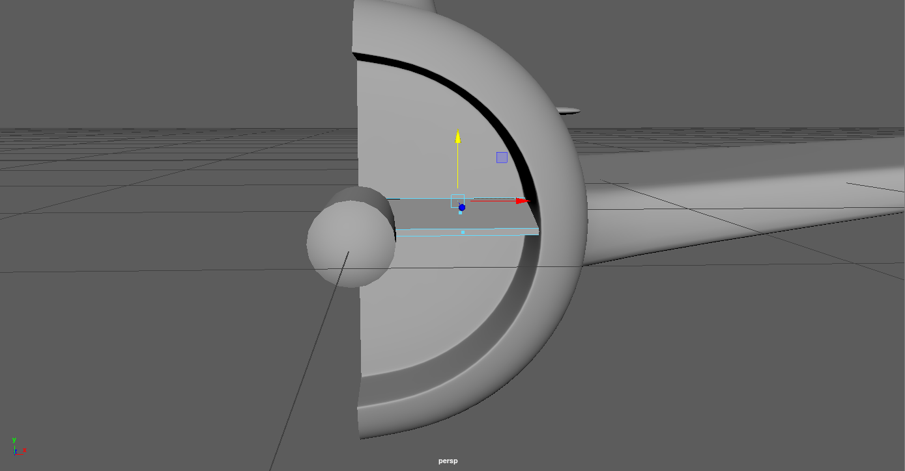

Bevor wir das Rotorblatt duplizieren müssen wir den Pivot Point modifizieren. Hierfür drücken wir D+X und setzen den Pivot Point auf die Y-Achse.

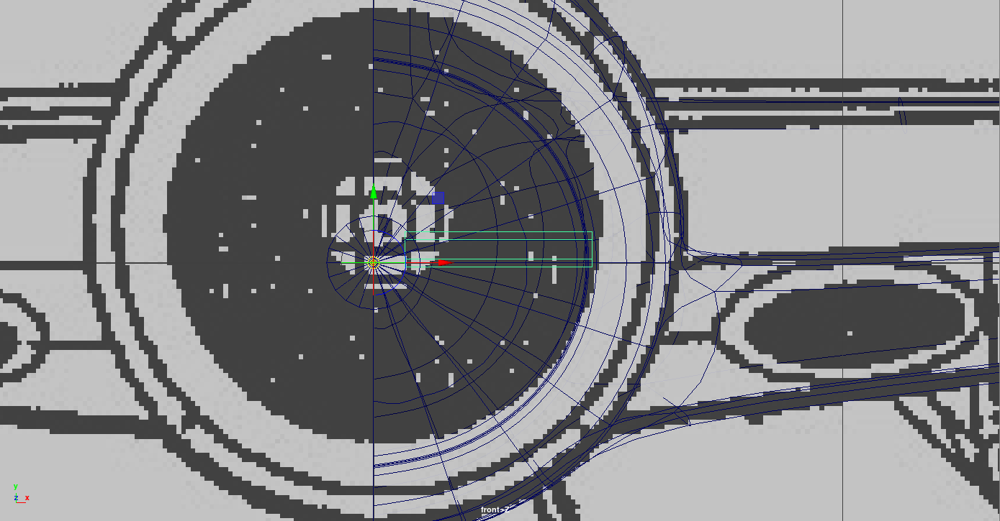

Mit Edit > Duplicate Special (option) In den optionen setzen wir RotateZ auf 9 und Number of copies auf 40.

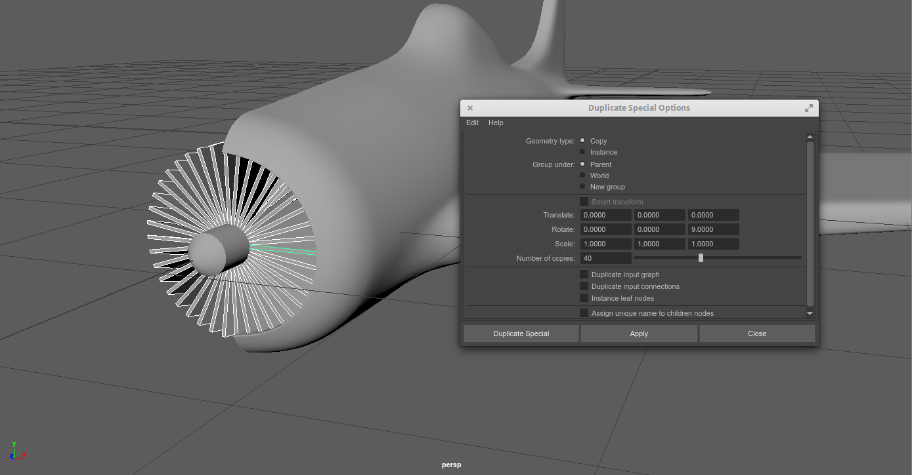

### Propeller

Wir bauen aus einem PolyCube (Create > Polygon > Cube) den Propeller.

Erst ihn positionieren und in die Länge und Breite skalieren. Danach selektiert man eine Face an der Spitze des Propellers und macht ihn an einer Spitze breiter und an der anderen schmaler in der Höhe und rotiert die Face um ca. 45°. (In der Seitenansicht hat man eine besseren Überblick)

Die Ränder vom Cube selektieren Edit Mesh > Bevel

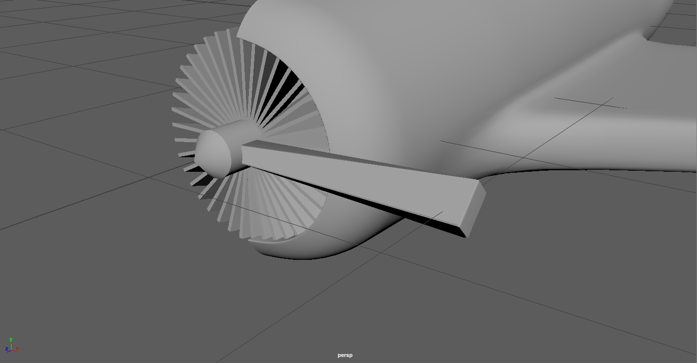

Wir positionieren den Pivot wieder auf die Z-Achse und mit Duplicate erzeugen wir eine Kopie die wir um 180 Grad drehen.

## Cockpit Fenster

Wir selektieren den Hauptkörper und wählen Mesh>Mirror

Nun selektieren wir die vorderen Faces die das Fenster definieren. Dann machen wir einen Extrude mit Offset = 0.01 und dann einen weiteren Extrude Thickness = -0.01

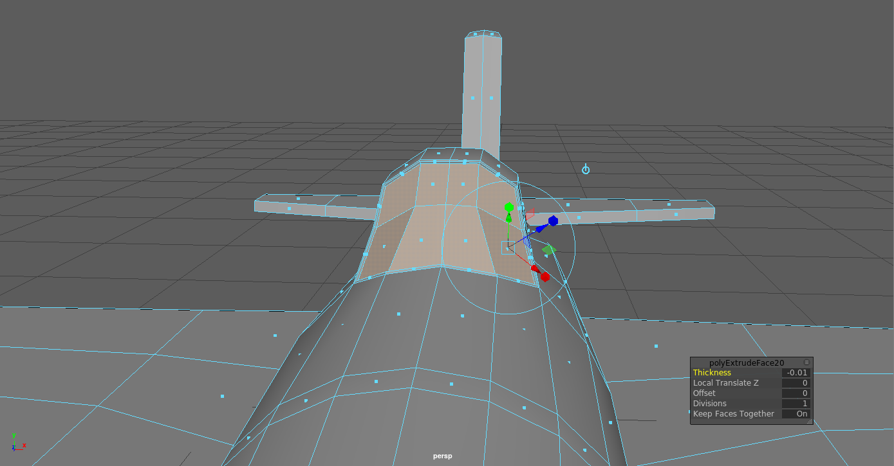
