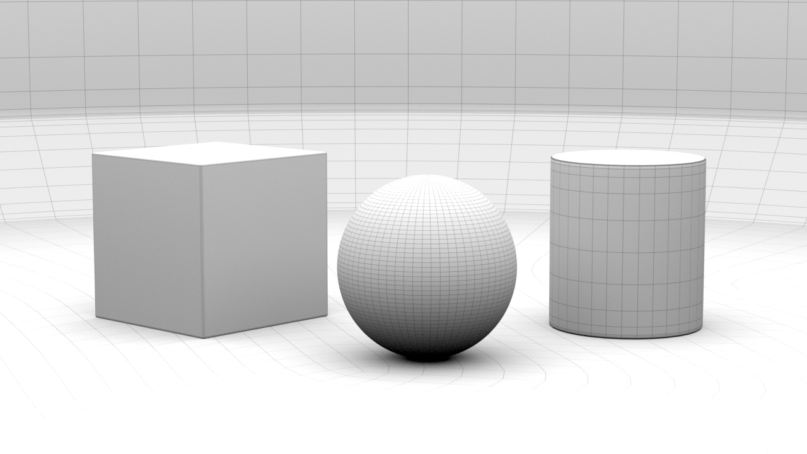

## Eigene Modelle modellieren

Wenn man anfängt eigene Modelle zu erstellen, sollte man zuerst eine klare Vorstellung von dem Objekt, was man gerne Modellieren möchte, haben.
Hierfür erstellt man eine Referenz in Form eines Fotos oder Zeichnung.

Man kann sich diese Referenz als Hintergrund in die ViewPanels laden.
Hierfür geht man auf das PanelMenü View > Image Plane > Import Image.
Man sollte die Referenzbilder nur in der Top, Side und Front view Camera laden, da diese statisch sind und die Position nicht verändern.

Es gibt die Möglichkeit sich das Bild nur dann anzeigen zu lassen, wenn man durch die Kamera blickt. Dazu aktiviert man in den Attributen für die ImagePlane > Image Plane Attributs > Display looking through camera.

> Anmerkung: Image Planes sind normale Objekte und werden von der jeweiligen Kamera ausgerendert und sollten ausgeschaltet werden vor dem rendern.

Man sollte nun das Objekt näher analysieren.
Aus welchen Primitiven bestehen die einzelnen Teile des Objekts?
Wenn man das Hauptobjekt in kleinere Teile zerlegt so stellt man fest, dass viele Objekte einfach nur aus Kugeln, Halbkugeln, Zylindern und Würfeln bestehen. Bei diesem Schritt stellt man auch fest, das ein Objekt sich an manchen Stellen wiederholt oder symmetrisch ist.
Bei Wiederholungen muss man die Stelle nur einmal modellieren und benutzt dann Duplicate bzw. Duplicate Special. Bei symmetrischen Objekten kann man direkt die Geometrie auf die andere Seite projizieren, so muss man nur die Hälfte des Objekts modellieren.
Danach überlegt man sich wie man am besten die Details ausarbeitet.
In machen Fällen ist ein Polygon-Objekt günstiger in manchen Fällen ein Nurbs Objekt.
Es hängt davon ab mit welchen Werkzeugen man die Details später ausarbeiten möchte.
Wie man modelliert hängt, jetzt endlich davon ab, welche Technik man persönlich bevorzugt.
Man muss das modellieren üben und verschiedene Ansätze ausprobieren.
Man spart sich viel arbeiten wenn man nicht das Gesamtobjekt ansieht sondern es in kleine Teile aufteilt und diese nach und nach abarbeitet.

## Abschließende Schritte

Nachdem man mit dem Modellieren fertig ist, sollte man die Szene und Objekte optimieren.

1. Hilfsobjekte wie Curves löschen.
2. Fehler in der Geometrie korrigieren.
3. Objekt Koordinaten Normalizieren. Mit dem selektierten Objekt Modify > Freeze Transformations anwenden. Dies setzt die aktuelle Transformationswerte als die Standartwerte also TranslateXYZ (0,0,0), ScaleXYZ (1,1,1) und RotationXYZ (0,0,0).
4. Die Construction-History löschen mit Edit > Delete by Type > History (Shift-Alt-D).
   Braucht man noch Input-Nodes wie Deformatoren (z.B. Lattice, Squash, etc.) wählt man Edit > Delete by Type > Non-Deformer History.
5. Prüfen ob man auch allen Objekten einen Namen gegeben hat.
   Insbesondere Szenen mit mehreren Objekten kann es sehr unübersichtlich werden ohne korrekte Benennung der Objekte.

# Häufige Fehler beim Modellieren

## Normals

Fehler durch Mirroring.
Die Normalen von dem Objekt zeigen nicht immer in die selbe Richtung.

### Erkennung

backside lighting
Display Normals

### Lösung

Faces selektieren und Edit Mesh > reverse Normals

## Extrude duplication

### Fehler

Versehentliches doppeltes extrude führt zu überflüssigen faces

### Erkennung

Face center anzeigen

### Lösung

Merge Components

## Unebenheiten in der Oberfläche

### Fehler

Dreiecke werden noch in der geometrie verwendet

### Erkennung

Blinn material dem objekt hinzufügen
Cleanup geometry

### Lösung

Auflösung der Dreiecke in Quad Geometrie mithife des Multicut tools.
