Wir sehen alles durch Kameras sie definieren den Bildausschnitt der zu rendern ist.
Der Bildausschnitt sollte möglichst früh definiert werden, da die Position der Kamera die Beleuchtung der Szene beeinflusst.

In Maya gibt es zwei Arten von Kameras, die perspektivische und die orthographische.
Üblicherweise benutzt man eine perspektivische Kamera zum Rendern.

Kameras in Maya orientieren sich an echten Film Kameras. Es werden verschiedene Linsen Eigenschaften simuliert z.B. die Brennweite aber auch Film Eigenschaften z.B. Film Aspect Ratio.
Zusätzlich gibt es Eigenschaften die nur für virtuelle Kameras existieren z.B. die Clipping Planes.

## Standard Kameras

Jede Maya Szene hat vordefinierte Standard Kameras um sich in der Szene zu orientieren.

Für die Darstellung einer Szene sind mehrere Kameras immer definiert:

- Ortographischen Kameras: „top“, „front“, „side“
- Perspektivische Kamera: „persp“

In der "Four View" die wir bei dem Modellieren verwendet haben werden alle vier Kameras simultan angezeigt.

Diese Kameras sollte nicht für das Rendern verwendet werden. Es sollte immer eine dedizierte neue Kamera erzeugt werden die ausschließlich für das Rendern verwendet wird.

## Kamera erstellen

### Perspektivische Kamera

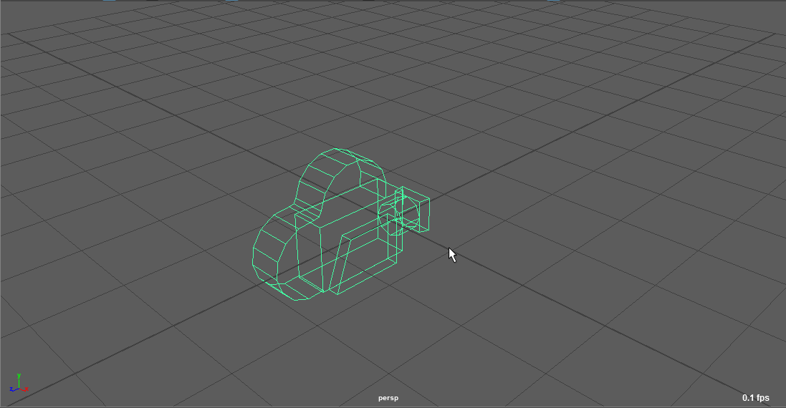

Mit Create > Cameras > Camera erstellt man eine neue perspektivische Kamera.

Man findet in dem Menü auch „Camera and Aim“ und „Camera and Aim and Up“.
Alle drei erzeugen eine perspektivische Kamera, es ist nur das Attribut "Camera Attributes - Controls" anders voraktiviert.

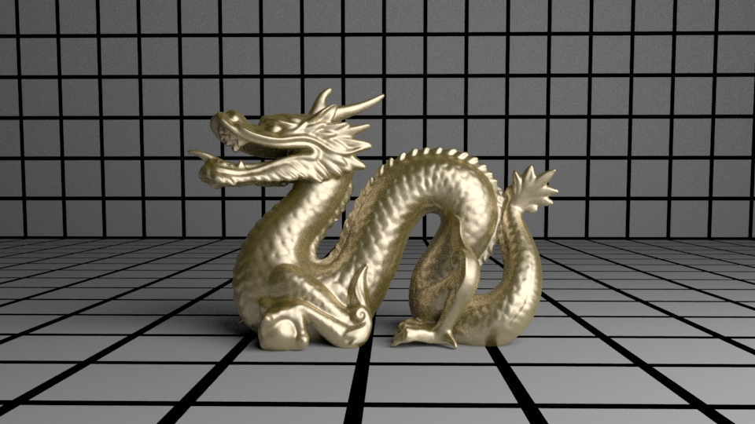

### Orthographische Kamera

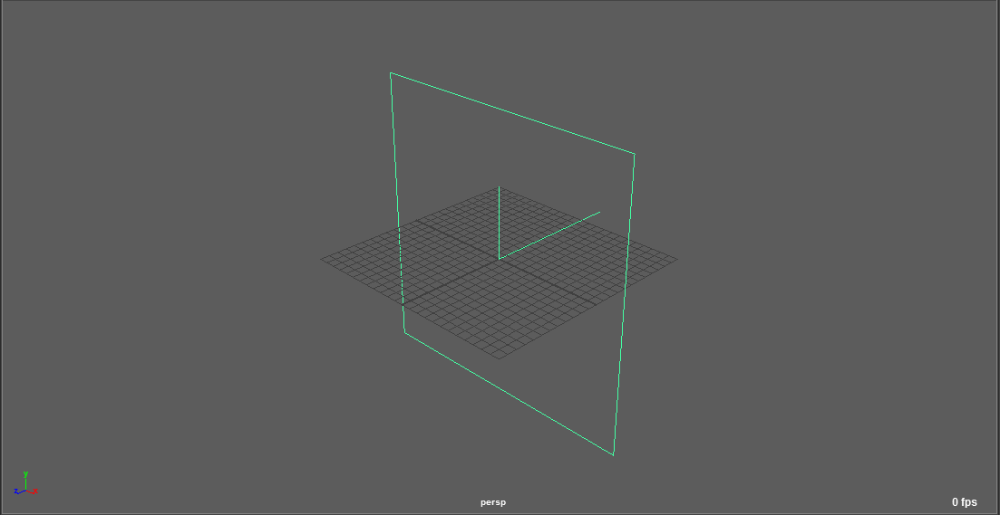

Eine orthographische Projektion rendert alle Linien parallel ohne Fluchtpunkt. Diese Projektion wird z.B. für Blaupausen verwendet.
Sie wird üblicherweise nicht für das Rendern verwendet.

Um eine neue Orthographische Kamera zu erstellen, erstellt man zunächst eine perspektivische Kamera.
Im Attribut Editor aktiviert man unter "Orthographic Views" > Orthographic.

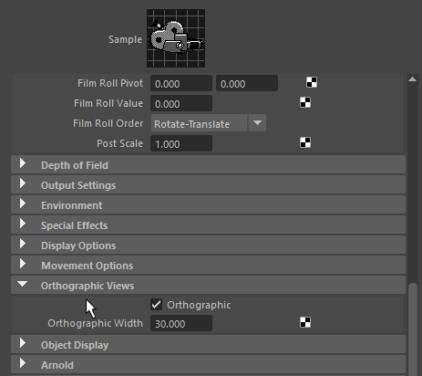

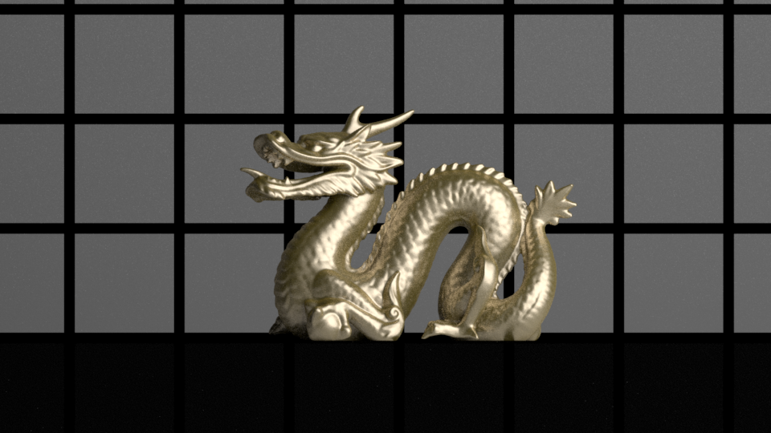

Durch anpassen der Rotation (RotateX = -35, RotateY = 45) kann man die Kamera in eine isometrische Kamera umwandeln.

Dieser Effekt wurde bei vielen Computerspielen in den 80er und 90er Jahren eingesetzt um einen limitierten 3D Effekt zu erhalten.

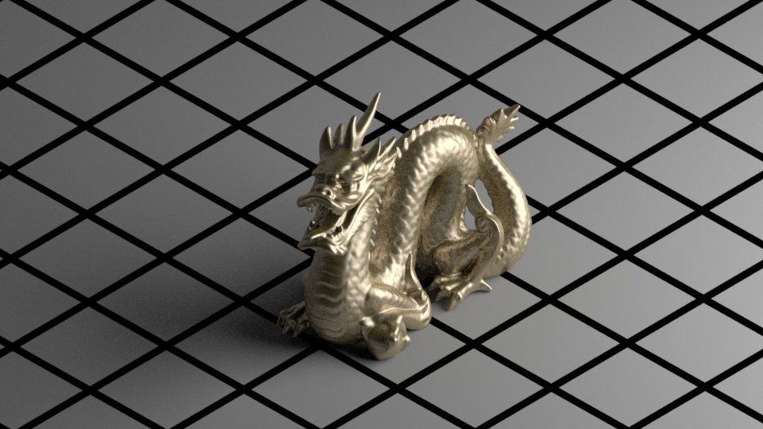

### Stereo Kamera

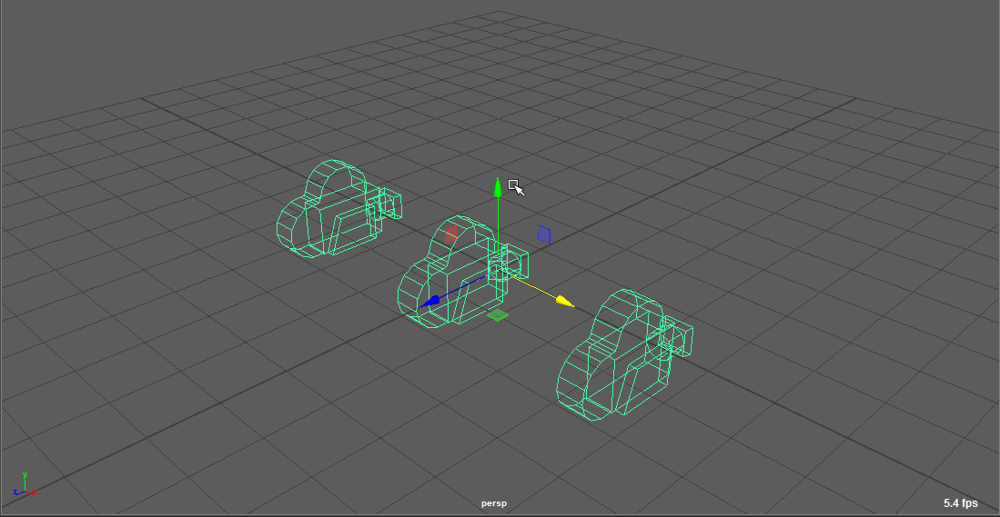

Mit Create > Cameras > Stereo Camera erstellt man eine 3D Kamera.

Die Stereo-Kamera besteht aus mehreren Standardkameras, "Left-Eye", "Center-Eye", "Right-Eye".
Mit dieser Kamera können Stereoskopische-Bilder erzeugt werden, dies ist der Effekt von dem man bei 3D-Kino spricht.

Das Center-Eye, hilft einem die Kamera zu positionieren. bei dem Rendern muss dann das "Left-Eye" und das "Right-Eye" ausgerendert werden.
Um Stereoskopische Bilder betrachten zu können braucht man ein spezielles 3D-Displays bzw. rot-blau Brillen um das Bild zu betrachten.

## Allgemeine Attribute

Insbesondere wenn man 3D Objekte in realem Filmmaterial integrieren möchte, sollte man die Eigenschaften von der Physikalischen Kamera
auf die Attribute von Maya übertragen.

### Angle of View / Focal Length / Camera Scale

Mit dieser Einstellung lässt sich die perspektivische Verzerrung bestimmen die bei dem verwenden von Kameraobjektiven entstehen.

Die Wertebereiche für die Focal Length ist für

- Weitwinkel Objektive 3-15
- Normal Objektive 35-55
- Telezoom Objektive 100-550

Der Öffnungswinkel (Angle of View) und Brennweite (Focal Length) sind direkt voneinander Abhängig (d.h. setzt man den einen Wert wird automatisch der andere gesetzt).
Das Camera Scale Attribut wirkt als Multiplikator für die Angle of View bzw. Focal Length.

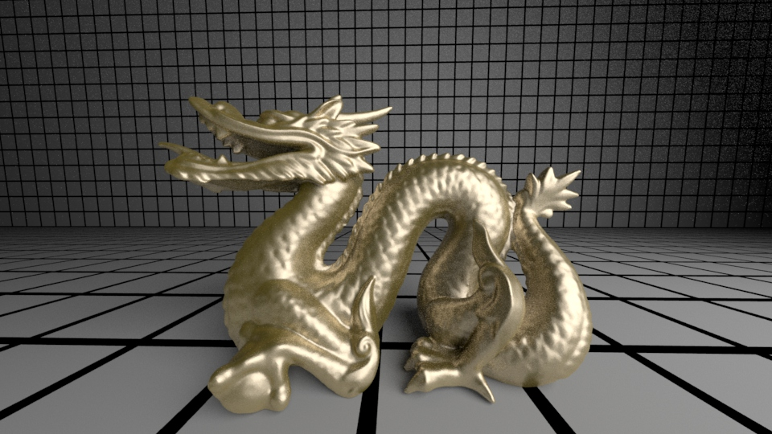

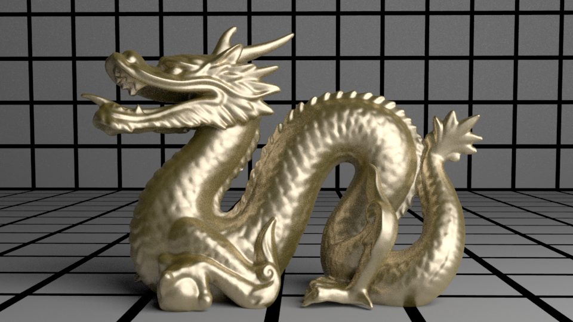

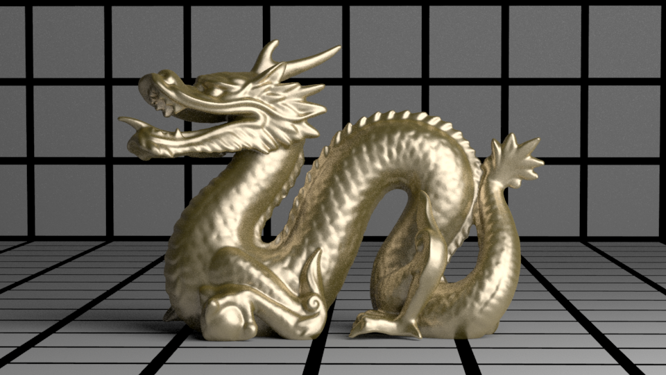

### Near Clip Plane / Far Clip Plane:

Um den Rendervorgang zu optimieren werden Objekte, die zu nah an der Kamera oder zu weit entfernt von der Kamera entfernt sind abgeschnitten.
Dies vermeidet unnötige Berechnungen von Übergroßer bzw kaum sichtbarer Geometrie.

Meistens treten Fehler auf wenn die der Abstand für die Far Clip Plane zu niedrig gesetzt wurde.
Um den Fehler zu korrigieren muss man den Abstand zwischen der Kamera und dem abgeschittenen Objekt messen.

Hierfür wechselt man in die Render_Cam Ansicht und aktiviert Display > Heads up Display > Object Details

In dem Panel Oben rechts wird nun "Distance from Camera" angezeigt.

Für den Wert der Far Clip Plane sollte ein größerer Wert verwendet werden. (Bei der Near Clip Plane ein kleinerer Wert)

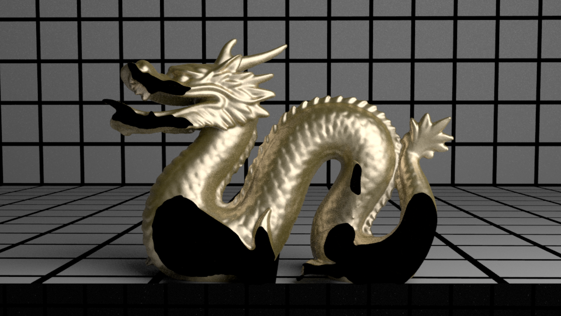

### Environment

Mit dem Environment Attribut kann man festlegen was gerendert werden soll, falls keine Geometrie sichtbar ist.
Standardmäßig wird die Farbe Schwarz als Hintergrundfarbe verwendet.

Möchte man beispielsweise eine Außen Szene Rendern und braucht einen Wolkenhimmel muss man dem Attribut eine Wolkentextur zuweisen.
(Die Textur sollte ein sphärisches Bild sein.)

Arnold ignoriert dieses Attribut, da man für jede Kamera das Attribut setzen muss.
Stattdessen gibt es ein Globales "Environment"-Attribut in den Render Settings.

### Depth of Field

Eine reale Kamera hat eine Tiefenunschärfe, grundsätzlich ist es sehr zeitaufwendig diesen Effekt
zu Rendern. Es gibt mehrere Methoden diesen Effekt zu Rendern und wir beschäftigen uns mit Depth of Field in dem Kapitel Rendering.
