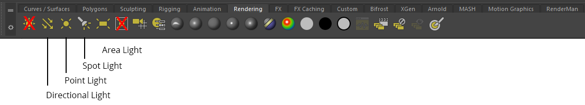
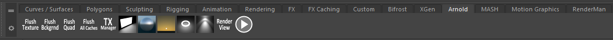
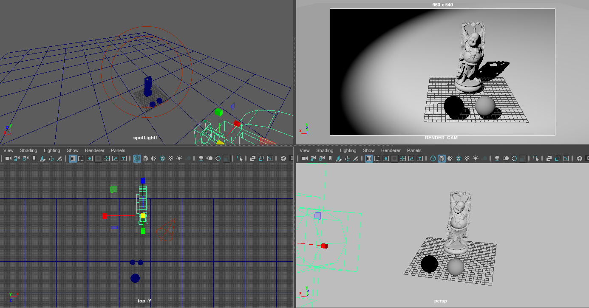
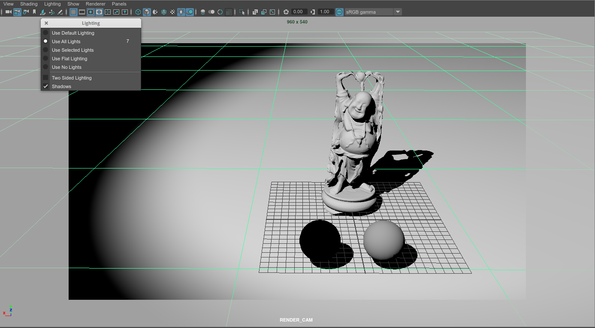
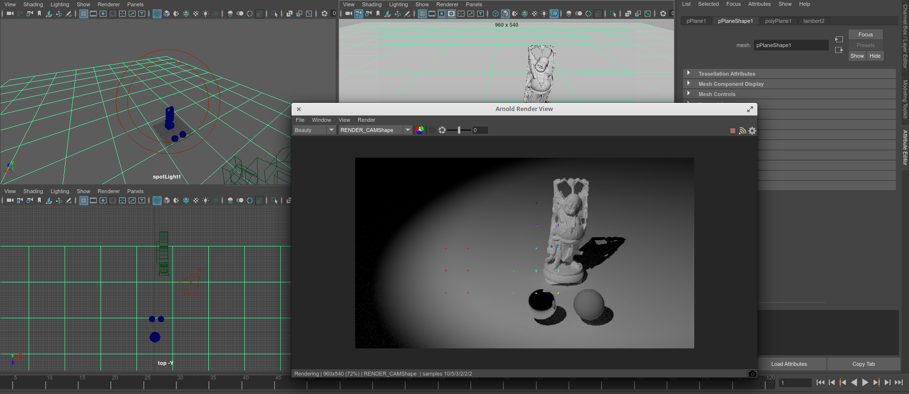

Bevor man mit dem Beleuchten beginnt sollte immer vorher definiert sein wo die Kamera positioniert ist und welchen Bildausschnitt die Kamera sehen kann.

## Menu

Das Modul "Rendering" (F5) muss ausgewählt sein.
Für das arbeiten mit Lichtern interessieren uns insbesondere die Menüpunkte:

- Create > Lights Erzeugt Maya Lichter
- Arnold > Lights Erzeugt Arnold Lichter
- Lighting/Shading Modifiziert das Light Linking
- Windows > Light Editor Öffnet den Light Editor

## Shelf

In der Shelf "Rendering" und "Arnold" findet man die Shortcuts um Lichter zu erzeugen.

_(Die Lichter "Ambient Light" und "Volume Light" werden nicht von Arnold unterstützt)_

## Panels

Beim beleuchten ist es üblich mehrere Views gleichzeitig offen zu haben:

- Die RENDER_CAM ist offen, damit wir sofort eine Vorschau haben wie das Finale Bild aussieht.
- Die Top und persp Views sind offen damit wir leicht erkennen können wo die Lichter platziert sind, relativ zu dem Objekt und der Kamera.
- Die Ansicht des Lichts macht es uns das Leben einfacher das Licht korrekt zu positionieren.

### Generell (Alle Render Engines)

In dem Panel der "RENDER_CAM" die Vorschau der Lichter aktivieren.
Hierfür selektiert man das Panel und drückt 7 (Panelmenü Lighting > Use All Lights).
Wenn man in diesen Modus wechselt und keine Lampen in der Szene vorhanden sind, werden alle Objekte schwarz dargestellt.

In der Standardeinstellung werden keine Schatten berechnet da dieser Prozess Maya stark verlangsamt.
Oftmals benutzt man die Schattenvorschau erst wenn die Grundlegende Beleuchtung definiert wurde um die Lichtposition zu verfeinern.
Die Schatten Vorschau aktiviert man mithilfe des Panelmenü Lighting > Shadows
Man sollte den Modus verlassen sobald die Beleuchtung der Szene vollendet ist.

Die Vorschau der Lichter und Schatten, ist nur eine grobe Voransicht wie die Beleuchtung wirkt.
Benutzen die Lichter Render Engine spezifische Attribute kann es sein das die Vorschau in keiner Weise der final gerenderten Variante gleicht.
Ein weiterer Nachteil der Vorschau ist, das jedes Licht jedes Objekt beleuchtet unabhängig ob es im "Light-Linking"-Editor anders definiert wurde.

Daher sollte man regelmäßig einen Test-Render machen um abzugleichen ob die Beleuchtung auch in der Render Engine den gewünschten Effekt erzeugt.

### Arnold

Arbeitet man mit Arnold, so sollte man direkt mit der Arnold Render View arbeiten. Dieser kann sehr schnell Test-Render erzeugen und wiederholt den Render der Szene,
sobald sich auch nur eine Kleinigkeit in der Szene verändert.
Mit Arnold > RenderView öffnet man die Render View.

In der Praxis verzichtet man komplett auf den den Maya Vorschau Modus, da er die Arnold Decay Rate und Arnold Exponent Attribute nicht korrekt darstellt.
Zusätzlich wird in der Render View, Schatten, indirekte Beleuchtung und Reflektionen gezeigt.

# Mit Licht arbeiten

## Positionierung mit Look through Selected

Lichter kann man am einfachsten positionieren mit dem "Look through Selected" Modus.
Hierfür selektiert man das Licht und wählt im Panel Menü Panels > Look through selected.
Nun sieht man genau das was das Licht beleuchtet und kann mit den üblichen Kamera Werkzeugen das Licht bewegen.
In der RENDER_CAM Ansicht sieht man den Effekt des Lichts und kann so abgleichen ob die Position richtig ist.

## Show Manipulator Tool

Mit dem Show Manipulator Tool (T) bekommt man zwei Move Handles für das Licht,
einen um die Position des Lichts zu bestimmen und einen um die Ausrichtung zu bestimmen.

Indem man auf den kleinen Kreis klickt, bekommt man zusätzlich die Möglichkeit den gemeinsamen Pivot zu verändern.

Für das Spotlight stehen noch einige weitere Modi für die interaktive Anpassung des Angle Attributs, Prenumbra Attributs und die Decay Rate Zones (Nicht unterstützt von Arnold)

## Light Editor

Der Light Editor ist eine Tabelle von Lichtern die in der Szene vorhanden sind.
Hier kann man die typischen Licht Eigenschaften schnell anpassen, wie sie ein und aus schalten oder die Intensität/Exposure anpassen.
