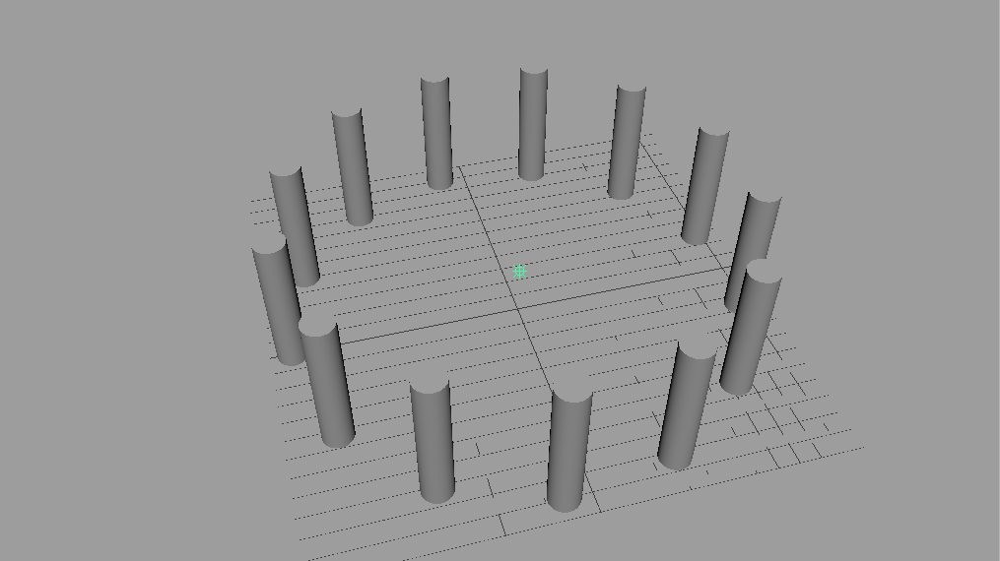
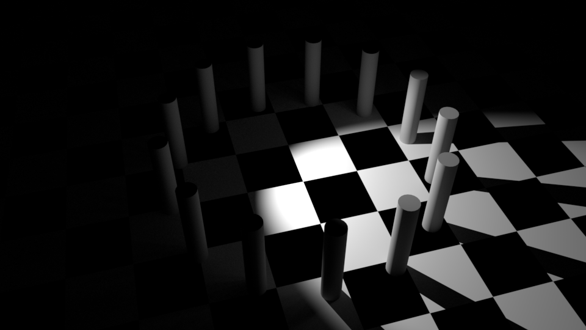
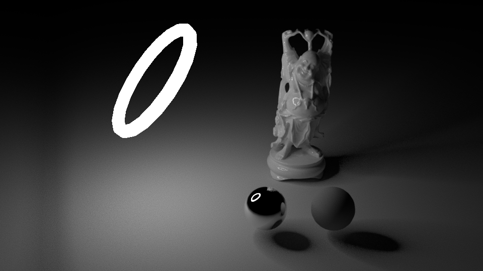

In der Realität werden unzählige Photonen aus einer Lichtquelle in die Umgebung geschickt.
Diese werden durch die Oberflächen reflektiert, gestreuut und abgelenkt.

Im 3D Raum wird eine vereinfachte Simulation von Licht gemacht. Von Lichtquellen werden Rays ausgesendet
und nach einer bestimmten Anzahl von Brechungen/Reflektionen wird die Berechnung abgebrochen.

Desweiteren imitieren 3D Lichter nur Aspekte von Licht aus der Realität. Man unterscheidet zwischen direkter und indirekter Beleuchtung.

- Direkte Beleuchtung, ist wenn eine Lichtquelle ein Objekt direkt Beleuchtet. Man redet hier von "Spotlights", Area Lights etc.
- Indirekte Beleuchtung, ist wenn eine beleuchtete Oberfläche eine weitere Oberflächen beleuchtet. Indirekte Beleuchtung wird auch "Global Illumination", "Final Gathering" etc. genannt.

## Standard Licht Typen

Die Standard Licht Typen kann man im Allgemeinen für alle Renderer verwenden und sind nicht Arnold spezifisch.
Wir werden uns jedoch nur die Arnold unterstützen Lichttypen betrachten.
_(Siehe Anhang für weitere Lichter)_

Man erstellt die Lichter über das Menü <span class="menu">Create > Lights</span> oder über die Shelf Rendering.

Jedes Licht hat sein eigenes "Light Icon". Die Lichtquelle selbst wird nicht ausgerendert und ist meist auch nicht in der Re

## Point Light



Die Lichtquelle vom Point Light ist ein einzelner Punkt und Licht strahlt von dem Punkt aus in alle Richtungen.
Im Prinzip simuliert es ein Licht von einer Glühbirne oder einer Kerze.

Nur die Position des Lichts spielt eine Rolle. Da das Licht von einem Punkt in alle Richtungen ausgestrahlt wird haben Rotation und Skalierung keine Wirkung auf das Licht.

Die Schattenberechnung von Point Lights ist sehr aufwendig. Daher sollte man Point Lights eher spärlich einsetzen und nur dann wenn man sie wirklich benötigt.
Zusätzlich muss man bei der Verwendung von Point Lights achten, das die Hotspots vermieden werden (unnatürlich Helle stellen).
Diese entstehen wenn das Licht zu nah an einer Oberfläche ist.

Eine gute Verwendung von einem Point Light ist wenn man eine eine Kerze auf dem Tisch simulieren möchte und man klar die Schatten des Lichts sehen kann.
Doch in den meisten Fällen, wie eine Glühbirne die von der Decke hängt, kann man das Licht auch mithilfe eines Spotlights simulieren.

Das Point Light erzeugt harte Schatten.


### Directional Light


Ein Directional Light simuliert parallel verlaufende Lichtstrahlen. Diesen Effect bekommt man nur von einer Lichtquelle die sehr stark ist und sehr weit entfernt ist.
Im Prinzip simuliert es Sonnenlicht.

Das Licht füllt den gesamten 3D Raum mit Licht. Die Position und die Skalierung des Lichts spielen keine Rolle.
Nur die Rotation des Light-Icons hat einen Einfluss auf das Licht.

Möchte man ein Fenster simulieren, wo die Sonne durch das Fenster scheint, muss man die Schatten des Directional Lights aktivieren, ansonsten wird der gesamte Innenbereich des Zimmers auch beleuchtet.
Meistens benutzt man das Directional Light als "Fill-Light" zu verwenden um die dunkelen Teile der Szene aufzuellen.

Das Directional Light erzeugt harte Schatten. Je kleiner der Winkel des Lichts zu der Oberfläche werden die Schatten länger und dramatischer.


## Spot Light


Die Lichtquelle vom Spot Light ist ein einzelner Punkt und Licht strahlt von dem Punkt aus durch einen Kegel in eine bestimmte Richtung.
Das Licht imitiert das Licht von einer Spotbeleuchtung wie man sie aus der Filmproduktion/Theater kennt (bzw. das Licht eienr Taschenlampe, oder Autoscheinwerfer).

Positionierung und Rotation haben einen Einfluss auf das Licht.
Darüber hinaus kann man den Öffnungswinkel über das Cone Angle Attribut verändern um einen größeren/kleineren Bereich zu beleuchten.

Beleuchtet ein Spotlight eine Oberfläche, so sieht man eine unnatürlich scharfe Kante zwischen dem Teil der Beleuchtet wird und dem unbeleuchteten Teil.


Mit dem Prenumbra Angle Attribut kann man einen Bereich definieren in dem das Licht an Intensität verliert und gleichzeitigt wirkt das Licht wesentlich natürlicher.
daher sollte man in den meisten Fällen sollte dieser Wert gesetzt werden.


Das Spot Light erzeugt harte Schatten.



## Area Light


Ein Area Light ist eine Fläche die die Szene mit Licht bestrahlt, es ist ein diffuses Licht.
Area Lights sind das äquivalent zu einer Softbox in der Photographie.
Einen ähnlichen Lichteffekt haben auch z.B. Licht aus einem Fernseher, Monitor, oder Leuchtstoffröhren.

Die Positionierung, Rotation und Skalierung haben einen Einfluss auf das Area Light.

Eine Area Light sollte verwendet werden um ein sanftes Licht zu erzeugen.
Daher muss man das Area Light immer auf eine angemessene Größe skalieren.
Im Allgemeinen sollte das Area Light die gleiche Größe wie das zu beleuchtende Objekt haben, oder man orientiert sich an einer realen Softbox (z.B. 50x50, 100x100, 50x150).


## Arnold Lichter

Arnold bietet zusätzlich noch weitere Licht Typen an. Diese können nur von Arnold verwendet werden und nicht von einer anderen Renderengine.

### ai Area Light


Das Ai Area Light erweitert das Maya Area Light mit dem Attribut "Light Shape", mit diesem
lässt sich die Form des Area Lights in eine Scheibe oder einen Zylinder (wie eine Leuchtstoffröhre) wechseln.

Nachdem es ein Arnold eigenes Licht ist, werden nur die Attribute angzeigt die Arnold beachtet angezeigt.


### ai Skydome


Das Skydome Light ist ein Ambient Light, das ist ein Licht was die Szene allen Seiten beleuchtet.
Dieses Licht wird meist im Zusammenhang mit HDRI Beleuchtung verwendet (_Siehe HDRI Beleuchtung_).

### ai Photometric


Lichtquellen in der Realität leuchten nicht gleichmäßig sondern haben ein Leuchtprofil (IES-Profil).
Dieses Profil wird durch die Form der Lampe und den Einsatz von Reflektoren (z.B. Halogenlampen) beeinflusst.

Die Hersteller von Lampen messen ihre Lampen und erstellen IES-Profile.
Meist findet man das IES Profil was man braucht durch eine Google Suche.

- [Osram](http://www.osram.com/osram_com/tools-and-services/tools/dialux-and-relux/index.jsp)
- [Phillips](http://www.usa.lighting.philips.com/support/support/literature/photometric-data.html)
- [Visual-3D](http://www.visual-3d.com/tools/PhotometricViewer/default.aspx)
- [Pixar Renderman Collection](https://renderman.pixar.com/view/DP25764)

Ein **Photometric** Light nutzt die Messdaten um die Szene zu erleuchten. Ohne Messdaten wird die Szene nur schwarz ausgerendert.


Das Photometric Light wird verwendet um eine Szene möglichst Photorealistisch Rendern zu können.
Insbesondere bei der Architekturvisualiserung wird darauf geachtet, das die Lichtprofile der Lampen stimmen.

<span class="anmerkung">
Es ist hilfreich sich seine eigene Sammlung von IES Dateien anzulegen damit man sich nicht immer wieder auf die Suche nach Profilen machen muss.
</span>


### Mesh Light


Das Mesh Light ermöglicht einen mithilfe eines Meshes die Szene zu beleuchten.
Man kann somit Lichter wie Ringblitze, Neonröhren etc. simulieren.

Ungleich wie die anderen Lichtquellen hat dieses Licht kein Light Icon, sondern nur die Geometrie.
Auch erscheint das Licht nicht in dem Light Editor.

Möchte man ein Mesh Light erzeugen, selektiert man das Objekt.
Im Attribute Editor selektiert man den "Shape"-Node und setzt das Attribut **Arnold-Translator = mesh_light**.


Das Objekt ist nun unsichtbar und es emittiert nur Licht. Man kann das Objekt sichtbar machen indem man
"Light visible" aktiviert.



# Kurz Übersicht

| Licht          | Typ             | Simulation                            | Modifizierbar                  | Nutzung                                                            | Anmerkung                                                                                               |
| -------------- | --------------- | ------------------------------------- | ------------------------------ | ------------------------------------------------------------------ | ------------------------------------------------------------------------------------------------------- |
| Point          | Hard Light      | Kerze, Glühbirne                      | Position                       | Wenn Radiale Schatten notwendig sind                               | Dieses Licht wird selten eingesetzt werden, und kann meistens mit einem Spot Light ausgetauscht werden. |
| Directional    | Hard Light      | Sonne                                 | Rotation                       | Außen Beleuchtung, Szene mit Licht fluten                          |                                                                                                         |
| Spot Light     | Hard Light      | Scheinwerfer, Taschenlampe            | Rotation, Position, Cone Angle | Kann vielseitig eingesetzt werden und kann viele Lichter imitieren | Immer den Prenumbra Angle anpassen, ansonsten wirkt das Licht unecht.                                   |
| Area Light     | Soft Light      | Diffuses Licht, wie von einer Softbox | Rotation, Position, Scale      | Sanftes diffuses Licht                                             | Man sollte das Area Light so skalieren, das es so groß ist wie eine Softbox in der Realität             |
| ai Area Light  | Soft Light      | Diffuses Licht, wie von einer Softbox | Rotation, Position, Scale      | Area Light mit der Form einer Röhre oder Scheibe                   |
| ai Skydome     | Soft/Hard Light | Fotographierte Umgebung               | Rotation                       | HDRI Beleuchtung                                                   |                                                                                                         |
| ai Photometric | Soft/Hard Light | Gemessenes Reales Licht               | Position, Rotation             | Nutzung von physikalisch korrekte Lichtprofilen                    | Um möglichst fotorealistische / physikalisch korrekte Lichter zu rendern                                |
| ai Mesh Light  | Soft Light      | Neon Lampen                           | Rotation, Position, Scale      | Eigene Lichtformen                                                 | Man kann die Form des Lichts animieren                                                                  |

# Attribute

## Allgemeine Attribute

Diese Attribute findet man bei allen Lichtern wieder.

### Color

Alle Lichter haben als Standardwert die Farbe weiß.

In der Natur gibt es eigentlich kein Licht was reines weiß emittiert.
Sonnenlicht ist wenn es auf der Erde eintrifft je nach Tageszeit, rötlich oder bläulich.
Künstliche Lichter wie Florescente Lampen erscheinen blau und Glühbirnen haben einen gelblichen Ton.

Die Farbe des Lichtes sollte eigentlich immer angepasst werden um ein realistischeres Bild zu erhalten.
<span class="anmerkung">(Oft benutzt man eine Farbtemperatur -> Siehe Arnold Color Temperature)</span>

### Intensity

Dies bestimmt die Lichtstärke des Lichts an der Lichtquelle.
Die Intensität des Lichts an der Oberfläche des Objekts wird errechnet mit der Decay Rate und dem Abstand von dem Objekt zum Licht.

Für Arnold ist es besser wenn man diesen Wert bei 1 belässt und stattdessen das Arnold Exponent Attribut verwendet.

### Decay Rate

Die Decay Rate definiert den Abfall der Licht-Intensität von Lampen.
Die Intensität berechnet sich an jedem Punkt mit Intensity = 1/Distanz^(Faktor).
In der Realität haben die Lichter eine quadratische Abfall Rate (Faktor=2).

Benutzt man keine Decay Rate (Faktor=0), so ist die Licht-Intensität gleich stark, unabhängig vom Abstand des Objekts zum Licht.
(Nicht von Arnold unterstüzt)

Das Licht wirkt unnatürlich wenn es keine Decay Rate verwendet.
Früher hat man eine vereinfachte lineare Decay Rate verwendet (Faktor = 1) um Rechenzeit zu sparen.
Maya bietet zusätzlich die Cubic Decay Rate (Faktor=3) an. Diese lässt die Licht-Intensität schneller abfallen als in der Realität und wird nur in seltenen Fällen verwendet.
(Nicht von Arnold unterstüzt).

Dieses Attribut wird von Arnold nicht beachtet, stattdessen hat Arnold sein eigenes Decay Rate Attribut.

## Illuminates by Default

Das ist ein einfacher an/aus Schalter für das Licht. Man verwendet ihn damit man den Effekt von den anderen Lichtern besser sehen kann.

## Emit Diffuse & Emit Specular

Lichter in Maya können getrennt die Diffuse Reflektion und für die Specular Reflektion beinflussen.
In manchen Fällen möchte man diese beiden Effekte voneinander trennen, da z.B. die Specular Reflektion einen unerwünschten Effekt hat.
Oder man möchte zwei getrennte Lichter definieren die für den jeweiligen Effekt sorgen.

Arnold hat seine Eigene Steuerung der Licht Render Eigenschaften (_Siehe Diffuse & Specular & SSS & Indirect & Volume_)

## Arnold Attribute

Nicht alle Attribute haben einen Effekt auf die Render Engine. Man muss sich immer mit der jeweiligen Render Engine auseinandersetzen welche Attribute überhaupt eine Wirkung zeigen.
Arnold unterstützt z.B. keine Depth Map Shadows.

Zusätzlich kann es passieren das die Renderengine die Maya Attribute mit seinen eigenen überschreibt.
Arnold überschreibt z.B. die Decay Rate und Shadow Einstellungen.

### Color Temperature

In der Physik ist ein “Blackbody” (schwarzer Körper) definiert als idealisierter Körper der jedes Licht (bzw. elektromagnetische Strahlung)
vollständig absorbiert. Erhitzt man den Körper kann er auch Strahlung aussenden und man kann durch Temperatur das gesamte sichtbare Farbspektrum abbilden.

Jede reale Lichtquelle hat ihre eigene Temperatur z.B. eine Glühbirne 2800K (gelblich), Tageslicht 5500K, bedeckter Himmel 6500K -7500K (bläulich).

Möchte man eine bestimmte Lichtquelle simulieren, braucht man nur googlen welche Farbtemperatur die Lichtquelle hat und kann diese verwenden.

Es ist einfacher eine Color Temperature zu setzen als das Color Attribut zu definieren was nur subtil das Licht färbt.

### Exposure

Durch die Decay Rate muss der Wert Intensity sehr groß sein um die Szene zu erleuchten.
Arnold löst dieses Problem indem es die Lichtintensität über die Formel

```
color * intensity * 2^exposure
```

bestimmt.

In der Praxis kann man intuitiver und genauer die Intensität bestimmen durch verändern des Exposure Attributs.

### Samples

Mit dem Samples Attribut kann man die Renderqualiät verbessern. (_Siehe Fixing Noise_)

### Diffuse & Specular & SSS & Indirect & Volume

Ähnlich wie die Maya Attribute "Emit Specular" & "Emit Diffuse" kann man hier modifizieren was das Licht beleuchtet
Anstatt einem an/aus Schalter, kann man hier eine Gewichtung für das jeweilige Attribut setzen.

So kann man z.B. Specular auf 0.5 setzen damit die Glanzpunkte weniger hell sind.

## Spot Light Attribute

### Prenumbra

### Dropoff
