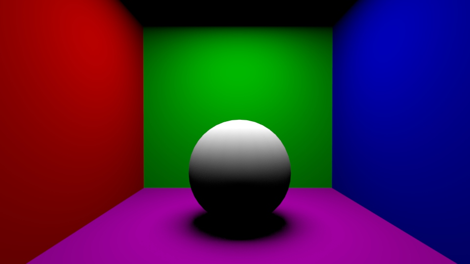
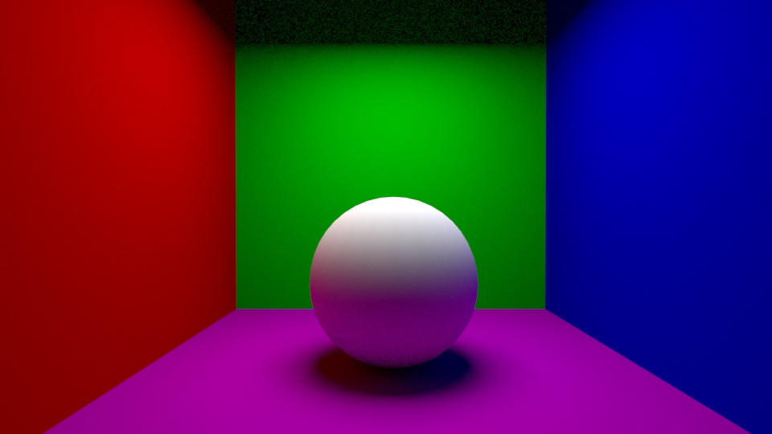

## Grundlagen Indirekte Beleuchtung

Indirektes Licht ist Licht was auf eine Oberfläche auftrifft, was zuvor von einer anderen Oberfläche gestreut wurde.
Das Licht übernimmt die Farbe von dem letzten Objekt und überträgt sie auf das nächste Objekt (Color Bleeding Effekt).

In der 3D-Umgebung wird inital dieser Effekt nicht simuliert und Lichter senden nur direktes Licht aus.
Renderengines bieten Global Illumination (GI) Methoden an um indirekte Beleuchtung zu simulieren.
Die physikalisch akurate Simulation von der Streuung von jedem Lichtstrahl kostet viel Rechenzeit.
Daher haben sich mehrere Verfahren über die Zeit entwickelt um die Renderzeit zu verkürzen.

In dieser Beispielszene ist ein weisser Ball in einem Raum mit bunten Wänden.

Bei Arnold ist die indirekte Beleuchtung standardmäßig aktiviert und man steuert sie indem man in den Render Settings die "Diffuse"-Samples anpasst.
Ein Wert von 0 deaktiviert den Effekt, höhere Samples verbessern die Qualität des Renders.
