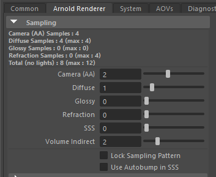
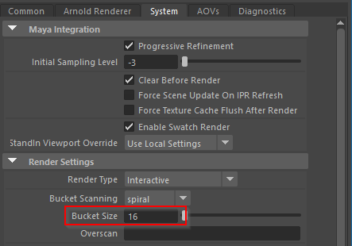
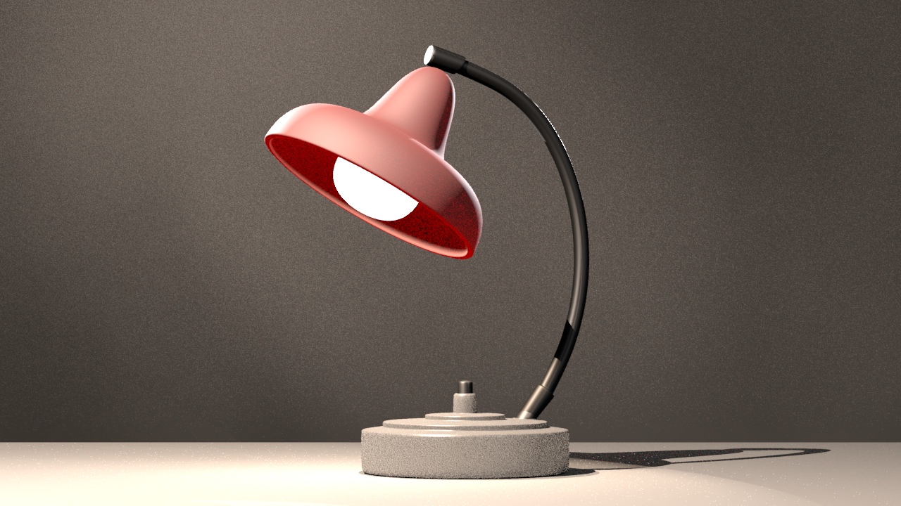
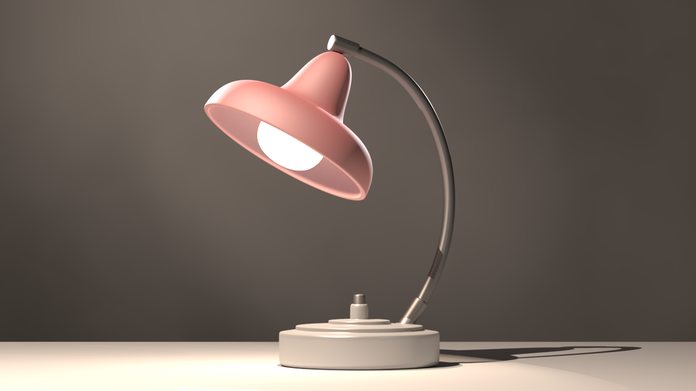

# Render Einstellungen zum arbeiten mit Licht

Die Standardeinstellungen sind ausgelegt damit man ohne viel Vorwissen ein Bild ausrendern kann.
In der Praxis hat es sind diese Einstellungen viel zu langsam sind um mit Arnold zu arbeiten.

Die Einstellungen für Testrender sollte optimiert sein für Geschwindigkeit.

Daher deaktivieren wir alle Funktionen von Arnold die wir bei der Beleuchtung nicht brauchen:

Wir öffnen die Render Settings Windows > Setting and Preferences > Rendering Editors > Render Settings und wechseln in den Tab "Arnold Renderer".

Wird man später in seiner Szene keine indirekte Beleuchtung verwenden, so kann man auch den Wert "Diffuse" auf 0 setzen.

Wir können nun noch zusätzlich die Bucket-size anpassen.
Die Einstellung hierfür findet man in dem Reiter "System".

Das gerenderte Bild wird sehr schlecht aussehen, es ist sehr pixelig und hat ein hohes Rauschen. Für den Moment ist das genau das was wir haben wollen.

Wir können ganz klar erkennen wie die Lichter unsere Szene beinflussen. Verändern wir die Position von einem Licht, wird Arnold sofort die Szene ausrendern und wir können genau den Effekt unserer Lampen sehen.

