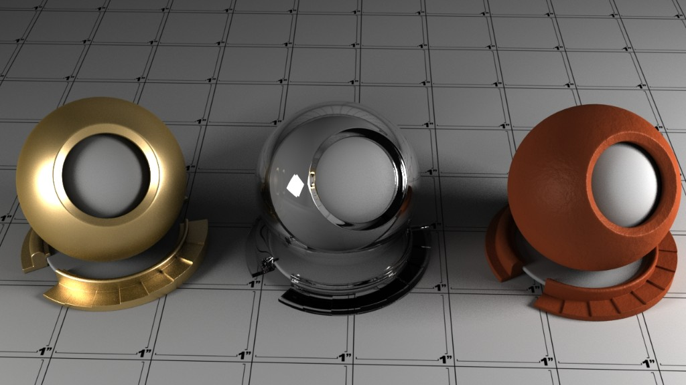

> „If you can shade a Teapot - you can shade anything“.

In den Anfängen der Computergrafik wurde eine Teekanne verwendet um Shader auszutesten. Der Vorteil der Teekanne ist, dass sie harte Kanten als auch weiche Kanten hat. Wenn es auf der Teekanne gut aussieht, sieht der Schader auch auf dem eigentlichen Objekt gut aus.

Es wurden die Shaderballs sehr beliebt Testrender mit Teekanne unnötig, da man den Shader meistens direkt auf das Objekt anwenden und es ausrendern kann. Jedoch kann man viel lernen wenn man Shader an Teekannen austestet.

In der Regel erstellt man mehrere Test-Render bevor man die Szene ausrendert. Diese Render haben eine sehr geringe Qualität und dienen nur um zu sehen ob einzelne Materialien, oder die Beleuchtung korrekt eingestellt ist.

## Tutorials

- [Arvid Schneider Youtube Channel](https://www.youtube.com/watch?v=Aog3KDgQN00&list=PLkb7MHt0xUF1y6t2XXM_Cm8aPYowToIfp&index=26)
