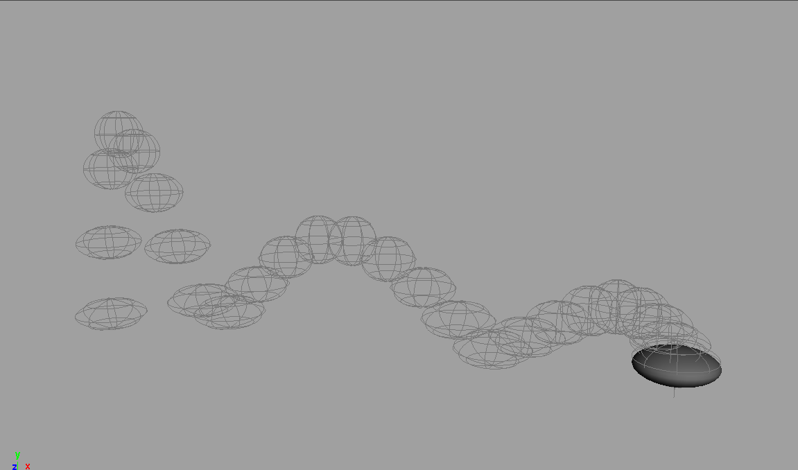
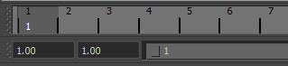
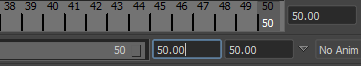
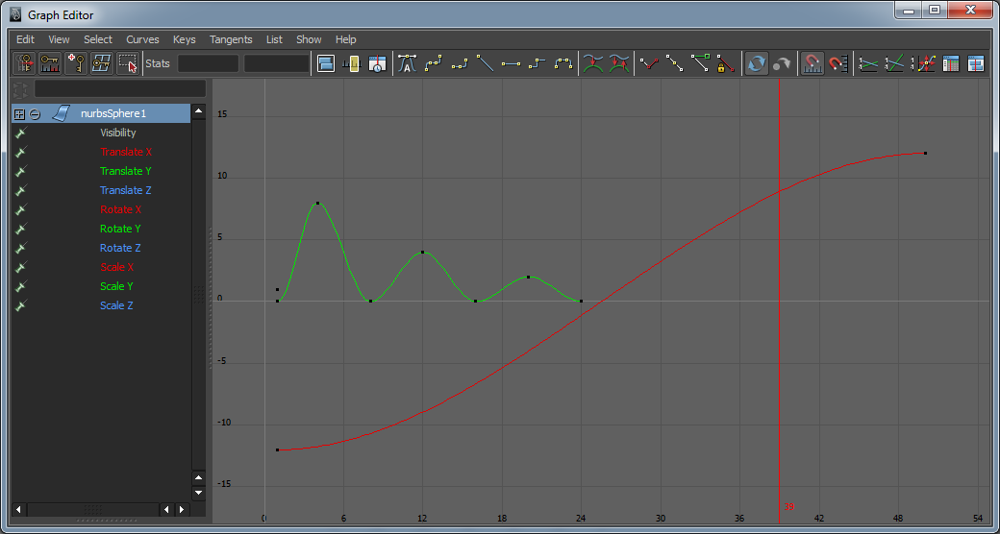
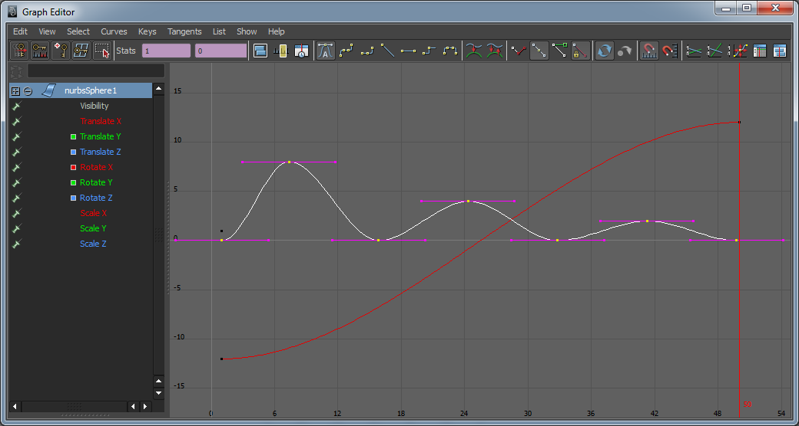
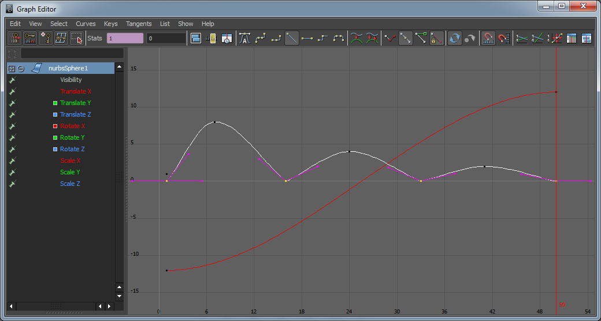
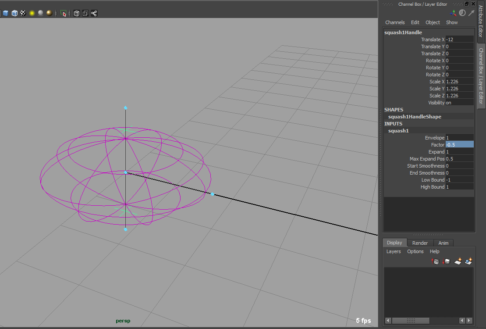

# Springender Ball

## Schritt 1

Eine Nurbs Sphere erstellen mit Create > Nurbs Primitives > Sphere (Radius 1, TranslateX -12)

## Schritt 2

Mit der Sphere selektiert drückt man S, oder Animate > Set Key. Dies setzt einen Keyframe für die Scale/Rotate/Translate Eigenschaften. In der Channel Box werden alle Elemente denen je ein Key zugewiesen ist rosarot unterlegt. In dem Time Slider wird ein roter Strich für den Keyframe des Objektes angezeigt (man muss dabei das animierte Objekt selektiert haben).

## Schritt 3

In der Zeitleiste klickt man nun auf Frame 50. Frame 50 wird aber nicht angezeigt. Im Range Slider gibt man deswegen für den „End-Time of Playback“ 50 ein. Automatisch wird nun für die „End time of Animation“ der Wert 50 gesetzt.

## Schritt 4

Mit Frame 50 selektiert setzt man nun die Sphere auf TranslateX = 12. Mit S erzeugt man einen weiteren Keyframe.

> Anmerkung: Per Default ist Autokeying eingeschaltet. Hat ein Objekt bereits einen Key wird für jede Veränderung automatisch ein neuer Keyframe gesetzt. Man muss daher immer nur den ersten Keyframe setzen und Maya setzt alle weiteren Keyframes automatisch, wenn man das Objekt manipuliert. Am Ende des Range Sliders kann man Auto Keying ausschalten, indem man auf den Schlüssel klickt.

## Schritt 5

Im Time Slider kann man nun auf Play forwards klicken und man sieht die Animation in einer Endlosschleife.

## Schritt 6

Nun setzen wir für Frame 4 TranslateY = 8, Frame 8 TranslateY = 0, Frame 12 TranslateY = 4, Frame 16 TranslateY = 0, Frame 20 TranslateY = 2, Frame 24 TranslateY = 0.

## Schritt 7

Mit Play sieht man, dass der Ball für die erste Sekunde hüpft, jedoch für die zweite Sekunde sich unverändert fortbewegt.

## Schritt 8

In diesem Beispiel wäre es besser wenn der Ball für 2 Sekunden hüpft. Dies kann man leicht verändern, indem man den Graph Editor verwendet Window > Animation Editors > Graph Editor. Im linken Teil sieht man die selektierten Objekte und die Keyframes. Im rechten Teil sieht man wie sich die Werte über die Zeit als Graph verändern. Die Punkte auf den Kurven sind die Keyframes.

## Schritt 9

Um sich einen besseren Überblick zu verschaffen, mit LMB auf TranslateY, um alle anderen Werte auszublenden (Mit LMB auf nurbsSphere1 werden wieder alle Werte angezeigt). Mit LMB eine rechteckige Selektion ziehen um alle Frames von TranslateY auszuwählen.

## Schritt 10

Im Graph Editor wird immer relativ zur Position des Mausklicks skaliert. Mit R (Scale Tool) und MMB auf den Ursprung klicken und skalieren. Wenn der letzte Frame in dem Bereich 45.5-50.4 ist, kann man aufhören.

## Schritt 11

Mit den selektierten Keyframes geht man auf Edit > Sna- so werden allen Keyframes ganze Zahlen zugeordnet.

## Schritt 12

Man kann nun die Animation abspielen. Da der Ball eine konstante Geschwindigkeit hat, wirkt die Sprungbewegung des Balles unnatürlich.

> Anmerkung: Um effizienter mit dem Graph Editor zu arbeiten, kann man in der Toolbox das Icon persp/Graph klicken. Alternativ mit der Hotbox (Leertaste) > (North Sector)> LMB > persp/Graph. Die Animation kann nun in der oberen Ansicht abgespielt werden. In dem unteren Graph Editor kann man die Werte direkt verändern.

## Schritt 13

Man selektiert nun alle Keyframes mit TranslateY = 0 und macht im Graph View Menü > Tangents > Linear

## Schritt 14

Beim abspielen sieht man nun die Kugel beschleunigen und abbremsen.

# Deformers

Mithilfe von Deformern können wir den Ball deformieren damit sich die Animation etwas realistischer auschaut.

## Schritt 1

Bei Frame 1 die Sphere selektieren und einen Nonlinear Deformer Squash erzeugen. (Create Deformers > Nonlinear > Squash).

## Schritt 2

Drückt man T (Show Manipulator Tool) kann man die Eigenschaften des Deformers kontrollieren. Für Frame 1 stellt man einen Faktor von -0.5 ein.

## Schritt 3

Wird Play gedrückt sieht man, dass der Deformer sich nicht bewegt und sich die Kugel seltsam deformiert.

## Schritt 4

Der Deformer muss als Child Object der Kugel gesetzt werden. Dabei selektiert man zuerst den Deformer und dann die Kugel. Anschließend drückt man (Edit > Parent)

## Schritt 5

Der Deformer bewegt sich nun mit, der Faktor bleibt immer gleich. Diesen kann man nun auch mit zusätzlichen Keyframes animieren. Um einen Keyframe für eine beliebige Eigenschaft zu setzen klickt man mit RMB auf die Eigenschaft und erhält die Möglichkeit Key Selected (Channel Box) bzw. Set Key (Attribute Editor).

## Schritt 6

Nun setzt man, immer wenn die Kugel den Boden berührt, den Faktor auf -0.5. Für alle andere Keyframes hat es den Wert 0. (Mit Next Keyframe (.) und Previous Keyframe (,) lassen sich die verschiedenen Keyframes einfacher setzen)

# Resultat

Nun kann man mit dieser Animation einige Dinge lernen. Im idealfall versucht man nun verschidene Dinge zu animieren:

- Was muss man machen damit der Ball schwerer wirkt?
- Den Abstand der Keyframes variieren was passiert nun?
- Den Ball in 3 Dimensionen springen lassen?
- Was passiert wenn man die Tangents verändert?
