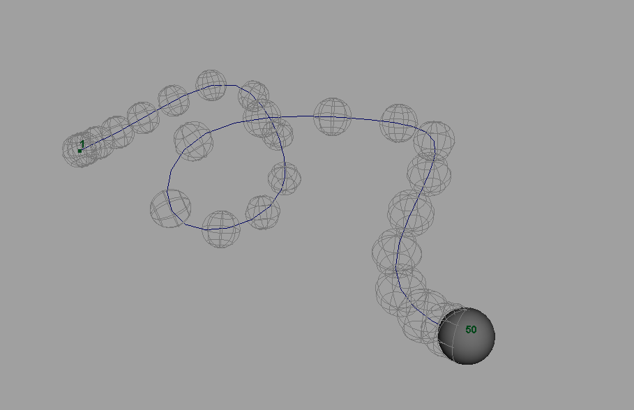

Eine motion path Animation ist einfach wenn ein Objekt entlang einer Kurve animiert wird.

# Praxis: Kurve entlang eines Pfades

## Schritt 1

Create > Nurbs Primitives > Sphere

## Schritt 2

Mit den Curve Tools kann man eine Kurve in den Raum zeichnen. Sie sollte möglichst genau der gewünschten Bewegung entsprechen.

## Schritt 3

Das Objekt (die Sphere) und die Kurve zusammen selektieren

## Schritt 4

Animate > Motion Path > Attach to Motion Path. Nun wird das Objekt auf den Anfang der Kurve repositioniert.

> Anmerkung: Der Control Vertex Point wird auf den ersten Punkt der Kurve gesetzt. Man sollte den Control Vertex Point daher vorher korrekt positionieren für ein besseres Ergebnis.

Der Range Slider definiert, wann die Kugel anfängt die Kurve entlang zu fahren und wie lange sie braucht um das Ende zu erreichen. Im Graph Editor kann man die Länge nachträglich verändern.

## Schritt 5

Die Kurve lässt sich im Edit Modus per CVs und EPs anpassen.

> Anmerkung: Weitere Keyframes, um die Geschwindigkeit anzupassen, erstellt man mit Animate > Motion Path > Set Motion Path Key
