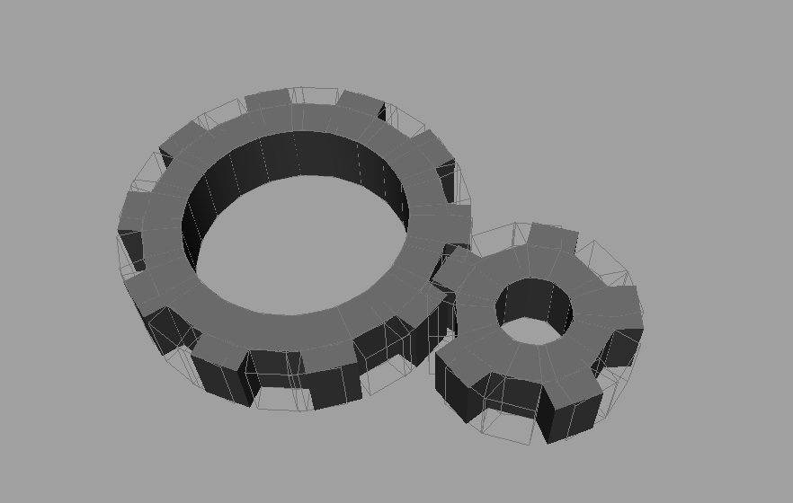
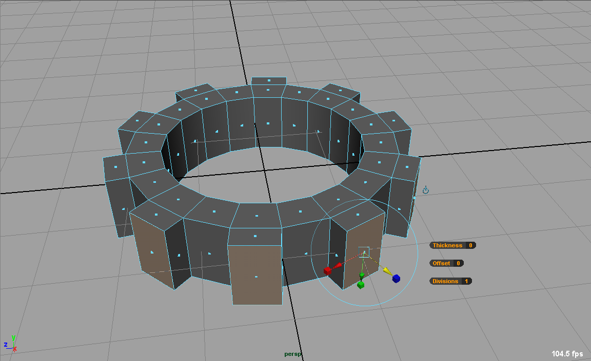
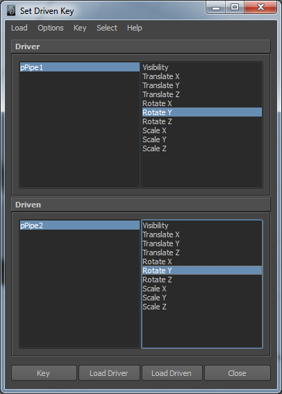
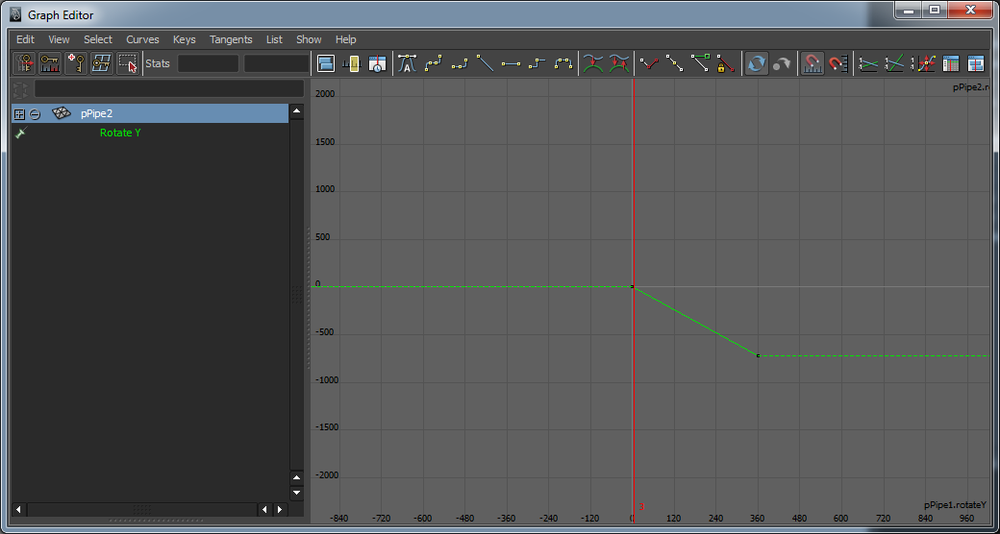
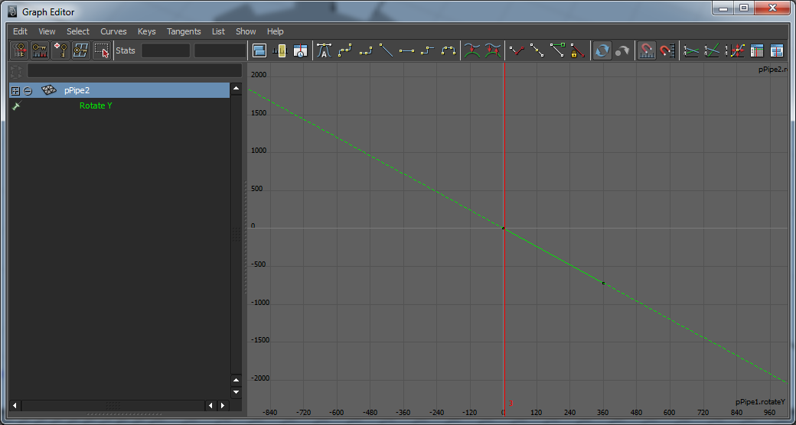

In Maya lassen sich reaktive Animationen mithilfe von „Driven Keys“ realisieren. Ein Attribut eines Driver-Objects beinflusst Attribute eines Driven-Objekts.

# Zahnräder Modellieren

## Schritt 1

Create > Polygon Primitives > Pipe (Radius 2, Subdivision Axis 20)

## Schritt 2

Jedes zweite äußere Face selektieren und Edit Mesh > Extrude

## Schritt 3

Create > Polygon Primitves > Pipe (Radius 1, Subdivision Axis 10)

## Schritt 4

Jedes zweite äußere Face selektieren und Extude

## Schritt 5

Das kleinere Zahnrad positionieren, sodass es mit dem größeren verzahnt ist.

# Driven Keys

## Schritt 1

Animate > Set Driven Key > Set...

## Schritt 2

Das große Zahnrad (pPipe1) selektieren und im „Set Driven Key“-Fenster „Load Driver“

## Schritt 3

Das kleine Zahnrad (pPipe2) selektieren und „Load Driven“

## Schritt 4

Die Attribute RotateY bei Driver und bei Driven selektieren.

## Schritt 5

Den Button „Key“ klicken.

## Schritt 6

Das große Zahnrad (pPipe1) selektieren und in der Channel Box RotateY = 360

## Schritt 7

Das kleine Zahnrad (pPipe2) selektieren und in der Channel Box RotateY = -720

## Schritt 8

Den Button „Key“ im „Set Driven Key“-Fenster klicken

## Schritt 9

Rotiert man das große Zahnrad mit dem Rotate-Tool um die Y-Achse bewegt sich das kleine Zahnrad mit, jedoch nur in dem Wertebereich
0-360. Wird der Wertebereich verlassen dreht sich das kleine Zahnrad nicht

## Schritt 10

Das kleine Zahnrad (pPipe2) selektieren und den Graph Editor öffnen. Man sieht, es wurden Keyframes für den RotateY gesetzt.

## Schritt 11

Die Keyframes selektieren und Tangents > Linear um den „Ease-In Ease-out“ zu entfernen.

## Schritt 12

View > Infinity (aktivieren) hier wird gestrichelt angezeigt, das vor und nach den Keyframes die Werte konstant bleiben.

## Schritt 13

Die Keyframes selektieren

## Schritt 14

Curves > Post Infinity > Cycle with Offset

## Schritt 15

Curves > Pre Infinity > Cycle with Offset

## Schritt 16

Rotiert man das große Zahnrad mit dem Rotate Tool um die Y-Achse bewegt sich das kleine Zahnrad für beliebige Werte von
TranslateY des großen Zahnrads mit

## Resultat

Spielt man die Animation ab, so passiert nichts. Man muss für das Driver-Objekt (das große Zahnrad) Keyframes setzen. z.B. Frame 1 RotateY = 0, Frame 200 RotateY = 360
