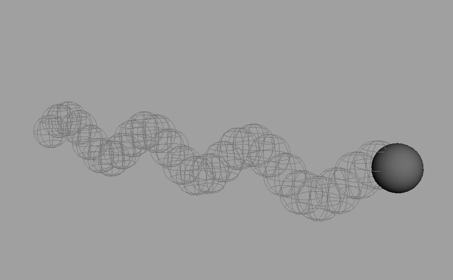
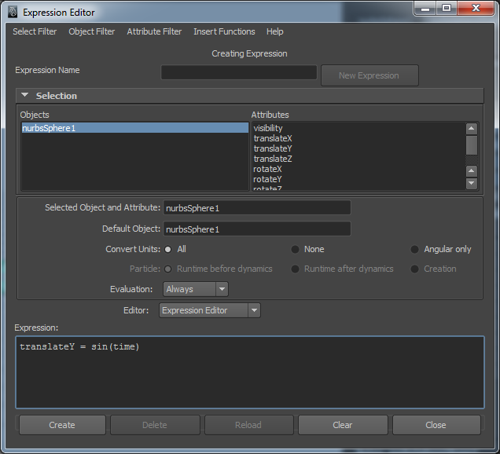

In dem Beispiel soll sich eine Kugel stetig auf und ab und zur Seite bewegen. Dies wird realisiert mit der Sinus- und einer linearen Funktion.

## Schritt 1

Create > Nurbs Primitives > Sphere

## Schritt 2

Window > Animation Editors > Expression Editor

## Schritt 3

Das Attribut translateX selektieren und den Ausdruck „translateX = time“ eingeben

## Schritt 4

„Create“ klicken. In der ChannelBox wird das Attribut blau unterlegt und kann nicht mehr mit normalen Keyframes animiert
werden

## Schritt 5

Wenn man die Animation abspielt, bewegt sich die Kugel auf der X-Achse

## Schritt 6

Das Attribut translateY selektieren und die Expression „translateY = sin(time)“ eingeben.

> Anmerkung: An dieser stelle kann man jede mathematische funktion definieren. In diesem Beispiel verwenden wir einfach eine Sinus funktion.

## Schritt 7

Nun die Expression erzeugen indem man auf „Create“ klickt.

## Schritt 8

Beim Abspielen bewegt sich die Kugel auf der Y-Achse auf und ab und auf der X-Achse linear
