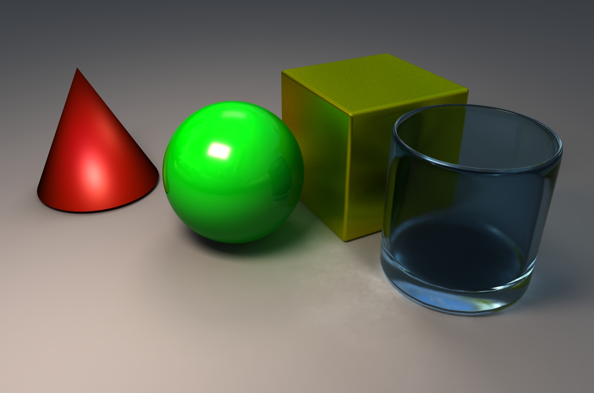

> “There’s nothing quite like turning a grey-shaded model into something that looks real - or that could be real.” Lee Lainier

Rendering ist der Vorgang bei dem aus der modellierten Szene ein Bild errechnet wird. Zuerst muss eine Render Engine ausgewählt werden und dann entsprechende Materialien dem Objekt zugewiesen werden. Zusätzlich solle man das Licht in der Szene setzen und mit einer Kamera einen guten Bildausschnitt wählen.

## Render-Vorbereitungen

Das Rendern braucht sehr viel Rechenleistung. Deswegen werden hierfür sog. RenderFarms verwendet. Pixar braucht durchschnittlich 7 Stunden um ein einziges Bild für ihre Animationsfilme zu erzeugen, sogar mit ihrer RenderFarm Wired Magazine 6/2010. Daher sollte man zuvor viele Testrenderings von einzelnen Elementen machen, bevor man einen finalen Render macht. Vor jedem Render sollte man unbedingt Abspeichern und alle unnötigen Programme schließen. Der Computer wird während dem Rendern üblicherweise kaum bzw. gar nicht reagieren. Um den RenderVorgang eines Einzelbildes abzubrechen muss man Esc drücken. Es dauert 1-10sek bis der Computer darauf reagiert.

# Rauschen minimieren

Es gibt viele Formen von Rauschen beim Renderen. Die Arnold Documentation geht in Detail ein wie man jede form von rauschen minimieren kann:

https://docs.arnoldrenderer.com/display/A5AFMUG/Removing+Noise

# Links:

- https://www.lifewire.com/increase-the-photo-realism-in-your-renders-2120
- https://www.lifewire.com/how-to-make-really-bad-cg-2129
- https://www.lifewire.com/what-is-rendering-1954
