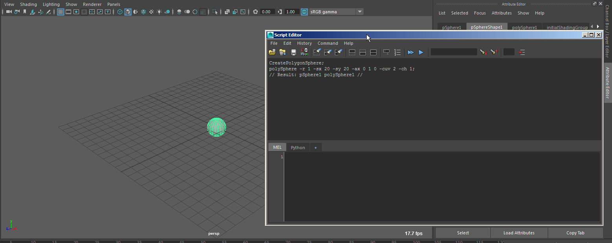

# MEL Scripting

Alle Funktionen von Maya kann man mit MEL-Befehlen ansteuern.
Maya wurde so ausgelegt, dass man auch mit keiner Programmiererfahrung einfach Skripte erstellen kann,
da Maya die Mel Befehle im Skript Editor anzeigt und man kann diese direkt in ein Skript verwandeln.

## Skript Editor



Im oberen Teil sieht man die History der ausgeführten Maya Befehle. Um ein eigenes Skript zu erstellen
könnte man eine Reihe von Operationen in Maya ausführen und dann einfach die Befehle aus der History
kopieren. Manchmal werden ein Teil der Befehle nicht angezeigt. Möchte man sich wirklich alle Befehle
anzeigen lassen wählt man <span class="menu">History > Echo All Commands</span>.
Im unteren Teil lassen sich eigene Skripte erstellen der Editor unterstützt Syntax Highlighting.
Möchte man das Skript ausführen, selektiert man den Code und drückt <span class="shortcut">Strg-Enter</span>
(Drückt man nur Enter wird der Skript Editor zurückgesetzt)

Die einfachste Variante um Skripte abzuspeichern ist den Code im Skript Editor zu selektieren und
mit MMB auf die Shelf ziehen. Es wird ein neues Icon erstellt und durch Klicken auf die Shelf wird
der Code ausgeführt. Man kann das Icon wieder löschen, indem man es (wie jedes Shelf Objekt) mit MMB
auf den Mülleimer zieht. Mit MMB und auf den Skript Editor ziehen kann man den Code im Code Editor
bearbeiten.Der bearbeitete Code kann nur als neues Shelf Item abspeichert werden.

## Beispiel Skripts

### Default Settings

Insbesondere wenn man in einem Studio Arbeitet und man ggf öfter den PC wechselt, möchte man doch immer das Maya die Identischen Einstellungen einstellt.

```
//deactivate View Cube
viewManip -visible off;
optionVar -iv viewCubeShowCube 0;
//poly center face selection polySelectConstraint
-wholeSensitive off;
//ininite undo
undoInfo -infinity on;
intFieldGrp -e -enable false queueSizeIFG;
//enable autosave
optionVar -iv autoSaveEnable true;
autoSave -en true; optionVar -iv autoSaveLimitBackups true;
autoSave -limitBackups true;
intSliderGrp -e -en true autoSaveMaxBackups;
```

### Maya API Resources

Zum Abschluss eine kurze Übersicht nützlicher Links.

- [Maya Mel SDK](http://download.autodesk.com/global/docs/mayasdk2012/en_us/index.html)
- [Procedural Modelling](http://cgi.tutsplus.com/tutorials/procedural-modeling-with-mel-script-in-maya--cg-2941)
- [Maya Api Help Page](http://www.comet-cartoons.com/3ddocs/mayaAPI/)

Es können auch Mel/Python Skripte der Shelf hinzugefügt werden. Hierfür muss im "Script Editor" die entsprechenden Zeilen (inclusive imports) selektiert werden und mit MMB-Klickdrag auf die Shelf gezogen werden.
