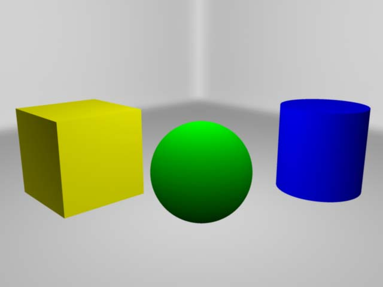
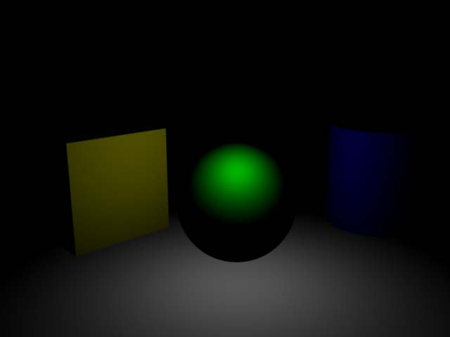

## Ambient Light

Diese Beleuchtung erzeugt ein weiches diffuses Licht in jede Richtung. Die Intensität hat kaum Varianz, da es versucht eine indirekte Beleuchtung zu simulieren.
Das „Ambient Shade“-Attribut bestimmt das Verhältnis zwischen omidirectionalen und direkten Strahlen.
Ein Wert von 1 bedeutet, dass alle Lichtstrahlen von dem Light-Icon in der Szene stammen, damit ist es einem Point Light identisch.
Ein Wert von 0 lässt das Licht von der Lampe an jeder Position im Bild gleich stark erscheinen (Dadurch gibt es keine Schatten mehr. Es gibt nur noch Farbflächen).
Per Default ist der Wert auf 0.45 gesetzt. Die Positionierung des Lichts im Raum hat kaum Einfluss auf die Beleuchtung.

Ambient Lights werden eigentlich nicht verwendet, da es einen sehr flachen Eindruck im Bild erzeugt. Mit anderen Lichtquellen hat man mehr Kontrolle über die Beleuchtung. Dieser Lichttyp wurde nur der Vollständigkeitshalber erwähnt.

## Volume Light

Das Volume Light ist ein künstlicher Licht Typ. Mit einem Volume Light, funktioniert es wie ein Point Light, nur das Licht existiert nur innerhalb der Begrenzung des Light-Icons. Das Licht entspricht keiner natürlichen Lichtquelle und wird daher nur für bestimmte Special-Effects verwendet. Position, Skalierung haben einen Effekt auf das Licht. Per default wird ein sphärisches Licht verwendet. Jedoch wenn die Einstellungen verändert werden soll wie z.B.. die Begrenzung von Sphere zu Box dann hat auch die Rotation einen Einfluss auf das Licht.

## Default Light

Manche Renderengines wie "Maya Software", oder "Nvidia Mental Ray" haben ein „Default Light“ dieses Licht wird nur dann verwendet wenn keine Lichtquellen in der Szene sind.
Das Default Light wird automatisch deaktiviert sobald man eine Lichtquelle der Szene hinzufügt.

Man kann das Licht auch in den Render Settings manuell deaktivieren.
