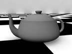
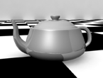
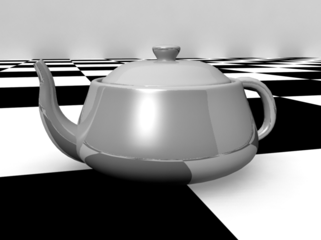
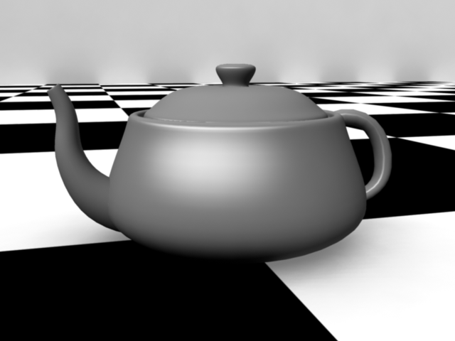
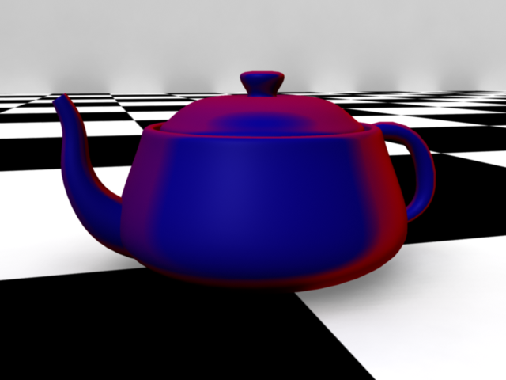

Ein besonderer Vorteil der Maya Shader ist das fast alle Render engines das Material ausrendern können.
Sogar bei einem Export in eine Game Engine kann das Material ggf. Übertragen werden.

Der Nachteil von den Maya Shadern ist jedoch, dass der Shader unter Umständen nicht optimiert für die Render Engine ist,
was die Renderzeit verlängert und ggf. zu Renderproblemen führt.

Maya verfügt noch über weitere Basisshader, die früher insbesondere mit der Maya Software Renderer verwendet worden sind.
Die Shader werden meist noch unterstützt von modernen Render Engines, jedoch werden die Shader im Alltag nicht verwendet.

## Lambert

Mit dem Lambert Material lässt sich eine matte Oberfläche simulieren.
Sie hat keine Glanzpunkte und kann weder Refractions noch Reflections simulieren.

Ein hoher diffuse Wert lässt die Oberfläche heller erscheinen, ein niedriger Wert lässt die Oberfläche dunkeler erscheinen.

Das Lambert Material ist die Grundlage für Blinn, Phong, Anisitropic Materialien.

Initial wirkt das Material wie ein graues Blatt Papier.

### "lambert1"

Jede Geometrie sollte ein Material zugewiesen haben, beim Rendern sollte kein Material den Default Shader zugewiesen haben.
Gleichzeitig kann man das lambert1 nicht löschen und man sollte es nicht modifizieren.

## Blinn

Das Blinn Material hat einen metallischen Glanzpunkt.
Dieser Glanzpunkt kann mit den Attributen „Eccentricity“ und „Specular Roll Off“ genauer bestimmt werden.

Das Material unterstützt, Diffuse Reflection, Specular Reflection und Refractions.

## Phong / Phong E

Phong erweitert das Lambert Material mit der Eigenschaft einen Glanzpunkt zu simulieren,
sowie Refractions und Reflections zu verwenden.
Die Stärke des Glanzpunktes wird mit dem Attribut „Cosine Power“ angepasst.

Initial wirkt das Material wie Plastik.

## Anisotropic Shader

Um Mikrostrukturen der Oberfläche zu simulieren, verwendet man ein Anisotropic Material.
Solche Strukturen findet man z.B. auf der Unterseite einer DVD oder bei Seide.

## Ramp Shader

Der Ramp Shader ermöglicht es verschiedene Materialien/Farben gleichzeitig auf einem Objekt zu verwenden. Je nach Betrachtungswinkel der Kamera werden die entsprechenden Materialien verwendet. Ein Verwendungszweck von dem Shader ist eine künstliche Fresnel Reflection auf ein Objekt zu projezieren. (Insbesondere wenn man Maya Software Renderer verwendet)

